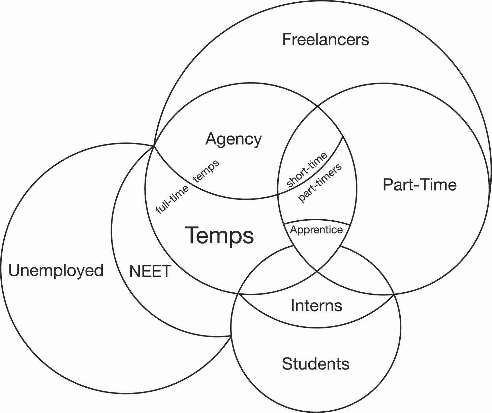

# Chapter 2. The Anatomy of Precarity and the Precariat as Historical Class

## For a Notion of the Precariat That Is Coherent With Social Experience

In Italian, *precariato* (precariat) is used to refer to the institution
of contingent work, and it is used indifferently along *precarietà*
(precarity)*.* Transforming the connotation of *precariato* into a
subject, and exporting it to English-speaking lands[^07chapter2_1] has worked to a
degree, since *the precariat* is now used in academic literature and
journalism[^07chapter2_2] to refer to the class of semi-employed members of the
population. However, these notions have been cause for misinterpretation
in academic sociology,[^07chapter2_3] which hasn’t fully absorbed the debate on
precarity developed by movements and intellectuals in Continental
Europe, where the concepts of precarity and precariat originate from.

Following the popularity of Guy Standing’s book, the precariat was named
as the lowest class in the Great British Class Survey released in
2013,[^07chapter2_4] which after much elaboration and application of Bourdieu’s key
insight – the distinction between economic, cultural, and relational
capital – has proposed a seven-class model of UK society:

1.  Elite - the most privileged group, distinct from the other six
    classes through its wealth. This group has the highest levels of all
    three capitals

2.  Established middle class - the second wealthiest, scoring highly on
    all three capitals. The largest and most gregarious group, scoring
    second highest for cultural capital

3.  Technical middle class - a small, distinctive new class group which
    is prosperous but scores low for social and cultural capital.
    Distinguished by its social isolation and cultural apathy

4.  New affluent workers - a young class group which is socially and
    culturally active, with middling levels of economic capital

5.  Emergent service workers - this new class has low economic capital
    but has high levels of cultural capital and high social capital.
    This group are young and often found in urban areas.

6.  Traditional working-class - this class scores low on all forms of
    the three capitals although they are not the poorest group. The
    average age of this class is older than the others.

7.  Precariat - this is the most deprived class of all with low levels
    of economic, cultural and social capital. The everyday lives of
    members of this class are precarious.

Note how the classification uses the term *precariat* in a distorted
fashion, essentially referring only to the unemployed, and the working
poor; this classification, for example, includes miners in the ranks of
the precariat. However, few in Britain would argue this, instead
claiming that miners should be instead classified as belonging to the
traditional working-class; few have a better claim than them!
Conversely, my notion of the precariat, which is arguably what people in
Continental Europe have in mind when they think of people in a
precarious condition, refers to both emergent service workers and the
low-wage precariat in commerce, government and industry. Thus, in the
classificatory terms of this misleading framework, my notion of the
precariat actually stands as an umbrella term incorporating all those in
Classes 5 and 7.

Again differently from what the Great British Class Survey says, I
understand the precariat as not being the poorest of social classes (the
residents of *banlieues* and *favelas,* for instance, are not
represented by it). The precariat has considerable relational and
cultural capital, due both to social media, and its comparatively high
education. With respect to this latter element, it stands in stark
contrast with the traditional working-class.[^07chapter2_5] From the point of view
of the *technical* division of labor, the precariat mostly contains
young people working in the information, culture, knowledge, and service
industries, who have unstable jobs and suffer from the twin evils of
oligopoly and oligarchy.[^07chapter2_6] In terms of the *social* composition of
labor, the precariat are young, women, and immigrants working in
multi-cultural, and multi-gendered (generally) urban environments.

This book argues that the precariat (temp workers, working poor, migrant
laborers, etc.) stands below the Salariat (middle managers, office
clerks, factory workers, etc.) and the elite (millionaires), and above
the underclass (ghetto youth, refugees, etc.).

Thus, my basic class model is stands as such:

  ---------------------------------------------------------------------------
  I. Elite (high political, high economic, and high cultural power)
  II\. Salariat (high political, middling economic, and low cultural power)
  III\. Precariat (low political, low economic, and high cultural power)
  IV\. Underclass (low political, low economic, and high cultural power)
  ---------------------------------------------------------------------------

Table 1: Basic Class Stratification in Contemporary Capitalism

The political strategy I advocate is essentially an alliance between the
two lower classes against the top two, for most of the Salariat is
becoming increasingly xenophobic, and lost to any leftist cause,
overwhelming choosing the most evil sections of the global elite as
their rulers. Pace Slavoj Žižek,[^07chapter2_7] there is no anti-neoliberal silver
lining in Trump and Brexit, it is a reactionary shift occurring in
response to the crisis in Anglo-America. Yet the left, including Žižek,
has no real alternatives to neoliberalism. By defending narrow sections
of the Salariat, while selling out to neoliberalism and leaving the
precariat hang to dry, social- and Christian-Democrats have undermined
their key bases of support. Contrary to what was argued at the 2017
World Economic Forum at Davos, it’s certainly not the precariat (young,
female, black, yellow, and brown) that’s behind the rise of right-wing
populism. Rather, it’s the fear felt by the working-class and petty
bourgeoisie at the prospect of losing welfare guarantees, social
standing, and cultural identity that is feeding the dragon of
nationalist populism. Populist demagogues play on the sentiments of
anomie and displacement characterizing societies that have polarized and
changed beyond recognition under neoliberalism due to unprecedented
migration and technological advancement. The precarious don’t fear
precarity because they know no other way of living. They are ready to
fight for their rights, and when it comes to fighting, acting in
conjunction with the riotous force of the underclass leads to an
uprising that will be hard to subdue. The social alliance between the
mass civil disobedience of the precariat and the insurgent underclass
can block anti-egalitarian and repressive measures, thus defeat the
xenophobic right currently striving for world power.

The alliance between the precariat and the underclass could also be
unmade by a recrudescence of Islamic terrorism in Europe and America,
alongside other forms of sectarian conflict, polarizing society in
accordance with ethnic, rather than class, divides. After the Trumpian
turn, we are not witnessing a classic head-on capital-labor conflict,
but rather the clash between two versions of modernity: one open and
liberal, the other closed and illiberal. Combining the traditional
left-right political axis with the new open-closed ideological divide
that contrasts national and cosmopolitan versions of capitalism yields
the following ideal types of contemporary forms of political
mobilization. Note how social democracy is still strongly rooted in the
nation-state. This is reflected by the fact that in its heartland,
Europe, social democracy's greatest achievement – the welfare state –
still remains outside the reach of European Union treaties, since
national governments consider it their preserve.

  ---------- ------------------ -------------------
             **Left**           **Right**
  *Open*     Social Populism    Liberal Democracy
  *Closed*   Social Democracy   National Populism
  ---------- ------------------ -------------------

Table 2: The Quadrant of Contemporary Politics

The clear polarity in the table is the one between social populism and
national populism, the two political ideologies that are on the rise
since the crisis of liberal democracy. Between Pablo Iglesias and Donald
Trump there is a wide gulf, filled by intermediate positions. In simple
terms, social populists care about equality like the left nominally does
and liberalism doesn’t. Similarly, to internationalist populists like
Ada Colau, liberals care about open borders, more for economic than
political reasons, so that there are two areas where the interests of
social populism might converge with the center-left against the
closed-minded populists of the hard right who oppose openness and
equality. On the other hand, there are two strong areas of disagreement
and potential conflict: the disagreement between populists and liberals
regarding resource distribution, and the disagreement between the
multiethnic precariat represented by left populist forces, and the
domestic working-class usually championed by social-democracy.

A contemporary case from France reveals some of the complexities at hand
in the interplay between social mobilization and political outcomes. In
the spring of 2016, the student and labor movements rose against the
*Loi Travail* (i.e. the Labor Law, which allowed lengthening of hours
and cutting of wages in defiance of industry-wide union agreements),
occupying the main squares of French cities large and small, in open
defiance of the socialist government proposing it. The political
dynamics were not driven by the red union officially calling the
strikes, the Confédération Générale du Travail (CGT), but by high school
and university students balking at their precarious future and fighting
for their rights, one night after the other for a month in Place de la
République. In spite of the increasing radicalization of the French
youth of *lycées* and *facs* in the Nuit Debout movement, the protests
were not successful in blocking the law, but merely added to the
trademark image of the Hollande-Valls government: a government marred by
incompetence and political betrayal. Despite this defeat, and inspired
by the autonomous revolutionary theory of the Invisible Committee,[^07chapter2_8]
the movement’s opinions were expressed in a series of powerful
pamphlets, *The Coming Insurrection, To Our Friends,* and, in time for
the French presidential elections, the even more simply titled
*Maintenant* (Now).

In the recent presidential elections, the liberal Emmanuel Macron ended
up squarely defeating nationalist leader Marine Le Pen, after both
socialists and gaullists failed to make it to the second round of voting
for the first time in the history of the Fifth Republic. Benoît Hamon, a
socialist who ran on a platform of basic income, ‘tax-the-robots’, and
anti-racism, was betrayed by his own party. The conservative candidate,
the *républican* François Fillon, squandered his early chances to be
elected as allegations emerged he had put his entire whole family on the
government payroll. The 2016 protests were a major factor in securing 7
million votes to Jean-Luc Mélenchon a leftist firebrand supported by the
red union CGT, who ran on anti-elite, and anti-Europe platform. His
positions on Putin and Aleppo during the campaign bordered on red-brown,
as the French and the Italians refer to those who mix bolshevism with
nationalism; were I French, I wouldn't have voted for him. Personal
preferences aside, the sum of Mélenchon and Hamon’s votes would have
been enough to send a candidate of the left to the second round. But
with the left divided, the road to the Elysée was wide open for Emmanuel
Macron, a young banker and former economic minister supported by the
financial and political establishment, who managed to easily defeat
champion of reaction Marine Le Pen by campaigning on a pro-European
position, asserting the value of France’s multicultural liberalism.
Before founding his centrist movement and seizing control the Elysée
Palace and the Assemblée Nationale, he had become famous for
deregulating shopping hours with the eponymous Loi Macron. In fact, the
candidate most in favor of Loi Travail – due to the flexibility it
grants the French labor market – won the elections, a paradox of
unintended consequences[^07chapter2_9] for a mass movement denouncing flexibility
as exploitation. Since the French Socialists have now disappeared from
Parliament, Macron and his government, headed by former right-wing mayor
Édouard Philippe, are ruling the country with little opposition. It will
be the French people in the streets that will bring Macron to account. A
so-called 'Social Front' has been constituted by radical unions and the
autonomist left[^07chapter2_10] to oppose the man they call ‘the CEO of France’. As
they say in their protests, *liberté* should never rhyme with
*précarité*.

## The Precariat: A Salmagundi of Lower Classes

I propose an alternative description of the precariat in the following
table, condensing many categories that have been used to describe the
new actors emerging out of Jobsian and Walmartian production relations.
The ordering differentiates the various sections of the precariat in
terms of income received.

  --------------------------------------------------------------------------
  i\) *Creative Class* (artists, coders, squatters, engineers, designers,
  etc., in internships, apprenticeships, or in freelance and/or temporary
  employment)

  ii\) *New Working-Class* (subcontracted employment as unskilled workers
  or technicians in warehousing, logistics, industrial manufacturing, food
  processing, construction, etc.)

  iii\) *Service Class* (waiters, baristas, busboys, cashiers, cleaners,
  fast-food workers, or employed as education, welfare, health care, child
  care, or home care workers in part-time and/or temporary employment)

  iv\) *Unemployed Class* (NEETs, short- and long-term unemployed, labor
  force dropouts, welfare recipients on workfare, illegal migrants, and
  refugees)
  --------------------------------------------------------------------------

Table 3: The Precariat: Its Internal Segmentation

Considering the unemployed class, one has to note that the proportion of
the adult population not in employment is huge, ranging from about 45%
in Italy, to 35% in France, 30% in the US, and 25% in Germany and
Japan.[^07chapter2_11] In fact, the employment rate - the percentage of people
within a given country that are employed - has shrunk dramatically since
the onset of the Great Recession in 2008.

The service class is the second largest section of the precariat. The
following are the frequent occupations in the United States, according
to BLS data for May 2015 (see table 4 below). Note that retail workers
make up the largest single category of working people. The service class
includes all pink-collar jobs: store workers, supermarket cashiers, food
workers, nurses, waiters and waitresses, and janitors and cleaners. It
amounts to almost 19 million people working precarious service jobs in
the US alone.

  --------------------------------------------------------------------------------- -----------------------------------------------------------------
  Retail Salespersons          4,612,510
  Cashiers                                                                          3,478,420
  Combined Food Preparation and Serving Workers, Including Fast Food                3,216,460
  Office Clerks, General                                                            2,944,420
  Registered Nurses                                                                 2,745,910
  Customer Service Representatives                                                  2,595,990
  Waiters and Waitresses                                                            2,505,630
  Laborers and Freight, Stock, and Material Movers, Hand                            2,487,680
  Secretaries and Administrative Assistants, Except Legal, Medical, and Executive   2,281,120
  Janitors and Cleaners, Except Maids and Housekeeping Cleaners                     2,146,880
  --------------------------------------------------------------------------------- -----------------------------------------------------------------

Table 4: Largest U.S. occupations in 2015. Source: Bureau of Labor
Statistics

The creative and/or ‘boring’ office class, either temporary (most
assistants and most customer representatives) or not (most clerks), are
over 7.5 million. By comparison, the new working-class is fairly small,
comprised of merely 2.5 million people.

Radical political scientists like Andrew Ross prefer to consider the
global precariat,[^07chapter2_12] and emphasize the commonalities between exploited
service labor (located in the core of the capitalist world-system), and
sweatshop industrial labor (located on the semi-periphery of the
capitalist world-system). Other social researchers even include the kind
of informal labor common in developing countries in their definition of
the precariat. I suggest we limit ourselves to informational capitalism
(i.e. the advanced capitalist core in the Global North), and take a
different tactic. We should start by considering who actually is
precarious, in order to arrive at what the precariat is, and what it
might be. First and foremost, it is youth who are precarious, and who
overwhelmingly constitute the precariat today.

The precariat and the creative class are the two conflicting signifiers
of class positioning in contemporary capitalism. While the first evokes
social exclusion and political resentment, the second bespeaks of
prosperous bohos enjoying the so-called sharing economy. In reality, the
precarious are both excluded from political power yet central to
economic innovation. The precariat is a generation in the process of
becoming a general class in the Marxian sense; capitalist corporations
and state administrations could not function without their labor. This
puts them in a league very close to that of the 20th century
working-class: disposable as individuals, but indispensable as an
aggregate. Unlike the working-class, the precarious class owns the means
of production (networked personal computers and smartphones), however
juridical and political domination still grant the elite the means to
appropriate social surplus. Capitalist command operates through
blackmail (the livelihood threat) or coercion (the repressive threat),
to mask the fact that capitalists are no longer needed to organize
production. Increasingly, contemporary capitalism appears parasitic to
social relations, now that wealth has become more concentrated than ever
before in human history, with a handful of digital and media
corporations controlling the entirety of society’s cultural production
and reproduction.

There has been some discussion on whether the precariat is the new
proletariat, or whether the precarious are just the children of
downwardly mobile middle classes. They are both. It’s a class of people
working today, but it’s also a generation: the generation of
twentysomethings and thirtysomethings whose exploitation and
mobilization affects the society as a whole.

## Matrix of Precarious Labor

In order to better illustrate the various forms of precarious labor in
the current economic environment, I have compiled the following matrix.
This provides a viewpoint from which we can analyze precarity from the
perspective of the kind of labor market prevalent in contemporary
information economies around the world.

  -------------- --------------- ------------------------------------ ----------------------- ------------------------
                 **Paid**        **Unpaid**                           **In Labor Force**      **Not in Labor Force**

  *Short-Term*   Temp            Intern                               Precarious,             NEET
                                                                                              
  *Relation*                                                          Laid Off                

  *Long-Term*    Employee        Volunteer                            Unemployed, Permatemp   Outcast
                                                                                              
  *Relation*                                                                                  

                 **Part-Time**   **Full-Time**                        **Under-the-Counter**   **Illegal**

  *Short-Term*   Retail Chain    Clerical Temp, Construction Worker   Daily Laborer           Mule,
                                                                                              
  *Relation*     Worker                                                                       Pusher, Prostitute

  *Long-Term*    Pink- Collar    White-Collar, Blue-Collar            Squatter,               Hooligan,
                                                                                              
  *Relation*                                                          Indentured Worker       Gambler,
                                                                                              
                                                                                              Gangster
  -------------- --------------- ------------------------------------ ----------------------- ------------------------

Table 5: The Precarity Matrix: Precarious and Outcasts in the Labor
Market Today

Those employees who have allowed worktime to colonize their lives are in
the best position in regard to the labor market. Their minds belong to
their employers. In exchange for their loyalty, they are granted access
to the salariat, the safe island of guaranteed long-term employment. The
benefits of this group, however, do not extend to paid leisure. Every
day, weekends included, must be sacrificed on the altar of the
employer's superior need. The permanently employed might be overworked
and overstretched, but they are the only insiders of today’s labor
market.

The *Sarariman* is a perfect example of this kind of worker. It is the
Japanese name given to office workers who, in exchange for a lifetime of
employment, slavishly devote themselves to serving their company. They
are an overworked, male figure that is fast disappearing from Japanese
society. Their profits swallowed by two decades of stubborn deflation
(so much so that the Nikkei has yet to recover from its 1990 peak),
*keiretsus* (business groups) are shedding them by the thousands. Yet in
spite of this, salaried middle-managers are what the media portray as
typical, contemporary employment; they are smartly dressed, travel
abroad on business, and the lucky among them may eventually join the
upper echelons of company management. These upper levels are still
overwhelmingly male, as corporations frown upon motherhood, obviously
negatively affecting women’s careers (it is important to note here that
paid maternity leave doesn’t yet exist in many parts of the global
economy).

At the opposite end of the spectrum are the outcasts of the labor
market, a descending segmentation of hidden layers of workplace
exploitation and forced precarity. No matter how educated, the
precarious are considered as inferior, second-class employees.

Below full-time workers in terms of job guarantees are part-time
workers, who are similarly regarded as having a lower status within the
company. Alongside them sit temporary workers (temps), who usually work
full-time, and are either directly recruited by a company or rented from
a temp agency. Temps and part-timers might be granted some pocket-sized
benefits (some paid holidays and minimal health care packages), but both
are frequently cut loose during lulls in business, and conversely must
work extended hours when business picks up.

I consider the temp the ideal type of precarious worker. Younger
generations initially thought they could be temporarily flexible under
neoliberalism, but in fact became stuck in seemingly permanent
precarity, or ‘temp hell’, to quote the name of one of earliest fanzines
devoted to the phenomenon. No matter the industry in which they are
employed, due to the strictures of their short-term contract, a temp's
leverage on their superior is far lower than that of their permanent
colleagues’. The demand for permanent workers suddenly dropped thirty
years ago, when neoliberalism became the dominant form of economic logic
within information economies. Neoliberalism hired temps whilst shedding
perms, thus precarious workers are legion today. Just over 15% of all
employees in the Eurozone work on temporary contracts. According to
Eurostat data and definitions, temporary employees made up 15% of
dependent employment in France and Germany in 2013. These same figures
hold in Finland and, outside of the Eurozone, Sweden as well. In North
America, the share of temporary employment had climbed to 14.5% of the
total working population by the end of 2012, according to the OECD’s
*Employment Outlook*. Focusing on this data according to a generational
cross-section is yet more worrying. In Europe, short-term and temporary
employees account for roughly 25% of people in dependent employment aged
15-39. In Mediterranean Europe specifically, these numbers are even
higher: almost a third of workers under 40 in Spain and Portugal work
short-term jobs, while in France and Italy, 23% and 21% respectively of
young workers are permatemps without hope of long-term employment. In
the Netherlands, the corresponding percentage stands at a high 31%.
However, unlike most Eurozone countries, this is matched by high, rather
than low, employment rates for people under 40. Focusing only on people
under 25 years of age, the OECD reported that in Europe more than 39% of
employees were temps (up from 36% in 2000).[^07chapter2_13]

I call the proportion of workers in temporary employment the *precarity
rate*. It is essentially a proxy for total precarity amongst a given
population, since it refers only to a subset of the precariat (this will
be explained fully later in this text). Temporary workers *are*
precarious workers. The precarity rate within the Eurozone is around 15%
(early 2013 figures), the total number of employees is in excess of
115,000,000, thus there are currently more than 17 million precarious
workers in Europe. These statistics signify a harsh reality:
informational capitalism depends on precarious labor for its extended
reproduction. Crucially, when we talk about the gig economy, we’re
really discussing labor performed by the precariat (and the precariat
alone). The profits of the sharing economy and social media empires
would be unthinkable without the flexibility, and knowledge, of the
precariat.

Although temps work the same number of hours (if not more) than
permanent employees, as well as do the same kind of work, they are paid
less by the hour. Their permanent colleagues tend to overlook this
patent discrimination, and thus tacitly collude with employers as they
work alongside temps at meetings, or converse with them casually by the
coffee machine without worrying about their predicament. They extend no
solidarity to their temp colleagues when employment contracts expire and
are not renewed. Their precarious status is usually knowledge private to
them, and permanent employees don’t want to hear about it. One day
precarious workers will simply vanish from the office, perhaps preceded
by a tearful little ceremony in a cheap restaurant. It is only after
they are terminated that long-term employees are confronted with the
fact that their able and smart colleagues were in fact temps, existing
with an invisible expiration date floating over their heads. In general,
the surviving employees merely count themselves lucky, and disregard the
destiny of the hapless temps, as if there were some kind of superstition
that precarity might rub off them and soon become their destiny as well.

If temporary labor is neglected, internships (i.e. the free labor
provided by young college graduates to build up their CVs), barely
register in the eyes of permanent and temporary employees alike. Interns
(in French and Italian they are called *stagiares* and *stagisti*,
respectively) constantly rotate every three to six months. The rest of
the office doesn’t even remember their names; one young face after
another passes them by. Interns start their jobs in a bright mood
initially; their expectations progressively dim as the nature of
gratuitously imposed free labor becomes apparent even to the most ardent
believers in careerism. Young people are often conscripted into
internships, because they are educational credits required for
graduation, and because they have become stepping-stones to a paid
precarious job. The hardened temp was once a hopeful intern.

Sometimes interns work longer hours than everyone else; sometimes to
extremes. Merrill Lynch intern Moritz Erhardt died from an epileptic fit
in November 2013, at the end of his third night spent in the office. The
coroner said overwork (what the Japanese call *karoshi*) was the cause,
yet corporate lawyers tried to make him revoke this: the Wall Street
company feared a lawsuit. His young colleagues simply went on working,
despite the fact that the bank (embroiled in the financial crisis) had
given employees the opportunity to time off to mourning the loss of one
of their peers. The living seemed more preoccupied with holding onto
their jobs, no matter how precarious, than commemorating the death of an
unknown intern.

Employment as an agency worker entails being hired by a temp agency that
periodically rents your services out to a company for the duration of a
temporary employment contract (typically less than a year). The company
has only limited responsibility for a temp’s fate after their contract
with the temporary work agency ends. The fee paid by the employer to the
agency is indirectly a cut on the temp’s wage, since companies pay temps
less by the hour than employees they themselves hire. Originally used
solely for office work, temporary labor has penetrated every economic
sector, even the manufacturing sector. In fact, blue-collar jobs in the
early 10s accounted for 47% of all temporary labor, up from 30% in 1993.

Temporary workers were initially used as substitutes for permanent
employees during an interim period where they were otherwise
unavailable. In fact, in France, they are still referred to as
*intérimaires*. Whilst temps are still commonly used to replace female
employees on maternity leave, for the most, temps do not in fact
‘replace’ anyone. Their temporary work is carefully planned, and
managed, by firms on a regular basis in relation to foreseeable business
events, rather than to cope with temporary labor shortage. A temp’s
contract is with Adecco, Randstad, Manpower, or Kelly Services (once
Kelly Girls, when temporary employment was still predominantly
feminine), to name but a few temporary employment companies. Their
contract is not with the employer that actually manages their labor.
These three corporations are among the largest US employers today, and
are creating a disproportionate number of jobs as the economy recovers.
It is no wonder that *The New York Times* wrote about the rise of the
permatemp economy in relation to the precarious nature of jobs created
since the Great Recession.[^07chapter2_14]

Temporary labor agencies have only been legal in Europe since the 1990s,
due to the entrenched hostility of unions and the left towards private
labor intermediation, reminiscent of indignities inflicted on industrial
and rural laborers in the 19th and early 20th centuries. It’s revealing
that, during the 70s, the first American temp agencies mostly managed
female employees, and referred in private to their workers as ‘warm
bodies’, or ‘skins’. Whilst the European left forestalled what it saw as
a trade in human beings, the battle was finally won by the likes of
Adecco, and Manpower. Worse yet, informal labor markets have recently
made a comeback in both the European agriculture sector (in the form of
migrant pickers), as well as American industry wholesale (in the guise
of the *raitero* system). While emblematic of the new age of
flexibility, agency labor is not yet the dominant form of temporary
employment in Europe. The standard temp is a young, educated individual
who signs a temporary contract with an all-powerful employer, unassisted
by a union, and likely unable to find alternative forms of gainful
employment if dismissed.

Neoliberalism aims to turn every worker into a free agent, an
independent contractor. This tendency is most evident in platform
capitalism, which profits from on-demand labor. Drivers, riders, and
home workers are considered entrepreneurs-of-themselves by corporations
operating service apps, in a travesty of the capital-labor relationship.
Uber drivers in Seattle, helped by the City Council and the Teamsters,
are making the first serious unionization drive against the most funded
company in history (one which has yet to turn a profit). As Trebor
Scholz argues, under the platform capitalism that sells itself as the
sharing economy, workers are *uberexploited*.[^07chapter2_15] They are
self-employed, and have neither sick leave nor insurance against
accidents. Gig workers can fight back in two ways, either by unionizing
and gaining recognition of their de facto employee status, or by forming
online co-ops; by counterposing platform cooperativism to platform
capitalism. Since I'm rather a believer in platform syndicalism (for a
contemporary expression of this originally Latin American anarchist
tendency, the Workers' Solidarity Movement in Ireland is a good
example), I believe that precarious workers exploited by the likes of
Travis Kalanick have to organize against the power of digital capital.
In the United Kingdom, Uber drivers and Deliveroo riders are fighting
via the courts for their employee status, minimum wage, and sick
pay.[^07chapter2_16] In London, Uber is appealing a decision that ruled against the
company for its unfair treatment of drivers. After protests across the
USA, most notably in New York and Texas, Obama’s National Labor
Relations Board sided with drivers in a class-action suit seeking
federal recognition of their status as statutory employees. Considering
Uber’s Trumpian slant, this is unlikely to continue. That's why the
Seattle unionization drive is so important, in the city that was among
the first to introduce living wage laws, and where a major portion of
the central nervous system of contemporary capitalism (Microsoft,
Amazon, and Starbucks) resides. Uber is, via their app, sending messages
and podcasts to its drivers, attempting to persuade them to remain as
‘partners’, and vote for the company in the unionization election.[^07chapter2_17]
Uber cannot afford to lose this battle. Yet neither can its 1.5 million
precarious drivers, whose incomes are currently at the mercy of customer
ratings, and exploitative algorithms.

The digital and the service components of the precariat have converged,
creating the sharing economy. Lyft drivers and Foodora cyclists (to cite
the two major competitors of the Uber and Deliveroo) feel they are
employees with shared, collective interests, rather than the
self-employed individuals that the corporations dominating the online
service economy want them to be. These workers are the latest addition
to the Pangea of precarious labor. Although their legal status is still
uncertain, what is certain is that these precarious workers have started
to rebel. In doing so, they have destroyed the veil of complacency
surrounding abusive labor practices in the sharing economy, a completely
deregulated sector where the value created is not shared with the
workers creating it.

## The Precarious’ Universe: Temps, Part-Timers, Freelancers, and Interns

Now that we have in mind how people are variously affected by precarious
labor, we can provide an accurate definition of the precariat, via set
theory. All things considered, the precariat counts among its members
those who: work in temporary and/or part-time private or public
employment; are self-employed as freelancers (often for a single
employer); work in poorly paid apprenticeships; work in unpaid
internships; do not work because they are unemployed; officially do
nothing (NEETs) and/or perform under-the-counter, black-market labor.

Essentially, the precarious perform contingent labor for substandard (or
even no) wages in an individualized, casualized work environment.
Alternatively, they are officially unemployed, meaning they live off a
subsidy (if there is one), at times supplemented by jobs paid in cash.
This is often a necessity for undocumented migrant workers, tellingly
referred to as *sin papeles* or *sans-papiers* (those without papers),
in Spanish and French respectively.

I played with Euler-Venn sets to draw the borders of the precarious’
universe, and break it down in subsets and overlapping sets of
precarious workers, so as to arrive at a precise representation of the
precariat. Fundamentally, the precariat set is constituted of the two
intersecting subsets of temps (short-term employees and agency workers)
and part-timers (who can be either short-time or full-time – the latter
are predominately concerned with wage precarity, rather than employment
per se). These subsets are united by the legions of (always belatedly)
paid freelancers and unofficial workers, and further supplemented by the
universe of unpaid labor and idle human capital: internships,
unemployment, and inactivity. It is now time to finally draw the
contours of the growing reserve army of labor in the wake of the Great
Recession: the burgeoning mass of the precariat.

Fig. 1. The Precariat Set

Temps, part-timers, and freelancers make up the subset of paid
precarious work. Workers that temp agencies outsource to companies are a
significant portion of the total of temporary workers (it is perhaps of
interest this portion is larger in regards to America than within the
European Union). They can either work full-time or part-time, depending
on the job profile they allegedly substitute. It should therefore be
noted that the agency labor subset partially overlaps with the set
comprised of part-time workers. Paid apprentices are instead a subset of
part-timers intersecting temps, since apprenticeships always entail less
than a full workweek (since apprentices need time off to study), and
have a fixed duration. Interns, a sizable subset of the student
population, are the missing link between the world of the precarious at
work and the precarious at home: the unemployed, and NEETs. Students are
not precarious insofar as they don’t have to work; their precarity is
potential, not actual. They will become precarious in the majority of
cases, but their non-work is of a different order than the refusal to
work of NEETs, (very) young people who do not care to study or seek work
so as to obtain additional benefits, as those officially registered as
unemployed do. They may live off welfare if they are in a country
civilized enough to pay anti-poverty subsidies, or are dependent on
their families. Mostly they perform black labor and possibly criminal
activities. Conversely, the unemployed are usually subjected to
re-training and workfare requirements in order to be entitled to receive
social transfers. The NEET rate is counted as a percentage of the young
population, while the unemployment rate is counted as a percentage of
the active population, i.e. young unemployed people divided by young
people in the labor force (the sum of people in employment and
unemployment).

Using formal notation with we can thus summarize the basic coordinates
of the precariat set:

*Paid Precarious*

**TEMP U PART-TIME U FREELANCE** with TEMP ∩ PART-TIME ≠ ∅

*Unpaid Precarious*

**INTERN U UNEMPLOYED** with INTERN ⊂ STUDENT and NEET ⊂ UNEMPLOYED

College and high-school students are of course an endless reservoir of
temporary and part-time labor. But the oversupply of educated labor has
brought the entry wage down to zero, so that corporations can now hire
young people for nothing, as shown by the inexorable rise of
internships.[^07chapter2_18] Only very few internship programs pay something like
the minimum wage – the lucky ones only get food and transport – and this
also applies to interns working for prestigious companies and financial
institutions. Some parents in Europe are actually ready to *pay* a
company to get their daughter or son taken on as an intern. Furthermore,
the institutionalization of internship in Western universities as a
preliminary requirement for degrees has created a vast pool of
officially sanctioned, unpaid precarious work. Consequently, the
majority of final-year students are now unpaid interns for Fortune 500
companies, corporate foundations, and high-flying independent
professionals such as lawyers and architects. Others are old-fashioned
working students, who toil because they cannot afford not to earn money
during their studies, since they have incurred high levels of debt to
pay for increasingly expensive tuition.

The luckier students, usually in the less noble but more established
trades, where craftsmanship and dexterity still pay a market premium in
spite of automation and 3D printing, get apprenticeships via the state
in Europe, and through unions in America. An apprentice gets paid
considerably less by the hour than a hired employee and works part-time.
Outside the apprenticeship, they attend technical classes in a
university or union center. In countries such Germany and America, there
has long been a tradition of individuals gaining decent, blue-collar
jobs through apprenticeship schemes. Whilst countries such as France and
Italy want to introduce them in order to improve the performance of
their manufacturing industries, to young locals, the schemes feel like
yet another way to defer a guaranteed job paying a full wage.

Some exclude formal part-time employment from the precariat. Conversely,
I argue that its marked feminization and/or juvenilization, and the fact
that much of it is involuntary, on-call, and non-unionized labor, make
the inclusion of part-timers into the precariat a matter of course. What
could be more symbolic of precarious labor than a McJob?[^07chapter2_19] What’s
more emblematic of the struggle of the precariat than the Fight for 15’s
struggle against US retail chains? McDonald’s employees, just like
Starbucks baristas and Wal-Mart associates, earn the minimum wage and
have next to zero benefits. If they try to form a union, they are
harassed, intimidated, and subsequently fired. Fast-food workers were
long seen as unable to form a union and strike; however, the recent
drive for service unionization all across the United States has perhaps
proved otherwise. Finally, labor boards are beginning to rule against
corporations exploiting precarious labor through their franchises, like
fast-food chains do. McDonald’s was among the first corporate franchises
to force retail workers to all dress alike. Just like army recruits (and
prison inmates), chain store workers must wear uniforms; big-box stores
(also known as supercenters, or megastores) and fast-food restaurants
are totalizing institutions where uniformity and discipline must be
strictly enforced, in order to prevent any attempt at organization that
would drive up wages. However, history is on the side of the precariat,
and the eventual raise of minimum wages to a decent level is likely to
(finally) be won across America, Europe, and East Asia.

## Precarity Rankings

I have included below a 10-category precarity ranking, identifying
various umbrella categories of precarious people, in order to highlight
those most in danger (as well as what they are in danger of). The logic
of this ranking is based upon the idea that being a migrant worker
(especially if undocumented) is the worst condition possible; they are
exposed to discrimination, abuse, and arbitrary detention. The condition
of an unemployed person is slightly better, even those who are
unemployed long-term, and/or not being eligible for unemployment
benefits. If decent subsidies for the unemployed existed, not having to
report to work wouldn't be so bad. Yet the callousness of western
governments is such that, nowadays, the unemployed are forced to work
for free (or next to nothing) as part of a workfare program (known as
*mini-Jobs* in Germany) in order to retain this subsidy. Workfare is for
those that governments believe can be reintegrated into the active labor
force. Being an unpaid intern (and possibly also having substantial
student debt) is one level higher, though still firmly within, precariat
hell. After interns come those who are laid off. Being laid off is
distinct from becoming unemployed; the term usually refers to full-time
workers who are only temporarily made redundant by a large-scale
employer, live off a decent wage-based subsidy, can work on the side for
cash, and are likely to be rehired by the company when business
recovers.

  --------------------------
  1\. Migrant
  2\. Unemployed
  3\. On workfare
  4\. Intern
  5\. Laid Off
  6\. Contractor
  7\. Freelance
  8\. Temp
  9\. Short-Term Part-Time
  10\. Long-Term Full-Time
  --------------------------

Table 6: Precarity Rankings (1 = Max. Precarity, 10 = Min. Precarity)

In the middle of the precarity ranking stand contractors: independent
workers, or ‘bosses of themselves’. While they usually have a fair
amount of income security, they are disproportionately likely to fall
victim to occupational hazards (such as those that affect workers in the
construction industry).

Similar to contractors, freelancers are self-employed, and as such are
worse off than temps, who gain some safeguards from being considered
employees, albeit of a non-standard, atypical sort (a regular paycheck,
and paid sick leave, for instance). Unless contractors associate for
insurance purposes, like the Freelancers’ Union has done in the US, and
SMart is doing in Belgium and the rest of the EU,[^07chapter2_20] they are on their
own if their employers refuse to pay them, or to cease hiring them (it
bears mentioning the almost certain termination of their contract if a
freelancer falls seriously ill). Contract workers cannot rely on any
sort of unemployment or sickness compensation, although this is offset
by the fact they make (on average) higher incomes than those workers
with a regular wage. They often have a higher mean salary, but also a
higher variance in labor income compared respect to temps, who are
wage-earning employees and thus at least know in advance what their net
pay will be, and usually have the right to unemployment compensation. As
already noted, temporary workers can be bought by firms from temporary
labor companies, who manage their labor in conjunction with the client
firm, leaving temps exposed to a weird form of double exploitation.
Short-term part-time workers are practically indistinguishable from
temporary workers, save for the fact that being hired directly by the
firm grants them a little more leverage in the workplace. Part-time
workers who are long-term employees are among the least precarious.
Their precarity is due mostly to insufficient income; working part-time
usually translates into half the wages of a full-time employee.
Furthermore, most part-time jobs are paid only the minimum hourly wage,
and the real value of the minimum wage has been steadily falling for
three decades.

Thus, we move to examine the final category. Category 10 has long meant
living without precarity; it is about being a permanent employee, one
who considers it a privilege to receive a 40-to-life work sentence. The
employees most secure in their jobs are usually government workers,
since not even the largest companies can now guarantee their employees
permanent employment. Times of fierce international competition, as well
as accelerating technical change, require increasing productivity from
an ever-reducing workforce, in order to merely stay afloat. If you can't
keep the pace, you can pack your personal belongings before being kindly
escorted out by security; you’re on the street, and out of work.

Only in Scandinavia are welfare provisions generous enough to enable
workers to give the boss the finger when their patience expires. In
fact, it’s in Finland that universal basic income (UBI) is being tested
for all people that are officially classed as unemployed or precarious
(the money is paid even if you later find a job). The introduction of a
basic income would complement the existing employment model called
*flexicurity*, which and has become a typical feature of Nordic
capitalism, characterized by the social-democratic bent of its politics.
Although it is not without faults (such as persistent youth
unemployment, as well as punitive workfare), it reduces the market’s
power over the lives of the precariat (in more academic terms, it
*decommodifies* precarious labor).

However, Scandinavia aside, within the rest of the world of
informational capitalism, those in precarious positions are constantly
blackmailed by businesses and administrations. It’s either kowtowing, or
facing the harrowing prospect of joblessness and financial distress.
Unemployment benefits are usually not enough to cope with basic economic
needs (such as food, housing, and transportation), especially if you
have a family. Furthermore, they are consistently being scaled back.
That’s why a fundamental demand of the politicized sections of the
precariat has always been UBI, in order to provide some stability
independent from the instability of the economy, and secure fundamental
rights for all.

The working poor are starting to go hungry even in Europe, whose
indifference to the plight of the weakest strata of society is beginning
to rival America’s (and also Japan’s, where casual workers and destitute
people are treated with contempt). In Britain and Germany there has been
serious pressure from governments to push people into workfare programs,
thus linking the payment of unemployment benefits to accepting jobs in
the private sector at below-minimum wage rates. The disciplining
function of workfare is not lost on young people, who resent being
subjected to considerable government intrusion into their lives, forced
usually into jobs of no social value, and benefit only the companies who
are permitted to pay their meager wages. There is a growing call for UBI
from the public, not least because of the vast numbers of people forced
into precarity by the Great Recession. UBI would mean the end of
workfare and all forms of means-tested welfare designed to regulate and
stigmatize the poor. It would also make it far easier to enforce a
higher minimum wage. It would limit the necessity for workers to accept
less than the statutory minimum wage in grey and black markets, since
they have some economic stability, in the form of basic income. UBI,
therefore, is both a key welfare provision to properly address social
insecurity, and also a form of empowerment, one which will unleash
social creativity in non-economic activities.

## Precarious Work: Damnation vs. Liberation

Although I have sketched the circles of the
precarious inferno, yet I am not sure which is the worst; temporary
work, or permanent? In general, leftist writings on precarity portray
precarious employment as a negative condition, known as the oppressive
model of precarity. On the other hand, there is also a wealth of
literature that highlights the liberating energies unleashed by
precarity which lead to solidarity with others; one's identity is not
defined by one’s work, but rather in relation to one's activities, and
relationships with other precarious people sharing a common
condition.[^07chapter2_21] While there is little doubt that no longer having a job
for life is positive, being jobless is not an ideal condition. Both are
social life sentences. One must consider that, due to the financial
crisis, creativity and solidarity have been undermined by lack of jobs
(any job), and surviving the ensuing rat race means undermining your
fellow precarious beings. Texts written by the precarious authors
underscore the overcommitted, albeit unstable, nature of precarious
jobs, but also their unwillingness to return to the regimentation of the
office or factory. Most precarious workers wish to attain employee
status and benefit from introduction of a basic income and the setting
of a high hourly wage, so that precarity can be a way of life, rather
than a daily fight for survival. Considering the looming threat of
technological unemployment, due to automation and machine learning,
worktime reduction also needs to be taken into account.

This book thus proposes a combination of the 4-day workweek, a \$/€15
minimum wage, and a \$/€1,000 basic income for all adults, starting with
people aged between 18 and 30. These basic measures will to bring
precarity under control, and reverse the growing economic inequality of
the post-crisis world. These reforms are significant, substantial,
achievable and also necessary to restarting the economy. The book
concludes with an open strategy for the emancipation of the precariat,
which will hopefully be subjected to both discussion and criticism. It
will be the precariat that will collectively decide its own
organizational forms, as well as its social and political program. Since
the year 2000, I have been dreaming of founding the revolutionary union
of the precarious of world, starting from within the European Union.
What is clear is that there must be a decisive step forward in labor
organization, advocacy, and conflict, for and by the precariat, and for
general social emancipation to take place, beginning with precarious
youth.

## Immigration and Discrimination

Immigrants are by definition precarious. Like the young, they are easy
to hire and easy to fire. In a country like France, young *beurs*
(French citizens of Algerian, Tunisian, or Moroccan descent) are treated
as second-class citizens, experiencing levels of unemployment and
discrimination matched only by that historically experienced in American
by young black men. France holds to the principle of *ius soli* (right
of the soil): if you are born there, you are a French (much like in
Canada and Australia). Its opposite principle, *ius sanguinis* (right of
blood) – the fact that one needs native parents in order to be a
citizen, a principle with clear ethno-fascist connotations – rules over
the rest of Europe. An Italian born in Buenos Aires stands a better
chance of getting Italian citizenship than a young Eritrean born and
bred in Milan. By the same token, French-speaking African immigrants are
better off if they live in Montréal rather than in Paris. Especially if
they’re middle-class, they are respected and treated as equal citizens,
and typically acquire nationality in the space of a few years.

During the neoliberal era, Europe trailed behind North America in regard
to integration. Poor, immigration-dense *banlieues* are to blame for the
worst nightmares of the European elites: fantasies ranging from class
war to apocalyptic jihadism. However, fundamentalism is still very much
a minority currency, even in places like Saint-Denis and Molenbeek.
Nowadays, Antifa and Antira movements rallying anarcho-autonomist youth,
local people, and the hooligan supporters of certain soccer teams, are
some of the few remaining antidotes to national populism. Mirroring
this, they also stand against the dangerous lure of nihilism embraced by
the tiny minority of young, European Arabs, tempted by the extreme
nature of Salafi jihadism.

Social movements must find a way to connect with immigrant
neighborhoods, or reactionary politics will prevail in Europe, and
groups such as Le Front National will gain enough power to fracture it
irreparably. Younger generations within the *banlieues* are rightly
enraged at mounting police violence, catalyzed by the state of emergency
put in place after the Charlie Hebdo and Friday the 13^th^ attacks.
Hollande caused the rebellion of half of the socialist party when he
threatened to abolish *ius soli* for Daesh supporters having double
nationality. On the issue of citizenship, as on the issue of labor, the
socialist administration betrayed its voters. Thus, Macron has emerged
as the champion of openness and change, standing against the National
Front, leaving fractured, warring camps of the anti-racist behind.

In the summer of 2015, when Germany and Austria opened their borders to
the flow of Syrian refugees crossing the Balkans, as well as fascistic
Hungary, a potent image was captured. The migrants on the highway
carried a European flag at their head. The symbolism was powerful:
Europe was a continent of human rights, and of peace. The good people of
Vienna and Munich welcomed the migrants arriving at railway stations,
the same migrants who had been blocked by Hungary’s barbed wire fences.
It was one of the few moments in recent history that made me proud to be
European. Europe will be made or destroyed on the issue of open borders:
the dividing line between progressive-, and reactionary-populism. The
Trump administration, by decreeing a Muslim ban and planning to build a
wall on the America-Mexico border, is honoring its racist campaign
promises. Migrants are fleeing the East Coast of America and pouring
into Canada, which, under liberal Justin Trudeau, is maintaining the
open-door policy on which the country's fortunes were built. America is
instead freewheeling backwards, adopting policies reminiscent of the
period between 1920 and 1965, when immigration was seriously curtailed
in the name of ‘American’ values. In Europe, if the Eurozone were to
collapse, the continent would be set to revert to the kind of
nationalism that caused the most murderous wars in its history. The
precariat must thus continue to stand for the rights of migrants, and
for freedom of movement within the European Union, across the
Mediterranean, and the Balkans. The precariat must take heed of the
actions performed by activists in Ventimiglia and the Brenner helping
African and Syrian migrants cross the border.

## Precarious Labor and Autonomous Marxism

In a literal sense, the precariousness of labor has existed since the
dawn of steam-powered, industrial capitalism. Karl Marx addresses the
issue in the first volume of *Das Kapital,*[^07chapter2_22] when he discusses the
reserve army of labor. He described how the wage demands of the
factory-bound proletariat were kept in check by the precariousness of
labor demand, due to the irregular, crisis-prone process of capital
accumulation (i.e. investment). If laborers didn’t organize, unchecked
exploitation and misery would befall those working in the mills and
fields. However, below the proletariat in the socio-economic hierarchy
was the *lumpenproletariat*, whom Marx wrongly despised (and Bakunin
eulogized): thieves and other petty criminals, prostitutes, tramps,
vagrants, etc. The lumpenproletariat made up a reserve army of potential
replacement laborers, keeping those in the factories in check, and
keeping wages low.

A temporary workforce is a permanent feature of certain industries,
exemplified by seasonal workers in sweatshops, and laborers in
commercial agriculture. In this respect, things have not changed much
since the 19th century. Informal labor remains the norm in emergent and
developing economies. However, the recent swelling of the precariat is a
symptom of a troubling return to informal labor markets inside the
relatively wealthy societies of advanced capitalism.

While contingent labor has always existed in capitalist societies,
Italian Autonomous Marxism was the first to argue that precarious labor
had moved from the peripheral position it occupied under keynesian,
industrial capitalism, to a core position in neoliberal, informational
capitalism. Negri and others argue that informational capitalism - the
current technological and social paradigm, according to Manuel Castells’
seminal work of social theory *The Information Age*[^07chapter2_23] - is based on
casual, affective, creative, immaterial, and precarious, labor.

However, a theory of the precariat is not immediately able to slot into
the world as understood by Autonomous Marxism. The precariat comprises
of two categories of workers with very different levels of skill and
education: pink-collars working in retail and low-end services
(cashiers, cleaners, janitors, cooks, waiters, etc.) under constrictive
but standardized employment norms, and the digital creative class
(editors, graphic artists, programmers, etc.) who are temping, sometimes
at high wage rates, in the information economy connecting the world’s
major cities. Furthermore, the precariat is also a plurality of young
people of different sexes, different classes, and different ethnicities.

Aside from Autonomous Marxism, contemporary Marxist thought tends to
discount the notion that this precarious plurality constitutes an
analogue of the 20th century working-class; there might be precarity,
but there’s no precariat. At most, they make up a section of the
working-class. I deny this. The precariat is the successor of the
working-class, emerging from the new form of informational neoliberalism
expanded and radicalized in the crucible of the Great Recession. The
precariat is a generation becoming a class. It has become a new
historical subject, and is the only subject capable of progressive
collective agency; it's the precariat that both performs general labor,
and constitutes the general intellect (to use Marx’s terms). The
precarious have their identity based on exclusion from social status,
rather than in nationalist, or cultural norms. The centrality of the
service precariat for 21st century capitalist accumulation is equivalent
to the role played by the industrial proletariat in determining the
fortunes of 20th century capitalism.

Autonomous Marxism, as elaborated by Antonio Negri, Mario Tronti, Paolo
Virno and others, places the revolutionary agency of the exploited
subject at the center of its philosophical analysis. After the defeat of
the 1968-1979 insurgency of the western working-class,[^07chapter2_24] the
theorists of *operaismo* (*workerism*) turned to focus on urban
movements, as well as emerging forms of service and intellectual labor,
as a new Post-Fordist, digital economy was consolidating out of the
ashes of industrial Fordism. In the work of Negri especially, this
position is made clear: the precariat must be radicalized, in order for
the multitude to cast off the dominating weight of imperial structures.
It is within the relative obscurity this intellectual tradition that the
radical theory of precarity was forged in the 00s, centered around
Milan, Rome, Barcelona, Madrid, Paris, Berlin, Helsinki, and Liège.

To summarize my previous point differently: the new digital capitalist
class is confronted by a multitude of young precarious workers. It is
the precariat’s labor, communication, and distribution that is making
internet billionaires rich beyond imagination. The oligopolists have
long acted jointly to protect their class interests (low taxes, low
wages, etc.). However, the time has come for the precarious to act as
class, and work with their collective interest in mind. It is time to
work towards the end of income insecurity. Just as Henry Ford needed to
be buried for Fordism to rise, not only Steve Jobs, but also his
ideology, needs to die for *Jobsism* to rise. Although in vastly
different technosocial paradigms (industrialism and informationalism
respectively), the implications of both the Fordist and Jobsian
compromises are the same regarding regulation: let workers share the
bounty of productivity, either individually in the form of wages, or
socially in the form of welfare, else risk economic crisis and class
warfare. If an egalitarian solution to capitalist crisis was found
against National Socialism in the last century, it can also be found
against national populism in this century. Capitalism can be reformed.
It has been reformed before, during the Belle Époque, and again after
World War Two. However, today we need a simultaneous revision of both
social and ecological regulation of capitalism. Social regulation has
been experimented before with success, yet ecological regulation has
not. If we consider Piketty’s laws of capitalist motion valid, and I
think any thinking left-leaning individual should, then growth must be
restarted, so that it can jump above the profit rate, and reduce
capital-labor disparity. However, this ‘red’ (social) objective is posed
to clash with the ‘green’ (environmental) objective, since additional
growth would lead to even greater carbon emissions, pushing the planet
further towards environmental chaos.[^07chapter2_25]

Of course, anti-capitalists of all tendencies will just question why we
don’t simply ditch capitalism instead. My answer to them is that
capitalism makes innovation and material progress possible in ways that
state communism has been unable to deliver at any latitude, even under
well-meaning leaderships like those of the Soviet Union’s Mikhail
Gorbachev, and Tanzania’s Julius Nyerere. Communism simply doesn’t work
as an economic system; look at what China accomplished when it switched
from Mao Zedong’s communism to Deng Xiaoping’s capitalism. Immediately
following the fall of the Soviet Union, Russia’s GDP was still larger
than China’s, at exchange rates reflecting purchasing power parities. By
2016, China’s GDP was more than five times larger that Russia’s (536%
larger), making the country the workshop of the world, pulling hundreds
of millions out of poverty. It is hard to argue with these facts.
Although the Communist party officially retained power in spite of the
Tiananmen Square student rebellion, the lives of over one billion people
were drastically improved by market reform: the rate of extreme poverty
in China went from almost 90% in 1980, to less than 2% in 2013 (World
Bank data). China’s might be state-controlled capitalism, but it’s
capitalism nonetheless. In light of this, I do not see a viable economic
alternative that can replace firms and markets. To adopt an effective,
populist strategy, the instinctive anti-capitalism of the precariat must
be of the transformative kind: changing both the state, and market
institutions, in order to achieve social and ecological regulation of
capital, abolishing the dictatorship of global finance, and expanding
the domain of commons-based peer production, as an alternative to both
state and market production.

## The Precariat is the New Proletariat

I have argued that the core of the precariat includes the emerging
social class composed of young, urban temps, of both middle-class and
proletarian origins, living and working in the global north.
Furthermore, the precariat is disproportionately female and immigrant.
In terms of its technical class composition, the precariat performs
service labor in low-tech retail industries, and high-tech information
industries.[^07chapter2_26]

This internal variety is problematic. A social alliance is needed
amongst the constituents of the precariat, to further their common
cause. Yet this alliance is by no means a foregone conclusion, but a
matter of labor agitation, and populist politics. When Oakland residents
threw rocks at the Google bus, they were protesting the fact that
residents – generally of African-American and Latino descent - had to
pay more than double the fare than coders – generally Caucasian –
traveling to the Googleplex on buses provided by the city. The city was
subsidizing a corporation while simultaneously cutting essential welfare
and housing services. The residents’ rage was mainly directed at Google
as a company, although its employees were still resented as agents of
gentrification. Yet how many of those on the Google bus were interns, or
temps? Surely many; a long-term employee at Google does not take the
bus, but instead drives a Tesla, or bikes to Mountain View on a \$2000
fixie.

From a political perspective, the precariat is the social subject at the
vanguard of the political constitution of those opposing both financial
and political elites. People are angry because bankers are bailed out
while ordinary citizens are left to suffer job losses and welfare cuts.
The precariat is a culmination of different grievances, and different
constituencies, in the common fight against inequality, and for the
reassertion of social and political rights. The precariat might not be
the 99% (it stands at around 15-25% of the working population), but it
gives voice to the people’s majority. Similarly, the industrial
working-class was not the majority of the people (it never grew beyond
33% of the population), yet the social and political logic of its unions
and parties permeated the whole of society, its emancipation opening the
gates of equality for all. If austerity and inequality are to be
defeated, the precariat must achieve full emancipation from social and
political inferiority.

The industrial proletariat has been replaced by the service precariat,
as the class that is at the spearhead of social movements opposing
domestic racism, and global inequality. Marx famously distinguished
between class *ex se* (*in itself*) and class *per se* (*for itself*).
The precariat is a class in itself, in the process of becoming a class
for itself. Although Standing[^07chapter2_27] didn’t acknowledge his intellectual
debt to the movement, he was right in arguing that the precariat was
making the leap from class in itself to class for itself. These are
clearly Marxian categories, yet Marxists have in general been critical
of furthering their usage (don’t touch the centrality of the
working-class!). Marxists aside, the fact of the matter is that,
post-Great Recession, the increasing precarity of the middle class, as
well as the pauperization of the service class, have both made precarity
a mainstream concern. The precariat stopped being merely the jargon of
the moment, and instead was discussed by major media outlets across the
globe. Never has the word ‘precarious’ has been used with more
frequency, and applied to a larger variety of contexts (see for
instance, Judith Butler[^07chapter2_28]).

Standing, contradicting his own thesis, envisages the precariat veering
to the right. Conversely, I think it is already veering to the left, and
is in fact behind the grassroots political revival occurring in Spain,
Greece, Portugal, and France. It’s the petty bourgeoisie and the native
working-class – not the precariat – that are voting in large numbers for
Marine Le Pen in France, Norbert Hofer in Austria, and Geert Wilders in
the Netherlands, to name but a few of the despicable xenophobes
threatening European unity today.

## Western Middle Classes: Marx vs. Weber[^07chapter2_29]

Class theory comes in two large sets: Marxian and Weberian. For Marx
(particularly in sociological works such as *18 Brumaire or Civil Wars
in France*) society can be segmented downwards, from the top of the
socio-economic hierarchy, into: the industrial, financial and commercial
bourgeoisie, the petty bourgeoisie (shopkeepers, middlemen, government
employees, etc.), the industrial proletariat (farmers and the
peasantry), and finally the lumpenproletariat (the unemployed /
illegally employed). Marx always thought in terms of class polarization,
his theory forcing a final showdown between industrialists and
industrial workers, organized by vanguard socialist parties and workers
unions. In stark contrast, Max Weber[^07chapter2_30] instead argued that
nationalism was going to lure workers away from the appeal of socialism
(as both a liberal and a nationalist, he was well placed as to
understand why), and capitalism was bound to integrate the growing
middle class, so as to form a political counterbalance to the mass of
the volatile proletariat. Similarly, Weber contended, while the
bourgeoisie was tiny and stood to lose against mass parties in the
emerging sphere of democratic politics, it could either ally itself with
old traditional elites,[^07chapter2_31] or with the newly emerging bureaucratic and
clerical classes, in order to achieve cultural and political hegemony,
to borrow the terminology of Antonio Gramsci.[^07chapter2_32]

National warfare would end up trumping class warfare, however, in the
carnage of the World War One. Peasants and workers from neighboring
European countries slaughtered each other over four ceaseless years of
trench warfare, disavowing the pacifism declared by both French
socialists and German social democrats during the Second International.
However, by toppling the Russian, Prussian and Habsburg Empires, World
War One actually contributed to the worldwide spread of socialism, and
not only in Bolshevik Russia, but also across Europe, Asia, Africa, and
Latin America, greatly contributing to early anti-colonial
movements.[^07chapter2_33]

According to Weber, there were two countervailing trends apparent in
spread of socialist ideology: the cross-class appeal of nationalism,
brazenly evident at Verdun or Gallipoli, and the growth of the middle
class. On the one hand, the modern state was creating an intermediate
stratum of bureaucrats, and the modern corporation was creating an
intermediate stratum of employees between workers and management
(clerks, technicians, secretaries, etc.). These people usually professed
conservative values, and were faithful to the party of order and
authority. They could be counted on to stave off the socialist threat if
workers’ councils attempted to seize factories and government buildings,
attempting to replicate in Berlin and Turin what the soviets of
Petrograd and Moscow had successfully accomplished in November 1917.

In fact, the defeat of the 1919-20 revolution in Germany and Italy can
be attributed to the effective mobilization of the middle classes by the
bourgeoisie against bolshevism in defense of the liberal order. This
mobilization subsequently degenerated into open fascism, as well as
repression of the working-class wholesale. The fascist dictatorships of
Italy and Germany, as well as their many imitators on the Continent,
enjoyed mass appeal amongst the lower layer of the middle class: the
petty bourgeoisie, comprised of state officials, shopkeepers, farm
owners, and tradesmen.

Conversely, in France, Great Britain and America, what came to be known
as the educated middle class stayed centrist and mostly clear of
fascism, both before and after World War Two. During the Great
Depression, the middle class of the few surviving liberal democracies
veered to the left, as vast numbers of artists, intellectuals, and
engineers joined the Popular Front in Europe, and the progressive New
Deal in America. Similarly, in the 60s and 70s arose a general
discontent with constrictive social structures and hierarchies, as well
as large-scale protests against western military intervention against
guerrilla armies. The radicalization of the children of the middle class
in the universities of America and Europe was a symptom of this,
evidenced by the meteoric rise of the Students for a Democratic Society
movement, and the proliferation of Marxist and anti-imperialist groups
(some even embracing armed struggle), respectively. Revolutionary
Marxism exerted considerable influence on the Western middle classes
until neoliberalism defeated it, both from inside and outside.

The catastrophic (but also radically reformist) 30s and 40s are much
closer to today’s experience than the revolutionary 60s and 70s. A
political radicalization of the middle class, as well as a renewed wave
of labor conflict similar to that of the Great Depression, is occurring
today in the aftermath of Great Recession. Arguably, the middle class
has been a major force for social change since 1945. The peace movement,
the international student movements, the women’s movement, the
anti-nuclear movement; these were all middle class movements. Now that
the Great Recession has severely squeezed its living standards and made
its children precarious, will the middle class ditch neoliberalism and
become progressive, by allying itself with the radicalized precariat,
and standing against national-populist reaction?

Certainly, the Occupy movement of 2011-2012 in America was an early sign
of this. It was a left-populist movement mainly composed of young
people, born into the middle class. Students, interns, and the
newly-unemployed laid off constituted the vanguard of an ostensibly
anarchist movement, making socialist demands, by virtue of an *a priori*
popular investiture (‘We are the People, We are the 99%!’). The
political legacy of Occupy is nurturing the current mass resistance to
the Trump administration. Under Franklin D. Roosevelt, it was workers,
intellectuals, artists moving to the left of the political spectrum, and
since Obama it’s been the precarious young who have become impatiently
radical, evidenced in the popularity of the Bernie Sanders’ campaign,
and the incredible growth of the Black Lives Matter and Pink Tide
movements. With Trump attacking immigrants and women, the issue of the
radicalization of the middle class has a renewed political urgency, if
resistance to fascist national populism is to prevail in the land of
Thomas Jefferson and Abraham Lincoln.

## Of Generation and Class

The worldwide protests of 1968 was, in my opinion, a case of generation
against class.[^07chapter2_34] In France, it was the anarchist and Maoist students
pushing for revolution, while the working-class pushed for reform under
the aegis of the French communist party (PCF); in America, it was SDS,
hippies, and Black Panthers seeking to overthrow the system and stop
war, while an overwhelmingly patriotic, unionized working-class defended
American capitalism because it brought them economic prosperity (it
would stop doing so shortly after). In both cases, it was ‘working-class
friendly’ reform that prevailed in the short-term, bringing wage
increases, and more generous welfare provisions. In the long term,
however, it was the generational aspect of 1968 that won; the baby
boomers soon discarded leftism to embrace the market, create new digital
industries, impose new sex-and gender-norms, and in doing so, ended up
replacing previous paternalistic elites.

The 68ers themselves didn't lose much sleep at witnessing the defeat of
the socialist leaning working-class. Neoliberalism provided plenty of
room to fulfill their personal and generational aspirations. Some of
them, of the ilk of Steve Jobs and Bill Gates, went on to become
billionaires, or join the ranks of the political class (countless former
1968 revolutionaries are now party officials and Eurocrats).
Anti-Vietnam protesters morphed into upwardly mobile yuppies, as baby
boomers started entering the establishment. They rode the wave of the
information and media revolution they had created, and became rich and
influential in the process. The precariat is made up of those that came
after them, and weren’t nearly as lucky.

## The Making of the Precarious Class

Following E.P. Thompson and Stuart Hall,[^07chapter2_35] we have to ask where the
precariat derives from, how its associated subculture(s) counters
domination, and how this counterculture potentially creates a new space
for a form of hegemony. The precariat is an urban, multicultural,
rebellious class. It is strongly influenced by pop subcultures (punk,
techno, reggae, and hip-hop, essentially), the cyberpunk culture of the
90s, and the free media and hacker movements of the 00s. A whole
generation of uprooted cosmopolitans came together in squats, raves, and
street parades, determined to change the world by reclaiming the streets
and producing political art. Instinctively, the early precariat detested
racism and forged multicultural bonds of friendship and solidarity,
prescient examples being the SOS Racisme movement, and Le Mouvement de
l’Immigration et des Banlieues (MIB), which were active in France during
the 80s and 90s.

The politicization of the precariat has occurred over three seminal
issues: the politics of partying, the fight against fascism and racism,
and more recently, youth unemployment and the accompanying protests
against corrupt elites engendering this.

Spain is a test case for considering reactions to these three issues.
The country has, traditionally, had a higher rate of youth unemployment
than the rest of the Eurozone. In the 80s, the *la movida* in Barcelona
and Madrid attracted youngsters from all over Europe. In the 90s,
Valencia and Ibiza became the world capitals of euphoric house music. In
the 00s, as Spain’s youth dispatched the pro-Bush Aznar government by
sending millions of text messages denouncing him as a liar, the country
boomed. Floating on a real estate bubble, the mid-00s saw Socialist
Prime Minister José Luis Rodríguez Zapatero legalizing gay marriage, as
well as legislation protecting women from domestic abuse: it seemed as
if Almodovar had gone to power.

Unfortunately, this wave of progress didn’t last. When the global credit
crunch started hitting the Spanish economy, young Spaniards felt doubly
betrayed. Their aging country seemed to only offer joblessness and
evictions, while bankers were still getting fat off corrupt practices.
In 2011-2012, precarious Spanish youth led millions to occupy the
central squares of cities across the country. The Indignados were
Europe’s most powerful movement in 2011, the year of global revolution.
Although Zapatero’s nemesis, the current Prime Minister – conservative
catholic Mariano Rajoy – was not thrown out of power; the political
legitimacy of the post-Franco establishment was gone forever. The
precariat in charge of organizing the *acampadas*, however, succeeded in
reclaiming democratic sovereignty for the people of Spain. The movement
against mortgage evictions became more powerful than labor unions under
the charismatic leadership of Ada Colau, who was then elected mayor of
Barcelona in 2015. Her election was, to date, the most significant
political victory of any achieved by the anarcho-populist movements that
shook the world in the 10s. Since then, Spain's major political
developments have centered around the actions of Podemos, a political
party born during the elections of 2014. Under the leadership of former
*tuta bianca* (*white overall*)[^07chapter2_36] Pablo Iglesias, and Laclauian
ideologue Inigo Errejon. This party, comprised of former Indignados,
could soon become the second largest in Spain, dethroning the socialist
party of their majority.

The proletariat that developed over the course of first two industrial
revolutions built tight, mostly male, communities centered around
working-class solidarity in industrial towns and cities. These
communities, which successfully existed as lived acts of resistance for
most of the 20th century, were shattered by the deindustrialization
engineered by monetarist policies in the early 80s. From the aftermath
of this shattering, the precariat coalesced amidst the relentless drive
of neoliberalism toward individualization. The trend toward singlehood
in urban and suburban environments, or uneasy communal living among
underpaid temps, made community much harder to achieve for young
precarious workers. However, the internet (chat rooms, mailing lists,
social media platforms, etc.) acted as a substitute for traditional
working-class milieux (the factory, the bar, the sport stadium, etc.) in
the age of postindustrial labor. Dilapidated neighborhoods in neglected
areas of cities connected to the global network of financial and
informational transactions acted as a magnet for the multicultural
precariat. Rich in ideas and short on cash, they have flocked to major
world cities, their only capital a university degree and a PC with
internet access. In urban areas on the verge of gentrification (where,
during periods of unprecedented economic growth, the so-called creative
class of affluent bohemians were to be found), young knowledge, culture,
and service workers have coalesced informally, often around localized
non-market or anti-market economies. Pertinent examples of these
informal economies include squats, social centers, communal spaces with
free-wifi, food and clothing exchanges, freegan food distribution
networks, civil rights associations, and environmental activism hubs.
Bushwick, Hackney, Kreuzberg, Ixelles, and Isola: these are the hubs in
which the precariat lives and acts in New York, London, Berlin,
Brussels, and Milan.

These multiethnic neighborhoods are spaces of interaction and
aggregation, often catalyzing protest movements against precarity,
evictions, urban speculation, and ecological degradation, acting in
solidarity with migrants, and in opposition to fascists and xenophobes,
whose influence has been steadily growing since the Great Recession. The
precariat acts as the general intellect in the social factory of
information, goods, and needs, brought about in the recent transition
from Fordism to Jobsism. It raises claims, and formulates demands to
improve its own welfare, as well as that of society in general. It is at
the forefront of anti-racist movements, present at the front of
demonstrations fighting austerity and corrupt politicians, and does not
shy away from rioting when police are too many, and the unemployed too
angry. Clashes with the police always garner media attention and keep
pressure on established power, but what is really at hand is something
under-reported: the emergence of a social economy based on peer
production and open technology; software, services, culture, and
entertainment. Of course, just like the dot-org activism of yore, the
contemporary sharing economy has already been colonized by a digital
oligarchy. Whilst the realm of non-profit platforms is steadily
expanding (both online and offline), the ubiquity of smartphones
maintains the dominance of market logic with regards to online
interactions. Nevertheless, a new social economy based on mutuality and
reciprocity, respect for all genders, and the environment is clearly
emerging, and municipalities and corporations are grappling with both
citizens and consumers beginning to assert their power.

## Postcapitalism and Anti-capitalism

Journalist Paul Mason[^07chapter2_37] sees in this burgeoning third sector as
evidence that the transition toward postcapitalism has already begun. He
envisages the world of postcapitalism as a not-too-distant situation in
which the current abundance of both informational and financial wealth
is distributed more equally across the whole of society. Capitalist
corporations, in this world, have gone the way of feudal castles, and
are simply relics of a distant past. Although Mason doesn’t explicitly
say it, it is the sharing economy – which is supported by the
post-working-class precariat alone – that will dissolve the exploitative
capitalist power relations present in contemporary labor and goods
markets. Giuseppe Allegri and Roberto Ciccarelli label this new class as
the *Fifth Estate* (succeeding the bourgeoisie and the proletariat), but
reduce it unconvincingly to the world of self-employed professionals and
freelancers. What Standing and Mason treat too broadly, they treat too
narrowly. All these authors seem to hint at an organic growth in the
size and reach of the social economy, thinking that a solidaristic
polity will emerge, built around mutuality. However, this growth (and
the polity that comes with it) is not something that we can take for
granted now the precariat has been put on the defensive by the Trumpian
turn.

Mason, in spite of his Trotskyist politics (suggesting a penchant for
permanent revolution), implies that capitalism will die of natural
causes. However, that seems unlikely at best: capital is about power
over people, and only struggle and counter-hegemonic actions can begin
to dislodge its current economic, political, and social stranglehold.
Both the reversal of neoliberal inequality, and the defeat of
nationalist-populism, require huge conflicts to take place involving
massive, populist mobilization in order to be achieved. Bear in mind
that these are necessary merely to abolish neoliberalism, not capitalism
wholesale. Unfortunately for my anti-capitalist persuasion, I don’t
think postcapitalism is on the cards in the post-Great Recession
bifurcation. Those alternatives currently available consist of a choice
between reform and reaction, not between reform and revolution. What the
precariat can achieve, via its struggles and revolutions, is the final
defeat of neoliberalism and petro-capitalism, and a return to
progressive social and economic policy making. It cannot overthrow
capitalism itself. It can bury neoliberalism, and it will. In order to
do that, precariat-led resistance will have to win against the
reactionary forces currently spreading across Europe and America, forces
which stand an equal chance of prevailing in the chaos created by the
crisis of neoliberalism. In a historical bifurcation, ideology is what
determines which version of regulation (of capitalism) will emerge out
of global strife and war. After World War Two, both the welfare state
and social democracy emerged as responses to the devastating memories of
Great Depression and war. Now, in the wake of the Great Recession and in
the face of burgeoning ecological crisis, informational democracy and
ecological populism should be used to redefine the boundaries between
the individual and the market, as well as those between the social
economy, private enterprises, and the public sector.

[^07chapter2_1]: ‘Precarity’ is a word of everyday usage in Romance languages
    (*precariedad* in Spanish, *precariedade* in Portuguese, *précarité*
    in French, and *precarietà* in Italian), that has become
    increasingly common in media and popular discourse in a number of
    countries in the European Union over the last two decades. Its
    transfer to the English language as *precarity* occurred at the
    start of millennium, and began to appear across the board, from
    European Union documents to pan-European, anti-globalization marches
    and protests. The EuroMayDay movement, which had a strong German
    component, also fostered the use of *Prekariat* in political and
    theoretical pamphlets in Germany, Austria, and German-speaking
    Switzerland. As for France, *précariat* has not really caught on,
    but *précaires* and *précarité* have been objects of academic
    investigation, journalistic discussion, and activism, for at least
    twenty years.

[^07chapter2_2]: ‘The American Precariat’, *New York Times,* 10 February 2014,
    https://www.nytimes.com/2014/02/11/opinion/brooks-the-american-precariat.html?\_r=1

[^07chapter2_3]: Stephven Shukaitis, ‘Recomposing precarity: Notes on the laboured
    politics of class composition’, *Ephemera*,
    http://www.ephemerajournal.org/contribution/recomposing-precarity-notes-laboured-politics-class-composition

[^07chapter2_4]: ‘Huge survey reveals seven social classes in UK’, *BBC News,* 13
    April 2013,

    http://www.bbc.com/news/uk-22007058; ‘Social Class in the 21st
    Century by Mike Savage review’, *The Guardian*,
    https://www.theguardian.com/books/2015/nov/13/social-class-21st-century-mike-savage-review

[^07chapter2_5]: In fact, the precariat is an ill-defined concept and this book
    intends to pay remedy to that. Standing includes all those who are
    underpaid and/or economically insecure, and thus at risk of downward
    social mobility. The precariat is dangerous, he argues, not because
    it’s composed of an underclass ready to loot and riot, but because
    the precariat could veer to the right by becoming nativistic. His
    notion seems more an analogue of the right-leaning petty bourgeoisie
    in Marx (18 *Brumaire*) and Poulantzas (*Fascism and Dictatorship*),
    than a description of the normally left-leaning generation of
    Millennials and Generation Z. He has written that the precariat is
    both a major resource for the renewal of the left, but also that it
    is feeding reactionary populism. The *New Left Review* has dismissed
    the concept out of hand, quoting the remarks I made in a video
    interview: ‘The precariat: is it a social subject, a social stratum,
    a class, a category, a cohort, a generational concept—who cares?’ In
    that context, I simply meant that loose theory didn’t prevent the
    precariat from acting out its grievances: definition could wait,
    activism could not. Even if this work takes a different route to the
    precarious question, Standing’s book does not deserve haughty
    rebuff, because the notion of the precariat as a class-in-the-making
    is to be welcomed and should be widely embraced by social research.
    Standing is right, however, in arguing that only by building a
    practical utopia for the precariat can democracy recover and thrive
    again.

[^07chapter2_6]: Franco Berardi (aka ‘Bifo’) and other autonomous writers speak of
    *precari* and *cognitari*: of average precarious workers and
    cognitive precarious workers. See Franco Berardi, *La fabbrica
    dell'infelicità: New economy e movimento del cognitariato*, Rome:
    Derive Approdi, 2002.

[^07chapter2_7]: ‘Zizek: Electing Trump ‘Will Shake Up’ the System’, *Al Jazeera*,
    16 November 2016,
    http://www.aljazeera.com/programmes/upfront/2016/11/zizek-electing-trump-shake-system-161116062713933.html.
    See also his BBC interview on YouTube: https://youtu.be/2ZUCemb2plE.

[^07chapter2_8]: The Invisible Committee, *The Coming Insurrection,* Cambridge: MIT
    Press, 2009; *To Our Friends*, Cambridge: MIT Press, 2015;

[^07chapter2_9]: *Mutatis mutandis*, this also occurred in 1968, with Pompidou in
    France and Nixon in the US ending up being the main short-term
    political beneficiaries of seismic student protests.

[^07chapter2_10]: A record number of people didn't vote (12 million) or voted blank
    (4 million) in the second round, a position expressed in the streets
    by the slogan: ‘*Ni Le Pen, Ni Macron, Ni Nation, Ni Patron’
    (Neither Le Pen nor Macron, neither Nation nor Boss)*.

[^07chapter2_11]: Comparative data from Organization for Economic Cooperation and
    Development (OECD), https://data.oecd.org/emp/employment-rate.htm

[^07chapter2_12]: Andrew Ross, *Nice Work If You Can Get It: Life and Labor in
    Precarious Times*, New York: University Press, 2009.

[^07chapter2_13]: OECD, *Employment Outlook*, Labor Force Statistics and
    Standardized Unemployment Rates.

[^07chapter2_14]: Erin Hatton, ‘The Rise of the Permanent Temp Economy’, *New York
    Times,* 26 June 2013,
    https://opinionator.blogs.nytimes.com/2013/01/26/the-rise-of-the-permanent-temp-economy/?\_r=0.
    See also “Feeling the 'Pressure All the Time' on Europe's Treadmill
    of Temporary Work”, *New York Times*, 9 February 2017.
    https://www.nytimes.com/2017/02/09/business/europe-jobs-economy-youth-unemployment-millenials.html

[^07chapter2_15]: Scholz, *Uberworked and Underpaid*.

[^07chapter2_16]: Kirsty Major, ‘Uber's happy go lucky drivers never existed - it
    was exploitation from the start’, 28 October 2016, *The
    Independent*,
    http://www.independent.co.uk/voices/uber-drivers-employment-tribunal-never-existed-a7385691.html;
    Homa Khaleeli, ‘The Truth about Working for Deliveroo and the
    On-Demand Economy’, 15 June 2016, *The Guardian*,
    https://www.theguardian.com/money/2016/jun/15/he-truth-about-working-for-deliveroo-uber-and-the-on-demand-economy;
    Cara McGoogan ‘Tribunal to rule on Deliveroo riders’ employment
    status’, 6 March 2017, *The Telegraph*,

    http://www.telegraph.co.uk/technology/2017/03/06/tribunal-rule-deliveroo-riders-employment-status/

[^07chapter2_17]: Greg Bensinger, ‘Uber Gears Up to Block Bid to Form a Union in
    Seattle’, 11 March 2017, *Wall Street Journal*,
    https://www.wsj.com/articles/uber-gears-up-to-block-bid-to-form-a-union-in-seattle-1489237201

[^07chapter2_18]: ‘Generation i’, *Economist,* 26 September 2014,
    http://www.economist.com/news/international/21615612-temporary-unregulated-and-often-unpaid-internship-has-become-route

[^07chapter2_19]: The term McJob was first popularized by Douglas Coupland in
    *Generation X*, his first novel, published in 1991 and set in L.A.

[^07chapter2_20]: SMart is a non-profit organization based in Belgium. It helps
    those who are self-employed and work in creative industries across
    several EU countries with potentially problematic issues such as
    getting paid, and various other occupational pitfalls, like
    invoicing.

[^07chapter2_21]: See the elegantly written and argued Patrick Cingolani,
    *Révolutions précaires,* Paris: La Découverte*,* 2015.

[^07chapter2_22]: Karl Marx, *Capital: A Critique of Political Economy. Volume I:
    The Process of Capitalist Production*, 1867.

[^07chapter2_23]: Manuel Castells, *The Rise of the Network Society: The
    Information Age: Economy, Society, and Culture Volume 1*, Oxford:
    Wiley-Blackwell, 2010.

[^07chapter2_24]: An insurgency that Autonomists had predicted would occur (much to
    the surprise of traditional communist and socialist parties), and
    came in the form of an extensive wildcat strike coupled with union
    demands, rendering factories unmanageable for a decade.

[^07chapter2_25]: This is what climate activist George Monbiot argues in his
    dismissal of a Keynesian way out of the current crisis of
    capitalism. Theoretically, a carbon-neutral form of capitalist
    accumulation can exist, mitigating this issue, and will be discussed
    in the final chapter of this text.

[^07chapter2_26]: Although this divide is being bridged by the app economy, that
    mixes geo-location technology with personal services performed by
    digital labor. When everybody owns a smartphone, everybody is a
    digital worker, independent from their occupation or education.

[^07chapter2_27]: Standing, *The Precariat.*

[^07chapter2_28]: Judith Butler, *Precarious Life: The Power of Mourning and
    Violence*, London: Verso, 2004. See also Isabell Lorie, *State of
    Insecurity: Governing the Precarious*, London: Verso, 2015.

[^07chapter2_29]: Like anyone with an interest in social science, I am indebted to
    Michael Mann’s fundamental quadrilogy *The Sources of Social Power*,
    Cambridge: Cambridge University Press, 1986-2013.

[^07chapter2_30]: Max Weber, *Economy and Society*, Vol. 2, University of
    California Press, 1928.

[^07chapter2_31]: Something which Joseph Schumpeter abhorred – it attributed the
    war-mongering bent of German capitalism to its unholy alliance with
    Prussian and later Nazi elites; liberalism had to eschew any
    intermingling with nationalism for capitalism to be peaceful, and
    the international economy unperturbed.

[^07chapter2_32]: Antonio Gramsci, *Quaderni del carcere*, Torino: Einaudi, 2014.

[^07chapter2_33]: See Michael Mann, *Sources of Social Power: Volume 2, The Rise of
    Classes and Nation States*, Cambridge: Cambridge University Press,
    1986.

[^07chapter2_34]: See Herbert Marcuse, *One-Dimensional Man,* Boston: Beacon Press,
    1964.

[^07chapter2_35]: See E.P. Thompson, *The Making of the English Working-class*,
    London: Penguin 2013, and Stuart Hall, *Resistance Through Rituals:
    Youth Subcultures in Post-War Britain*, London: Routledge, 2006.

[^07chapter2_36]: Term referring to Negrian anti-globalization protesters, who wore
    white overalls in Genoa and other early 00s counter-summits.

[^07chapter2_37]: Paul Mason, *PostCapitalism: A Guide to Our Future*, London:
    Penguin, 2016. Although I hereby highlight my differences with
    Mason, I was so struck in 2012 by his book proposal read on his
    agent’s Kindle at the Frankfurt Book Fair, that I immediately
    pre-empted the Italian translation rights. When the book was finally
    published in Italian in 2016, my job was no longer there.
