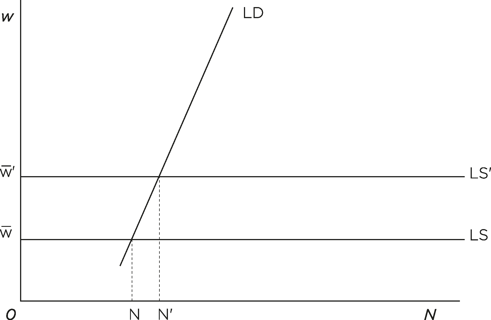

# Chapter 3. The Economics of Precarity and the Great Recession

## Neoliberals and Neoclassicals: Only Markets Count

Neoliberalism refers to the ideology first championed by conservative
economists like Friedrich Hayek and Milton Friedman. Reacting to the
growth in the role of the state after World War Two, Hayek and Friedman
advocated free markets, monetarism, deregulation, and privatization as
alternatives to the tactics of Keynesian demand management, indicative
planning, and the welfare state favored by social democracies.[^08chapter3_1]
Neoliberalism started as a rearguard battle against Keynesianism in the
decades following World War Two, but became increasingly influential as
the Cold War progressed, particularly after the inflationary shocks
caused by the 1973 and 1979 oil crises. Its status as a global hegemonic
ideology was sealed in the 90s after the fall of the Berlin Wall, and
the subsequent breakdown of Soviet communism. The combination of these
two events led to a widespread discrediting of central planning
strategies, as well as all forms of government intervention in the
economy, seemingly proving Hayek’s point that the market was superior to
the plan in terms of informational efficiency and innovation.

Neoliberalism was born to be global. It liberalized information and
communication networks and dismembered monopolies. However, its precepts
were applicable to illiberal regimes, too. In the western world,
particularly after 1989, neoliberalism chimed with freedom, human
rights, and democracy. It was in equal measures economically
conservative, morally libertarian, and socially multicultural. Yet the
tone of western neoliberalism radically changed following the September
11th attacks in 2001, and mildly tolerant neoliberalism yielded to
intolerant neoconservativism. Following this, the Great Recession
struck, and neoliberalism unraveled in less than a decade between 2008
and 2016. With his Keynesian fiscal stimulus, Obama saved both America
and the world from economic meltdown, yet his embattled progressivism
created a reactionary backlash so strong that neoliberalism was rejected
for something far worse: Trumpian national populism. The winds of closed
borders and racism are now blowing strong through the western world,
dissolving post-1945 European unity. The two mainstays of post-1945
liberalism, America and Great Britain, have turned their backs on both
Europe and globalization, favoring instead nationalist alternatives
bound to breed geopolitical rivalry, and macroeconomic chaos. A
social-populist alternative must emerge; one that is sufficiently
powerful to counter the reactionary malaise that is currently seizing
Europe, America, and Asia.

Neoclassical economics provides the basic philosophical tenets to
neoliberalism – complete faith in the invisible hand of the market and
total mistrust in the visible hand of the state, the axiom of
methodological individualism and the assumption of the rationality of
investors and all economic agents, combined with a complete indifference
toward inequality. It has dominated the academic teaching of economics
in American and European university departments until very recently,
when its hold over theory and policy became weakened by the financial
crisis. Neoclassical economics provides a scientific foundation to the
neoliberal fixation on the liberalization of markets and the
privatization of public goods. In particular, neoclassical economists
justified the excessive risk-taking that led to the financial crisis by
professing a blind faith in the efficiency of financial markets. This is
the main reason why mainstream economists were unable to see the crisis
coming, and have similarly been completely incapable of solving it. If
anything, their policy recommendations (based on the assumption that
austerity measures increase growth) have made the recession even worse,
creating the perfect breeding ground for right-wing, populist
sentiments.

## The Great Recession and the End of Neoliberalism

Just as the 1929 financial crash brought an end to laissez-faire
economics, the economic meltdown of 2008 punctured the neoliberal
illusion that markets were always right, a dogma invariably taught in
universities around the world. Following the pattern that runs through
capitalism’s history, a long cycle of financial exuberance ended in a
sudden, major depression. This trend should serve to remind even its
most ardent believers that capitalism cannot regulate itself, as Keynes
pointed out in *The General Theory*; a work that revolutionized
economics during the Great Depression. Perhaps more prescient to our
current crisis is the work of Karl Polanyi, who’s work *The Great
Transformation*[^08chapter3_2] (written in the ideological chaos of the 30s)
outlined how early industrial capitalism destroyed pre-existing social
relations in order to impose market forces on a population, and
described the countervailing institutional and political forces that
could arise in response.

Thirty years of unchallenged neoliberal rule has shattered the economy
and fragmented the middle class, ultimately bringing a demagogue to
power for the first time in American history, and has made precarious
jobs the norm. Precarious millennials, who played a pivotal role during
Obama's term in office, deserted the polls in 2016 and let the enraged
proletariat elect Trump on racist, populist grounds, rather than
mobilizing in support of Hillary Clinton, the baby-boomer candidate of
the neoliberal elite.

Free market liberalism didn’t survive the Great Depression.
Neoliberalism hasn’t survived the Great Recession. Brexit and Trump have
destroyed the international foundations on which both the post-1945
liberal order, and the post-1989 neoliberal disorder, were erected. The
Trans-Atlantic alliance is withering, and nationalism is spreading
across Europe abetted by Putin's authoritarian control of Russia. Aided
by this, neoliberalism, although enshrined in international institutions
like the IMF, World Bank, WTO, and NATO, is being contested as
transnational doctrine, in favor of unilateralism, which makes for an
uncertain world where racist fear and civil wars proliferate. Free-trade
agreements are worth only the paper on which they were signed, and both
TTP and TTIP have been shelved amidst popular reject of globalization
and immigration. The liberal power of mainland Europe is now alone,
dominated by Angela Merkel’s Germany, who faces elections in the fall of
2017 after ten years in power. It is worth noting that France is rising
to rescue European centrism after Macron’s stunning victory against Le
Pen's nationalism; Macron has managed the feat of outclassing France’s
political establishment while simultaneously underwriting the continuity
of France’s financial establishment.

Yet from Moscow to Ankara, and Manila to Delhi, nationalist, xenophobic,
and homophobic regimes cling to power. Illiberal regimes are presently
in the majority at the UN Security Council. In the Middle East, three
strong men, Putin, Erdogan, and Trump, are now calling the shots,
constituting a new axis of evil that spells doom for Aleppo and the
Syrian opposition, and seriously endangers Kurdish aspirations for
autonomy both in Rojava and elsewhere. Europe is on the defensive; NATO,
the military alliance that was the bedrock of the alliance Anglo-Saxon
and European liberalism during the Cold War, has been seriously weakened
by Trump's hostility to Germany and the EU, as well as his
presently-murky relationship Russian’s regime. Recent political
developments at the White House, namely the consolidation of a paranoid
regime that practices protectionism and selective isolationism, have
destroyed multilateral neoliberalism. The ‘West’ as we used to know it,
no longer exists. Its core, the Anglosphere, is no longer synonymous
with openness and freedom.

In economic terms, Trumpism is a mix of restrictive monetary policy and
expansionary fiscal policy, the latter in the form of massive tax cuts.
Trump wishes to put America ‘back to work’ with tariffs and
infrastructural investment, as the Federal Reserve brings the recent
stretch of zero interest rates to a close. The return to positive
interest rates is negative macroeconomic shock to a global economy still
ailing from the 2008 crisis. Unemployment could yet again begin to rise
across the world as capital flows back to American shores. However,
following through on promises made to engender the domestic consensus
for national populism requires giving people jobs. A program of public
works will be launched, which will serve provide economic sustenance to
Trump’s ‘Buy American’ philosophy – a philosophy which was key to his
victory in the Great Lakes states of the Rust Belt. This logic does, of
course, create trade tensions with China, Europe, and even Mexico and
Canada. America’s early confrontation with China seems to have given way
to a mutual understanding between Trump and Xi Jinping, although this is
in no way stable: the North Korean crisis is ongoing, and Trump is
supporting Japan against China’s claims over the South Sea islands. The
tycoon enthusiastically endorses the nationalist government of Shinzo
Abe; telling in his extended handshake with Trump, contra to Angela
Merkel’s lack thereof. Gone are the days of John Kennedy’s declaration:
‘*Ich bin ein Berliner’*. Today brings private meetings in the Oval
Office with the Russian ambassador and foreign minister. The hitherto
unimaginable closeness to Russia, and the subsequent thawing of
relations between Europe and America could have permanent geopolitical
consequences: for Eastern Europe, it means to be left vulnerable in case
of Russian expansion. Western Europe, on the other hand, must now deal
with threats to its economic prowess and political stability, posed by
the close relationship between the White House and the Kremlin. Reliance
upon America’s nuclear umbrella is no longer unconditional, as Germany
and South Korea are painfully discovering.

Although capitalism is being appropriated by populist nationalism and
authoritarian regimes, is also pressed from below by movements for a
radically democratic, more egalitarian, and less carbonized alternative
to neoliberalism. I term this movement eco-feminist populism, more
simply *social populism*, which stands in opposition to mounting
national populism. Since the Great Recession started in 2008,
neoliberalism has entered a critical phase which has now ended with the
death of the patient: the liberal west. The defeat of both James Cameron
and Hillary Clinton in the recent American presidential elections (the
candidates of the City and Wall Street, respectively) signals the end of
Anglo-Saxon neoliberalism.

Expansionary monetary policy, such as quantitative easing at both the
Federal Reserve and the European Central Bank, has cushioned the effects
of the crisis on banks and financial markets, and ultimately kept the
economy alive. However, due to restrictive fiscal policy, particularly
in the Eurozone given the adoption of German-backed austerity, its
effects on growth have been modest. The net result of post-crisis
economic policy across advanced capitalism has been to further enrich
the financial elite, while barely making a dent in unemployment levels
(particularly youth unemployment). Worse yet, the quality of jobs and
levels of pay, not to mention employment rates, have nowhere climbed
back to the levels of the pre-crisis world.

## Insiders, Outsiders, and Biased Economists

There are two basic drivers of precarity. One stems from neoliberal
economic policy and free market ideology, the other from the dual
structure of labor markets. In the 80s, a two-tiered job market came
into being, initially only in Europe and Japan, although it soon spread
elsewhere. This new job market discriminated against newcomers, and
economists soon took notice.[^08chapter3_3] On the upper tier of the market there
were the insiders, aging, unionized, full-time employees who worked for
either the government or large companies, and had guarantees of safe
employment, as well as a clear career advancement trajectory. On the
lower tier of the labor market were the outsiders, the newcomers to the
labor force: mostly women, young people, and immigrants. These outsiders
weren't warranted the kind of employment rights enjoyed by the insiders,
and only worked short-term contracts that allowed employers to terminate
their jobs with ease if they complained or went on strike. The two
markets for labor, that of incumbents and that of new entrants, operated
under two different regimes, as if belonging to two different economies.
Insiders could tie their wage to productivity, profitability, or
seniority through collective bargaining, while outsiders could not.
Whereas in the insiders’ market, wages and hours were jointly set by
oligopolists and oligopsonists,[^08chapter3_4] such as big companies and major
unions, in the outsiders’ market wages were set by competition in a
labor market where expanding supply was unmatched by a corresponding
growth in the labor demand coming from firms. Since the early 90s, real
wages for the outsiders have irreversibly declined. The outsiders of the
job market are none other than the precarious workers at the center of
this book.

In the conventional microeconomics of the labor market, the neoclassical
model posits a decreasing returns production function, from which a
demand of labor by firms can be derived. The equilibrium wage level is
at the point where a positively sloped supply of labor (peoples’
decisions about whether to work, and for how many hours) intersects the
negatively sloped labor demand curve. An increase of the minimum wage
depresses labor demand and causes unemployment. In a depression, since
there is unemployment, neoclassical economists recommend wage cuts, a
contemporary example of this being the dramatic wage deflation
experienced by Greek citizens in the wake of the euro crisis. The policy
decisions of the neoclassical labor market model depend crucially on the
shape of the labor supply and demand curves: a rigid labor supply and a
decreasing labor demand. However, this does not fit the stylized facts
of the post-depression labor market, namely a flat supply curve, which
means that, at a given minimum wage, there will always be people ready
to fill positions – a reserve army of labor, if you will. On the other
hand, empirically, labor demand has not been negatively but *positively*
sloped since the crisis,[^08chapter3_5] which is consistent with the fact that the
technology prevalent in the economy exhibits increasing returns to
scale. The prevalence of oligopoly in information industries is an
indirect proof of this, since this particular market form tends to
emerge when unit costs fall, as production increases and the network
expands. If that holds, a positive labor demand emerges as the one
supported by European data. In this situation, the upward shift in the
labor supply causes by a jump in the minimum wage, *increases* (rather
than decreases) employment, and enlarges the share of income going to
labor. The theoretical relevance of increasing returns was underscored
by Adam Smith, Allyn Young, Nicholas Kaldor, Paul Romer, and other
classical and Keynesian economists. Furthermore, it appears that labor
demand is influenced by product demand, as John Maynard Keynes and
Michal Kalecki showed in their pioneering macroeconomic writings,[^08chapter3_6]
for a decrease in the nominal wage further shrinks an economy already
mired in depression. So, if wages are not only a cost, but also the main
driver of demand, in a depression, when capacity utilization is low and
inventories high, an exogenous increase in the minimum wage could in
fact shift labor demand upwards, thus further enhancing the positive
employment effect of raising the wage.

Fig. 2. Doubling the minimum wage under alternative economic assumptions

Neoclassical economics, already hard-pressed to explain the return of
mass unemployment its models rule out as a possibility, also has
troubles explaining the yawning gap in wage differentials seen since the
90s. They typically justify widening pay disparity with the so-called
theory of skill-biased technological progress. The reason that so many
are paid little, and so few a lot, they argue, is that technical
progress has been biased against uneducated, low-skilled workers, and in
favor of educated, high-skilled workers since the advent of computer
technology. Faced with the task of justifying widening wage disparity in
a pitiless, winner-take-all world, neoclassical economists typically
blame disadvantaged workers for rising inequality. Demand for highly
educated workers has risen, the reasoning goes, and consequently so have
their salaries, while demand for low-skilled workers has decreased or
stagnated, and therefore so have their wages. Thus, inequality is due to
the normal functioning of the labor market in times of accelerated
technological growth; if workers want to earn more money, they should
get a better education. This, however, is utterly disingenuous, since
job security is independent from skills, and is under attack across the
spectrum of labor. An alternative interpretation of growing wage
discrepancies is instead centered on precarity and the balance of power
in the neoliberal job market. Levels of education have gone up, but
wages have gone down. The reason for this is precarity and the
enfeeblement of collective bargaining. Young people have plenty of
degrees, for which they have paid dearly and often sunk into debt, but
can't find paying jobs. When they do, they discover their graduate
degrees do not command high salaries. Furthermore, no unions protect
temps, adjuncts, indebted students, or the unemployed (although this is
changing, especially in American universities).[^08chapter3_7]

In order to provide a more accurate view of contemporary work as mutated
by the precarization process, I examined job security in relation to
working skills, and arrived at the following table:

  --------------------------------- ------------------------------------------------------------------------------------------------------------------------------- -----------------------------------------------------------------------------------------------------------
                                    *Low-Skilled*                                                                                                                   *High-Skilled*

  *High Job Security*               Public employees, unionized industrial working-class –                                                                          Bankers, managerial elites,
                                                                                                                                                                    
                                    standard workweek, overtime labor.                                                                                              top-level professionals –
                                                                                                                                                                    
                                                                                                                                                                    most hours worked, overtime used as a status symbol.

  *Low Job Security (Precarious)*   Chain workers, service laborers – fewest hours worked per job (involuntary part-time), irregular work hours and moonlighting.   Freelancers, creative class, knowledge / cognitive workers (*cognitarians*) – highly variable work hours.
  --------------------------------- ------------------------------------------------------------------------------------------------------------------------------- -----------------------------------------------------------------------------------------------------------

Table 7: Job Security, Skills and Hours Worked in Today’s Segmented
Labor Market

The major cause of widening wage and salary differentials is thus not
skill-biased technology (technological changes that are disadvantageous
for insufficiently trained or educated workers), but an on-going process
of the precarization of employment, which has depressed wages for
incomers with respect to incumbents. In other words, the reasons for low
wages and underemployment are not technological (with workers lagging
behind technical innovation) but political, namely the consequences of
policies that have diminished workers’ rights, and depressed demand.

Skill-biased progress and meritocracy are baseless myths of contemporary
capitalism; a good education is no escape from precarity. On the
contrary, the increasing cost of higher education is depressing youth
engagement via student debt and unaffordable rents. The ‘brain drain’ of
college-educated youth across both Southern and Northern Europe, North
America, and Australia is a tale of thwarted ambitions and burning
delusions. Capitalism is not rewarding the brightest. It’s those with
connections, wealth, or fame (financiers, rentiers, pop stars, pro
athletes, corporate lawyers, etc.) that pocket income growth at the
expense of all else. Cronyism and nepotism are rampant.

Precarious work does not lead to overall economic improvement. In fact,
the opposite is true. It pushes families to the brink of working
poverty, and demoralizes workers. It shrinks the share of the pie going
to labor, which has fallen steeply since 1990 from about 2/3 to little
more than 1/2 of the wealth produced by the business sector.[^08chapter3_8]
Shortchanging workers drives down productivity, and thus growth.
Conversely, empowering the precariat would increase wages, jumpstarting
economic growth. Fighting for a major increase in the minimum wage is
one of the most effective ways of doing so; an increase to \$/€15 across
America and Europe would boost labor demand, economic growth, and
decrease wage inequality.

## The Birth of Precarity: The Defeat of Keynesian Rigidity and the Rise of Neoliberal Flexibility

In the name of flexibility and individual freedom, precarious employment
relations first became common in the 80s, after Margaret Thatcher and
Ronald Reagan came to office in Britain and America. Between them, they
successfully imposed a new, transatlantic ideological template:
neoliberalist economics. This was a watershed moment in the history of
capitalism. Before the conservative free market revolution of the 80s,
progressive Keynesianism was the hegemonic economic order. In order to
defend labor from financial dislocations, the monetary order which
emerged after the defeat of Axis powers severely restricted
international capital movements, and tied the economies of both Western
Europe and war-ravaged Japan to the price of the dollar. Neoliberal
doctrine abruptly changed this. Neoliberals explicitly pursued financial
deregulation, floating exchange rates, labor flexibility, and wealth
concentration, in order to undermine the power of unions, restore
profitability to corporations, and impose stricter labor discipline in
the workplace.

Friedman-centric neoliberalism prevailed over Keynesian liberalism; the
emergence both high inflation, and high unemployment, in the 70s (called
*stagflation*) was something the *General Theory* had not contemplated,
but which Milton Friedman’s monetarism could explain and redress, by
defeating inflation at the cost of even higher unemployment.
Neoliberalism emerged as a viable economic alternative to Keynesianism,
overseeing the then-burgeoning technological turn of capitalism, which
was based on a deindustrialization of capitalism's old heartlands, as
well as the digitization of information, knowledge, and culture. In
other words, neoliberalism fostered the information revolution, and the
birth of the network society. It provided the institutional framework of
the new economy. However, unlike Keynesianism in the 50s and 60s,
neoliberalism did not distribute the fruits of increased productivity to
wage-earners. The neoliberal economy almost exclusively rewarded top
managers, corporate bankers, and all kinds of international rentiers.

Therefore neoliberalism, unlike Keynesianism, lacked a solid demand base
for the new informational products and services that corporations sold
to consumers. Since flexible jobs lead to precarious workers with
uncertain incomes, a huge consumer credit bubble was needed to keep the
population buying. Another way of sustaining this increasing demand was
by suppressing prices; although this applied particularly to electronic
devices, this price suppression was applied to all kinds of manufactured
goods and packaged commodities. The combination of Moore’s Law in
electronics, and Wal-Mart’s ruthless efficiency in retail, brought
ever-lower prices to consumers. These low prices came, however, at the
cost of lower wages.

The issue of the distribution of productivity is crucial. The structural
cause of the Great Recession lies in the failure of neoliberalism to
distribute the growth in productivity, afforded by the digital
revolution, to working people. Because of this, they had to burden
themselves with debt, in order to finance constant consumption of novel
informational goods and services. The crisis will really end when what
Negri and Hardt call ‘common wealth’[^08chapter3_9] is finally re-appropriated by
the precariat, whose members vitally contribute to the social media,
e-commerce, and platform economies that have emerged from the Great
Recession. Neoliberalism is based on the assumption that flexible,
self-regulating markets for money, goods, and labor are the model of
economic organization. Between democracy and the market, it is the
latter that must prevail, in the name of freedom; this is what
neoliberalism ultimately preaches. It is a form of economic
fundamentalism (or ‘market theology’ as Marxist historian E.J. Hobsbawm
once quipped during class at the New School) which harks back to 19th
century laissez-faire liberalism, and has nothing to do with the 20th
century liberalism of The New Deal or The Great Society. In fact, the
liberals that introduced social security and fought poverty, are the
arch enemies of any self-respecting Chicago boy. However, Thatcher and
Reagan were not alone in enforcing neoliberal ideals; various world
leaders, such as Deng Xiaoping and Augusto Pinochet, enforced neoliberal
economic policies, as David Harvey has rightly noted.[^08chapter3_10]

The ideological hubris of free market capitalism became unassailable
after it vanquished state-planned communism. Throughout the 90s and the
00s, neoliberalism and monetarism ruled unchallenged; apologetic
economists call the period between 1989 and 2007 the age of Great
Moderation, but it was in fact a sharp turn to the right in economic
governance after the socialist and Christian democratic consensus of the
postwar years. Reagan and Thatcher had imposed conservatism at home and
struck a deal with Deng abroad, giving rise to the globalized nature of
trade, finance, technology, and labor that has reshaped the global.
Swiftly, Keynes was replaced by Friedman: deficit spending, inflation,
and fixed currencies were replaced by balanced budgets, high interest
rates, and flexible exchange rates. Attendance of the Washington
Consensus on free trade and financial deregulation became an obligation
for all governments in the world; access to money from the International
Monetary Fund, as well as inclusion in lucrative international loans,
were conditional on the appropriate amount of international kowtowing.

The Roaring 90s brought prosperity, but only for the upper middle class.
The Asian crisis of 1997-98, and the dot-com crash of 2000, were the
first cracks in the facade of neoliberalism. Yet business continued as
usual, thanks to the moves made by Alan Greenspan at the Federal Reserve
Bank, and George Bush at the White House. They propped up financial
interests, allowing the housing and asset bubble to continue to grow to
immense proportions all across America and Europe. When the subprime
crisis destroyed the American mortgage market in the summer of 2007, it
soon led to the complete unraveling of the American financial industry.
In September 2008, Lehman Brothers, along with a score of other
international banks, began irreparably hemorrhaging money. A p that
lasted well into 2009 seized the financial markets, puncturing the
illusion of ever-rising asset prices, and paralyzing world trade.
Finance had frozen, thus trade stopped too, leading to thousands of
container ships laying idle in Asian ports. With the Great Recession,
neoliberalism finally met its nemesis, and capitalism fell into its
second historic depression. Unbridled greed and deregulation had again
destabilized the economy, much like in 1929.

## Neoliberal Globalization and Labor Defeat

The period between 1989 and 2008 was marked by an exceptional expansion
in international trade and global finance, commonly labelled as
*neoliberal globalization*. The City and Wall Street were accumulating
huge financial wealth by speculating on currencies, commodities,
mergers, and acquisitions. The Dow Jones Industrial Index skyrocketed
from 4,000 points at the worst of the 1987 stock market crisis, to
16,000 points on the eve of the 2007 subprime crisis. As of 2017, it is
above 20,000 points. As America and Britain became financial casinos,
China entered the international market, and soon became the leading
global export hub. Since communist China turned progressively towards
capitalism after 1978, its manufacturing exports have grown at
astonishing rates; worth \$27 billion in 1985, China’s exports were
worth around \$2.3 trillion in 2015.

As the Cold War yielded to neoliberal globalization, a huge number of
internationally mobile workers flooded the market. Just as Western
Europe and America were deindustrializing, shedding millions of
well-paid blue-collar jobs, millions of economic and political migrants
from not only Eastern Europe, Russia, China, but also Latin America,
India, the Maghreb, and Sub-Saharan Africa started to fill positions in
menial, dangerous, and poorly paid jobs, or start small businesses of
their own. Along their families, they also began to take residence in
global metropolises of the Global North. In the late 20th century,
population movements across continents grew in size, reaching
proportions comparable to the mass migration of poor and persecuted
Europeans towards the Americas in the first age of globalization at the
end of the 19th century.[^08chapter3_11] The ensuing wave of redundancies due to
downsizing and offshoring, combined with an influx of migrants, exerted
a downward pressure on wages across the capitalist world, even during
the boom years of the 90s and early 00s.

When the labor supply exceeds the labor demand, and there is no
counterbalancing pressure (in the form of unions, for instance),
companies can easily bend the rules in order to profit from individual
laborers. Flexible, non-standard precarious forms of work, such as
part-time employment and internships, began being tested on women and
young people; typical newcomers to the expanding service industries of
the 80s. These were new industries in which there was no union culture,
and the uncouth male chauvinism of many labor unions held little appeal
to women and modish young people. What’s more, Thatcher and Reagan had
squarely defeated unions and crushed their power. This was particularly
evident in the 70s, when wage hikes and oil shocks had caused an upsurge
in inflation. Thatcher – also known as ‘the Iron Lady’ - managed to
erase one of strongest, and oldest, working-class cultures of the world.
This was, of course, the coal miners in Yorkshire and Wales, disbanding
the National Union of Miners (NUM), the most radical, and historically
powerful, union in the country. Following both this, a slew of similar
defeats followed. Organized labor was defeated time and time again, in
pitched battles with business and government; another key example of
this is the fiasco of 80, when a sit-down strike called by Italian
unions at Mirafiori, FIAT’s main car manufacturing location in Turin,
was defeated. Unions became undesirable and unfashionable, and utterly
lost the respect and admiration they had commanded amongst working
people since 1968.

The following waves of automation and delocalization that transformed
manufacturing also greatly damaged the power of organized labor, so much
so that union membership fell dramatically all the world in the 90s and
00s. In Australia, for example, unionization levels dropped from a peak
of 48.5% in 1980, to a trough 15.5% in 2014, a class defeat of
historical proportions. This was mirrored in Britain, where trade unions
took a similar beating: unionization levels fell from 51.7% to merely
18.7% between 1980 and 2014. Across the same period, in America,
unionization from 22.1% to 10.7%, and today in the private sector only
6.4% of employees are members of a union. All in all, union membership
was halved in OECD countries in years between 1980 and 2014. It now
stands, on average, at 16.7%, down from 34.1% in 1980. Even in the labor
bastions of Germany (down from 34.9% in 1980 to merely 18.1% in 2013)
and, to a lesser extent, Scandinavia (Sweden saw a drop from 78%
membership in 1980, to a still hefty 67.3% in 2014), unions lost
members, and social democrat parties lost votes. As their blue-collar
constituencies were disappearing, socialists in Southern Europe, and
social democrats in Northern Europe, were swayed by the neoliberal
consensus, and stopped furthering the interests of working people as
they had done until the final days of Fordism. No longer facing friendly
governments, American and European labor unions were unable to overcome
the challenge represented by the shift from the old industrial
manufacturing economy, to the new informational service economy.[^08chapter3_12]
Old industrial unions largely proved incapable of reforming their ranks,
policies, and communication style to deal with the increasingly
tertiarization, feminized, and multicultural, nature of the contemporary
workforce. In the majority of cases, women, immigrants, and the young,
were excluded from traditional union representation, and thus from
collective bargaining with enterprises and governments.

The weakening of trade unions on both sides of the Atlantic coincided
with rise of the Pacific in world trade. First Japanese, then Korean,
and finally Chinese exports redesigned the industrial landscape of
American and European markets. The very competitive prices of the goods
coming from the Pacific countries altered the structure of a marketplace
that had not changed since the Second Industrial Revolution. Japanese
and Korean cars, Japanese and Taiwanese electronics, and Korean and
Chinese steel (to name but a few), flooded world markets at the expense
of Western European and North American producers. East Asia emerged as a
formidable industrial competitor in international trade; prior to Trump,
America and the European Union opposed economic protectionism, and
allowed their steel industries to wither away (think, for instance, of
Pittsburgh or Liège). European car manufacturers fared better with
respect to Asian competitors, while the American car industry was
drastically downsized as a result of Pacific exports: cities like
Detroit soon became ghosts of their former selves.

## The Precariat During High Neoliberalism: from McJobs to Permatemps

It was Generation X who brought down the Berlin Wall and invented the
internet. They did it to the benefit of all, but for the profit of very
few (who were usually older than them already). GenXers were the first
to experience precarity in their office cubicles, working as temporary
employees for downsizing corporations throughout the 90s. From their
resistance to ‘careers for life’, to defining their lives according to
their professions, they ended up striking a Faustian bargain. They
accepted labor flexibility and a degradation of workers' rights, because
this allowed for the number of flexible jobs to increase. These jobs
allowed GenXers to accommodate the increasing diversity of roles the
individual had come to experience in society; working by day to pay the
bills, but producing an underground movie by night; waiting tables or
working as a bike messenger, while simultaneously pursuing a career as a
graffiti artist. Today, it is known as the gig economy. Smartphone apps
and smart aggregators did not exist back then, but the roots of the
platform economy were present from the beginning of neoliberal
flexibility, and the free-agent model of the worker it projected.

Aided by pro-business governments, corporate and financial elites
popularized the idea that flexibility was the only possible solution to
rising unemployment. Since neoliberals believed in free markets, prices
had to be flexible, free to move up and down depending on the supply and
demand of goods, assets, currencies, and, crucially, workers. Central
banks were not blamed for the sudden unemployment spike that wreaked
havoc in Northern England and the American Midwest in the early 80s, a
spike caused by their drastically increasing real interest rates. It was
in fact the unions who were blamed, for resisting technological change,
and its Schumpeterian ‘creative destruction’. Their imposition of wage
rigidity (labor agreements according to which that union members’ wages
would not fall in real value) as well as restrictive employment norms
(thus limiting market freedom and innovation) that were blamed for
unemployment. In the neoliberal model, wages had to become flexible,
thus labor markets were deregulated just as the financial markets had
already been. To achieve this, the unions had to be thoroughly
undermined, and the minimum wage cut in real terms. Republican and
Conservative governments thus took a rabid, anti-labor stance, passing
laws and policies that gave employers a free rein, and seriously
weakened the unions’ ability to organize and strike back. These policies
were not reversed when Tony Blair and Bill Clinton, financial
deregulators themselves, took office in the 90s. Critics pointed out
that, for all the growth of the mid-80s and early 90s, many of the
employment positions created were unstable McJobs, a fact ardently
denied by the business press; these jobs were not unstable, but
flexible, temporary jobs, perfectly suited to a neoliberal lifestyle.

In 1985, the *New York Times* hailed the early spread of temporary work
as befitting the lifestyles of young artists, former housewives, and
laid-off managers. Neoliberalism promised freedom, and young people
eagerly embraced it. They were finally free to be what they wanted to
be: single, gay, African-American, alternative, yuppie, etc.
Neoliberalism won the day because it promised the liberation of
individual identities held in check by the constrictive institutions of
the Fordist deal: powerful bureaucracies, and the idea of the nuclear
family. Neoliberalism offered this individual freedom in exchange for
labor flexibility. Each individual would be left free to seek their own
fortune, rather than being member of a faceless workforce. Free markets
fostered free networks, and decreasing prices for computer power,
communication, and travel, empowering individual lives (and enabling
labor mobility) in ways that had not seemed hitherto possible. Until the
economy crashed, the freedom to sell and the freedom to hack went hand
in hand: market freedom and digital liberty didn’t appear mutually
exclusive.

Precarity, dressed as flexibility, was accepted by governments and
unions as a short-term solution to the difficulties that young people
faced trying to get entry-level jobs in the 80s and 90s. Companies, of
course, knew better. They used flexibility as a way to break the
rigidity of existing labor norms, to manage cheaper workers as they
pleased with minimal union or government interference. Full-time workers
began to be portrayed as sluggish, contentious, ungrateful, and
inefficient. As large employers replaced difficult to please permanent
workers with docile temporary workers, precarity began to permeate to
all industries, and all forms of labor. New entrants to the job market
were easy to discriminate against and be denied equal opportunities in
terms of civil, labor and welfare rights; the balance of power was
always favorable to employers. Following the defeat of organized labor,
transformations in the organization of work and management of personnel
(Human Resources Management, in today’s bizspeak) cemented the
transition to an economy increasingly based on short-term employment.

The temporary help industry was born in the 70s, by providing
overstretched companies with female office workers (*temporaries*) on an
irregular basis. The industry bloomed in the 80s, as temporary help was
renamed *temporary employment* in official jargon, and temporary labor
agencies became big business. As the president of Manpower revealingly
wrote in 1988:

Our objective is to take what is viewed as a commodity (an unskilled
worker), bring sophistication to the selection process, and deliver a
premium product. In the process we will be able to deliver more value
for cost.[^08chapter3_13]

Management theorists soon started selling flexibility as the new
corporate gospel, and temporary labor as a panacea for excessive
overhead labor costs. Flexible companies meant lean corporations, and
lean meant mean, to employees and competitors alike. Firms offered
flexibility when there was an increasing demand for it, because
post-Cold War freedom increasingly meant freedom to do as one desired,
to be unconstrained in individual choices by any form of communal
shackle or social bonding: freedom of expression, yes, but also market
freedom as consumers, and freedom to work when one chose to. Single
mothers could now work while their kids attended day care, and
university students of modest backgrounds could work their way through
college by moonlighting many part-time jobs, both on- and off-campus. Of
course, employers always tended to gloss over the hidden, degrading
aspects of temporary and part-time employment, but a largely obedient
workforce decided to wear blinders and buy into the mantra of
flexibility as an enabler of social progress and individual advancement.

The fact was that flexible jobs paid less – even by the hour for
comparable job positions – and largely were not unionized. Flexibility
gave staff managers the ability to organize the workforce so as to
optimize business activity across the economic cycle, hiring temps and
part-time employees during peaks, and laying them off in troughs. This,
however, meant that flexibility quickly became unilateral, undermining
the promise of flexible hours that had lured people into precarious
employment. At the end of this process emerged zero-hour contracts,
guaranteeing no minimum compensation, with work schedules completely
dictated by market demand. It is now common for employers to impose
variable hours upon employees, rather than delegate predictable shifts.
Part-timers often clock in more than a full-time workweek; being ready
to work non-traditional hours and holidays has become a job requirement,
inversely mirroring the diffusion of the 24/7 culture of the finance and
media spheres. Gradually but irreversibly, the 40-hour workweek has been
supplanted by intermittent worktime, also aided by the spread of mobile
technologies, which have given managers the opportunity to keep
potential workers always on the alert so to have a just-in-time
workforce at their disposal. This has most worryingly led to the recent
emergence of platform capitalism, wherein most labor hiring and
supervision is attended to by algorithms.

Organized labor mostly didn’t care that the young were getting
short-term, low-wage contracts with no benefits, as long as the
entitlements of long-term employees and pensioners remained largely
untouched. During the zenith of neoliberal hegemony at the turn of the
millennium, the precariat was neither seen as a social problem nor
listened to as a political constituency. It was then that the
anti-globalization movement started agitating against the worsening
conditions of flexible workers (or ‘flexworkers’). For instance, in
2005, the precariat in Helsinki collective staged a coordinated
performance of precarious aerobics. Dressed in red gym outfits, they
picketed a Lidl supermarket (a company notorious for its anti-labor
practices across Europe). This picketing also served as a clear allegory
of the fitness and flexibility companies demand from young workers,
provided they want to keep their job. This kind of creative picketing
was replicated in Italy, Spain, Germany, and elsewhere. Uniformed
employees inside chain stores reacted with a mix of sympathy and
indifference.

The fact was that the precarious did not take pride in their jobs. They
dreamt of professional success while they carried out low-payed,
demeaning jobs. They mostly cared for themselves, and found nothing
wrong in stabbing colleagues in the back, or selling themselves at a
lower price than their peers (even their friends). At first, the
precarious thought they were the flexible workers of the digital future,
on the road to become powerful managers or rich entrepreneurs. However,
they eventually found themselves heavily indebted, with their jobs and
livelihoods constantly at risk. When the financial crisis hit, the truth
was finally exposed: flexibility had been *precarity* all along, and
talk of a work-life balance was nothing more than corporate propaganda.

## The Great Recession and the Wasting of a Whole Generation 

Even in periods when the economy was booming (particularly the periods
between 1993 and 2000, and 2003 and 2007), the precarious were not able
to cash in on this, save for the lucky few who had been paid with
valuable stock options by successful technology companies. The lives of
precarious young people were far more irregular than those of their
parents, who had attained economic security and gained access to
property in their thirties, after starting families in their twenties.
The precarious rented, they didn’t own. They didn't form family
households, they shared an apartment with their peers like the
characters of the sitcom *Friends*. Their lives, however, were much less
amusing; bills came faster than checks, and credit card and banking debt
inevitably rose. A health mishap or a spell of psychological illness (an
increasingly frequent occurrence) threw young people out of jobs and
housing arrangements. Irregular income fed anxiety and fear; good ways
to keep temporary employees tame, and pliable. The office became a
schizophrenic environment of superficial cordiality and friendliness,
hiding unprecedented levels of psychological abuse and wage inequality
under the veneer of sociability. The hard truth was that that the
precarious existed at the mercy of their superiors. When kept out of
jobs, many precarious started businesses to survive, giving life to what
has come to be called the *entreprecariat,*[^08chapter3_14] meaning ridiculously
undercapitalized firms which struggle to stay afloat in a depressed
economy.

Precarious workers neither went on strike nor complained, since they
could lose their jobs for the slightest act of insubordination. When the
financial crisis hit, the young, saddled with student debt and
unemployment, returned to their parental households in droves. They are
commonly referred to in America as the *boomerang generation*, and in
France as *génération Tanguy* (named after a movie in which a man lives
with his parents well into his thirties). In mom-loving Italy, male
youngsters have become increasingly reluctant to leave the family nest,
and only begin living alone in their thirties, a decade later than their
Northern European counterparts. The Great Recession has further
exacerbated this trend, so much so that almost 14% of Italian adults
have gone back to live with their parents since the crisis. In a nation
of pensioners, the parents’ social security checks are the welfare of
last resort for adults who have lost their jobs and / or seen their
sentimental unions fall apart.

In 2009, it was shocking to see the children of the American middle
class return home, their Masters and PhDs made useless by the financial
crisis. Leaving for college had traditionally meant leaving the family
home behind forever, joining society as an adult, and forming a new
household. The Great Recession has in fact made the younger generations
jobless, and thus caused a tremendous waste of human capital, with
lasting effects on long-term growth. It is the young and highly skilled,
the educated, the workforce with up-to-date talents and knowledge, that
are being left to rot in forced inactivity or imposed precarity, left
unemployed, or coerced into jobs that are inferior in terms of pay and
security to their qualifications and possibilities. The working
conditions of today’s youth are fundamentally worse than those
experienced by people over the age of 50, be they industrial workers or
office employees. Across the world of advanced capitalism, the
precarious’ lot is typically worse than the pensioners'. While the
former contribute to national wealth, the latter only detract from it.
The wasting of America and Europe’s younger generations will not be
without economic consequences. This wasting signals the start of a
long-term decline, since the youngest generations are endowed with
state-of-the-art knowledge, the input that enables, as Nobel economist
Paul Romer has shown,[^08chapter3_15] the increasing returns and productivity
dynamism first observed by Adam Smith in *The Wealth of Nations*.

The most worrying indicator of youth precarity – and its attendant waste
of knowledge and skills – is the rate of youth unemployment, which has
skyrocketed in Europe since 2009. Whilst the European Union has devoted
more than a few summits to the issue, youth unemployment remains high;
over 40% across Mediterranean Europe. This appalling state of affairs
has led to major riots and protests in Greece and Spain. Mass youth
unemployment undermines both social reproduction (by depressing birth
rates) and democratic cohesion (by increasing inequality). An entire
generation has been made precarious by a deadly combination of
restrictive fiscal and welfare policies – respectively, austerity and
workfare.[^08chapter3_16]

Due to the lasting effects of the Great Recession, the younger, better
educated, better-equipped generations of neoliberal societies are seeing
their lives go to waste. Sometimes they cannot take it anymore. Michele
was a graphic artist who could not find a job in his native Udine, in
Italy’s North-East severely struck by the crisis. After a string of
humiliations due to failed job interviews and unpaid jobs, he committed
suicide, aged 30, on 5 February 2017, leaving behind a poignant letter
accusing Italian society as a whole of finding a place for neither him,
nor his generation.[^08chapter3_17] Michele's parents told the press that it was
precarity that had killed him. With ghastly appropriateness, the
Deutsche bank calculates a ‘youth sacrifice ratio’, quantifying the
amount of economic pain inflicted on Europe’s youth since the onset of
the Great Recession. It is highest in the PIGS countries (Portugal,
Italy, Greece, and Spain), particularly Greece and Italy. Analysis shows
that those who lived in the time of the Great Depression never
completely closed the income gap with those generations working during
the post-World War Two economic boom. This could mean - extrapolating
this trend outwards, and speculatively applying it to future generations
- that precarious generations will never bridge the economic distance
separating them from their forebears, the prosperous and increasingly
resented baby-boomers. If there are no decisive interventions, such as
the introduction of a basic income, or free university tuition,
jettisoning the economic potential of the young could have lasting
repercussions for the long-term prospects of western societies. Indeed,
talk of a Transatlantic ‘lost generation’ is everywhere in mainstream
media.[^08chapter3_18]

At the height of the Eurocrisis, youth unemployment exploded across
Southern Europe. Between 2011 and 2012, the unemployment rate
skyrocketed to 55.3% in Greece in 2012, to 53.2% in Spain, and 35.2% in
Italy (according to OECD standardized unemployment rates). In fact, many
young people have dropped out of the labor market altogether, meaning
that the inactivity rate is in fact much higher than official
unemployment rates, as a recent study of the ECB has observed.[^08chapter3_19] They
are the NEETs, bearers of the ghastly new acronym that defines a growing
portion of today’s youth: *Not in Employment, Education or Training*. In
late 2013, over 13% of young people in the European Union exist in this
condition, according to the OECD. In Italy, there were 4,310,000 young
people aged between 15 and 24 who were neither in education, nor in
employment (22% of the entire age bracket). Spain fared even worse, with
a 23% NEET rate (over 3,500,000 people), about the same proportion as
Ireland. Even in Germany, NEETs make up almost 12% of people under 25
(compared to about 17% in France and Britain). In essence, these are
young people doing nothing (or at least not working legally). The term
‘NEET’ originates from the British employment bureaucracy, when it began
to register the peak in the number of idle youth caused by the financial
crisis. In Spanish-speaking countries they are referred to as *ni-ni*,
while in lusophone countries as *nem-nem*, meaning ‘neither-nor’; they
are young people who neither study nor work. When youth unemployment was
not improving in spite of the recovery, the then-Prime Minister of
Britain, David Cameron, sprightly told the English youth their choice
was either ‘earn or learn’, or face the termination of unemployment
benefits. This is the tough love that neoliberals have for the
generation they betrayed. Consider the case of the rich and privileged
Macron, the young banker who triumphed over Marine Le Pen to become
France's youngest president. He caused an uproar when he said: ‘If I
were unemployed, I would not sit there and wait for handouts.’ Easy for
him to say as graduate of a top school. He's likely to encounter the
stiff resistance of French leftist movements, which present themselves
as either *insoumis* (*unbowed*), or *ingouvernables* (*ungovernable*).
Organized, insurgent members of the precariat make up the latter of
these groups.

The fact is that Generation Z is made to feel, as it has no future, in a
hopeless world. Hence its anti-system anger, and street-bound rage in
countless black blocs. ‘Welcome to Hell’ declared the poster calling
legions of anarcho-autonomists to protest at the G20 summit in July of
2017, in order to fight both the police and the legitimacy of global
rulers, and especially national-populist strongmen in power in America,
Russia, Turkey.

Much like Japan’s reclusive *Hikikomori,* who never leave their bedrooms
to venture in the outside world*,* late teens and young people who could
be in college lack the resources, and energy, to leave their parental
homes*.* They instead find social support by assembling online, and
creating rich online cultures that are shielded from adult interference
(partially because they are hard to decipher: suits just don't get it).
They might run with street gangs in the blighted cities where the
British and French underclasses live. They might be squatting, and
waiting the crisis out, as autonomists and anarchists are doing in
Brussels and Berlin. They might be chatting with far-away peers, sharing
their specialty interests and tech passions, snapping their nude selves,
or commenting on politics and celebrity culture. No matter whether they
are hoodies or nerds, the young are full of resentment, for they know
there is no future in store for them. As the Great Recession finally
subsides, they are unlikely to find anything other than unpaid
internships and precarious employment.

Generation Z has no present and no future, thus cannot but express anger
at still-rising uncertainty, and ever-worsening prospects. When rage
mounts, as in Paris in 2005, London in 2011, or Ferguson in 2014,
unemployed and precarious youth are liable to riot, and set entire
neighborhoods alight. Their fury is blind, their hatred compounded by
their daily experiences of residential segregation, and exclusion from
legal sources of income. The NEETs are a multiethnic underclass. Whilst
they are the nightmare of governments and xenophobes alike, their
underground culture is what makes people dance across Europe, and
America (global hip-hop, grime, the dubstep invasion, and the
continuation of rave culture, stand as notable examples that have
crossed into mainstream culture). In place of anything else, NEETs are
also the newest cohort of soccer hooligans and / or black blocs,
standing off with the riot police, who are increasingly the last line of
defense for politically discredited institutions.

If Generation X struggles to balance increasingly insecure jobs and
mortgage payments (provided banks haven’t yet repossessed their homes),
and Generation Y is experiencing either heightened precarity (as periods
of inactivity get longer, and the incidence of on-demand labor grows) or
outright joblessness, Generation Z have become a generation of NEETs
whose existence is outside of work, possibly permanently.

The following table provides an illustration of the evolution of
unemployment rates for people under 25 (the labor cohort that was worst
affected by the crisis) across advanced, capitalist countries. Note how
rates overshot after the 2008 financial crash, and have yet to properly
recover. Note also the trough of the depression between 2010 and 2011,
forcing youth unemployment to record levels in the PIGS economies.
Greece was worst hit, with 50% of under-25s out of jobs due to the IMF’s
austerity package. Italy’s youth unemployment remains stubbornly high at
40%, undoubtedly a factor in former Prime Minister Matteo Renzi’s defeat
in the December 2016 referendum, while the Spanish unemployment rate
climbed yet higher to 50% at the height of the crisis (although it now
shows a decreasing trend). Portugal has held a fairly steady rate of
around 30% since 2011.

European youth are similarly disadvantaged elsewhere. In Finland, 20% of
people under 25 are unemployed, a figure so worrying that the country
has recently launched a pilot basic income scheme aimed specifically at
idle young people. All across Scandinavia (particularly in Denmark and
Norway), youth unemployment has increased, putting pressure on the
social-democratic welfare state. In France and Belgium, youth
unemployment is over 25%. In Europe, only Germany has benefited from the
crisis, and this is evident from examination of its youth unemployment
rates, which have decreased from about 12% at the start of the crisis
and to around 7% today. In East Asia, South Korea displays the strongest
tendency toward an increase in the number of young people out of work.
In Japan, however, fiscal and monetary expansion under nationalist Abe
has led to a reduction in the proportion of youth seeking jobs from 9%
to 5%. In America, from a peak in 2010 where more than 18% of young
people were unable to find jobs, the youth unemployment rate has
decreased to little over 10%. Conversely, in Canada and Australia youth
unemployment rates remain as high as they were during the worst of the
crisis.

**\
**

  -------------------------- ---------- ---------- ---------- ---------- ---------- ---------- ---------- ---------- ---------- ----------
  **Country**                **2007**   **2008**   **2009**   **2010**   **2011**   **2012**   **2013**   **2014**   **2015**   **2016**
  Australia                  9.36       8.80       11.45      11.54      11.36      11.72      12.21      13.31      13.13      12.67
  Austria                    9.38       8.47       10.65      9.47       8.95       9.40       9.68       10.28      10.57      
  Belgium                    18.88      17.82      21.90      22.40      18.68      19.68      23.68      23.30      22.10      
  Brazil                     21.20      18.00      18.47      16.04      14.47      13.48      14.02      13.38                 
  Canada                     11.20      11.62      15.30      14.91      14.27      14.41      13.72      13.45      13.18      13.08
  Chile                      17.84      19.73      22.60      18.54      17.54      16.26      16.05      16.44      15.50      15.66
  Czech Republic             10.72      9.85       16.57      18.35      18.07      19.52      18.98      15.82      12.55      
  Denmark                    7.50       8.03       11.85      13.97      14.22      14.15      13.03      12.63      10.85      11.97
  Estonia                               11.75      27.40      32.80      22.38      20.80      18.75      14.97      13.20      
  Euro area (19 countries)   15.00      15.53      20.00      20.90      21.20      23.43      24.23      23.75      22.35      
  Finland                    16.45      16.18      21.00      21.13      19.75      18.77      19.55      20.35      22.02      
  France                     18.85      18.30      22.98      22.57      21.98      23.63      24.07      24.23      24.68      24.57
  Germany                    11.93      10.57      11.25      9.82       8.53       8.05       7.80       7.75       7.25       
  Greece                     22.68      21.88      25.73      33.00      44.70      55.30      58.25      52.42      49.80      
  Hungary                    18.00      19.50      26.38      26.43      25.95      28.23      26.60      20.40      17.30      
  Iceland                    6.95       8.22       15.60      16.07      14.38      13.50      10.53      9.75       8.75       6.50
  Ireland                    9.05       13.30      24.02      27.63      29.05      30.38      26.75      23.93      20.88      
  Israel                     16.02      12.61      14.55      13.60      11.57      12.09      10.50      10.52      9.24       8.59
  Italy                      20.38      21.23      25.32      27.88      29.07      35.30      40.00      42.67      40.33      
  Japan                      7.72       7.28       9.17       9.32       8.29       8.13       6.81       6.20       5.58       5.16
  Korea                      8.79       9.27       9.84       9.77       9.61       8.99       9.34       10.03      10.52      10.68
  Latvia                     10.55      13.82      33.35      36.05      31.00      28.52      23.07      19.63      16.30      
  Mexico                     7.21       7.70       10.09      9.76       9.84       9.44       9.48       9.47       8.61       7.73
  Netherlands                5.97       5.30       6.60       8.72       10.00      11.72      13.20      12.75      11.25      
  New Zealand                9.88       10.94      15.87      16.39      15.95      16.72      15.05      13.89      13.70      13.20
  Norway                     7.42       7.50       9.18       9.25       8.68       8.45       9.13       7.85       9.88       11.13
  OECD – Total               11.86      12.71      16.51      16.74      16.28      16.29      16.16      15.11      13.89      
  Poland                     21.65      17.30      20.65      23.68      25.77      26.50      27.27      23.85      20.75      
  Portugal                   16.70      16.68      20.32      22.75      30.23      37.92      38.10      34.83      31.95      27.93
  Slovak Republic            20.32      19.02      27.18      33.50      33.42      33.98      33.67      29.70      26.45      
  Slovenia                   10.15      10.53      13.65      14.70      15.75      20.52      21.65      20.30      16.43      
  South Africa                          45.61      48.35      51.19      50.28      51.69      51.42      51.27      50.13      53.34
  Spain                      18.10      24.48      37.75      41.50      46.23      52.88      55.48      53.20      48.35      44.45
  Sweden                     19.32      20.15      24.90      24.77      22.75      23.60      23.52      22.88      20.32      
  Switzerland                7.10       7.00       8.50       7.85       7.63       8.43       8.50       8.55       8.57       8.40
  Turkey                     17.27      18.48      22.85      19.77      16.73      15.70      16.95      17.82      18.52      
  United Kingdom             14.25      14.97      19.10      19.88      21.25      21.20      20.65      16.95      14.63      
  United States              10.53      12.82      17.57      18.42      17.28      16.18      15.52      13.37      11.60      10.42
  -------------------------- ---------- ---------- ---------- ---------- ---------- ---------- ---------- ---------- ---------- ----------

Table 8: Youth Unemployment Since the Great Recession, Various OECD
Countries (%). Source: OECD, *Employment Outlook*.

## Precarionomics

Neoliberal deregulation produced major financial instability, which in
turn made the global economy nose-dive in 2008-2012. Yet it was not the
financial elite who took the plunge, but everybody else – namely, the
precarious youth, as the data above shows. In the creative industries
that had employed Millennials in droves, the comedown was especially
harsh. Creatives were suddenly no longer a hot commodity, and countless
advertisers and graphic designers, journalists and editors, and even
engineers lost their jobs, possibly forever. The weak economy, coupled
with increased digitization and disintermediation, made them quickly
redundant, the same fate that had befallen the resilient steelworkers of
Pennsylvania and Ohio thirty years before.

Technological unemployment is always a looming possibility under
capitalism. Machines displace workers: the power loom put weavers out of
work, as today robots are set to replace service workers, while
artificial intelligence promises to abolish many well-paid professions,
including medical technicians, and legal analysts.[^08chapter3_20] However, just
like past disruptions brought by labor-saving technical progress, the
net effect on total employment depends on economic, rather
technological, factors. If the economy stagnates, output growth will be
less than productivity growth, and unemployment will rise. If the
economy accelerates, the opposite occurs. So, while it might well happen
that I, a professional translator, will be made redundant by Google’s
machine learning, much like McWorkers are being replaced by monitors
upon which customers take their own order, my ability to find a job in
another industry is really dependent on growth conditions. A
Keynesian-Schumpeterian state would have both the macroeconomic, and
microeconomic, tools to counter technological unemployment through
public investment, re-training, basic income, demo-grants, and free,
science-oriented higher education. Only social conflict, however, can
erect such a state.

In the worst years of the Great Recession (2008-2010), everybody seemed
to be going bankrupt: the recently unemployed, long-established firms
and businesses, and even governments. Portugal, Ireland, and (of course)
Greece, were put under international tutelage: financial markets would
no longer buy their debt. Italy and Spain were massively targeted by
international speculation. Rating agencies – the same agencies that
previously claimed toxic assets to be first-rate, before these were sold
to gullible investors – were now declaring that Greek and Portuguese
bonds were to be avoided. Investors, unfortunately, still heeded their
advice. As markets stagnated, businesses and governments became
insolvent, and unemployment, particularly youth unemployment,
immediately soared. It has not really dropped since.

Austerity was the disastrous policy response to the onset of the Great
Recession. Austerity just made precarity worse. As business was
plummeting and unemployment soaring, governments cut spending and raised
taxes, unnecessarily inflicting additional economic pain on a population
already tried by the crisis. The number of evictions and repossessions
went through the roof, and entire industrial districts disappeared in
the space of a few months. The Great Recession was reshaping the
economic landscape. Austerity was remaking society, by creating more
poverty and precarity. Instead of spending cuts to balance budgets,
governments should have taken the opposite approach to the crisis,
accepting the necessity of temporarily widening deficits, and funding
environmental investment, alongside social spending, in order to speed
up economic recovery. Faced with the sharp rise in unemployment claims,
rather than making the jobless pay for the system’s inadequacies, they
should have accepted the reality of chronic precarity and unemployment,
and from this designed an alternative welfare system. This system should
be based on different sources of funding and recipients of transfers, to
replace the existing one, still based on the surreal assumption of
full-time, permanent employment for the vast majority of the population.

Deflation in the Eurozone and the structural-adjustment punishment meted
out on the Greek people[^08chapter3_21] have destroyed the traditional principles
of European integration, namely prosperity, and economic solidarity of
better-off member states. A rift has opened between Northern and
Southern Europe: between creditor and debtor countries. Europe is no
longer a union of equals. The European Central Bank (ECB) prevented
sovereign debt from sinking beyond repair in 2009, and again in
2010-2012. Then in 2015, it started a massive program of quantitative
easing, buying government bonds to defeat deflation. In spite of this
belatedly pro-active stance, it has been unable to persuade banks to
return to lending to people and firms. Not even negative interest rates
have done the job: banks are drowning in a sea of bad loans and have
little appetite for risk. Radical movements should force Frankfurt to
place money directly in the pockets of consumers, who would spend it,
rather than give it to banks who hoard it. However, the days of
quantitative easing are numbered; the Federal Reserve is tightening
monetary policy, and the ECB will have to follow suit in order to
prevent capital flight.

Quantitative easing (QE) was inaugurated by Bernanke immediately after
the crisis struck in 2008, with the Fed buying off banks’ toxic assets.
The ECB only adopted quantitative easing as a permanent policy seven
years later, and has almost solely purchased government debt, rather
than corporate debt. The effect of QE was anyway similar in the two
currency areas. It propped up the monetary values of equities, bonds,
and real estate, but did little to address unemployment, and nothing to
address inequality. Europe has given trillions to banks to fund this
move, all the while slashing essential services, and destroying the
economic future of its youth. The ECB burns €80 billion every month
buying bonds. That same money could be used to grant every adult in the
Eurozone €400 per month. Thus, it appears that the target of many
universal income schemes – a monthly sum of €1,000 – is perhaps more a
matter of conflicting political priorities, than of financial
sustainability.

Precarity in the labor market deepened after the financial crisis. The
crisis sapped demand by decreasing the share of capital going to
workers, who tend to spend all they have, while enabling a crippling
increase in the share going to capitalists, who tend to accumulate
wealth, rather than spend. The rich and privileged didn’t suffer from
fiscal austerity. On the contrary, austerity safeguarded asset prices
and the value of capital investments, and thus allowed a continuation of
rentier capitalism, with its stellar salaries of top managers and
high-ranking officials – an insult to people existing in economic
precarity. Europe seems to be mired in permanent stagnation, while
America and Japan, having been less affected by austerity measures, are
stumbling into a precarious recovery. However, this could easily revert
to crisis again, as protectionist and monetarist tendencies grow
stronger after the recent wave of national populism in American
politics.

Trump's economic policy is similar to Reagan’s in two fundamental
respects: military spending, and tax cuts. The effect of Trump’s rise to
power has been to galvanize the stock market and the dollar, similarly
to what happened after Reagan’s election. If the supply-side economic
program of Trump succeeds in increasing growth, this economic surge
should normally translate into higher trade deficits. However Trump's
instinctive economic nationalism calls for protectionist measures to be
adopted, in order to prevent large trade deficits accumulating with
Europe and Asia. This is Trump’s fundamental difference from Reagan, who
was fundamentally a free-trader, in spite of his occasional
anti-Japanese jibes. Trumpism breaks decisively with neoliberal
orthodoxy and its apology of free trade and sound government finance, by
advocating protectionism and fiscal deficits, a classic Keynesian recipe
embraced by both left- and right-wing governments across modern history.
Whether this will be enough to boost America’s economy and create jobs,
only history will tell. However, the alliance with the worst of both
Wall Street and corporate America is a guarantee that labor income will
not rise as much as is needed to spur growth.

We are witnessing the end of the international system created after
1945, and it is unclear what kind of international political economy
will emerge. Those on the left who wish to see a return to protectionism
are wrong, because trade promotes the diffusion of technology and
prosperity, and (more importantly) prevents war, as Giovanni Arrighi
reminds us in his masterpiece on China and the future of
capitalism.[^08chapter3_22]

To sum up: in the 90s, labor flexibility slowly gave way to workers’
precarity. In the 00s, as the economy slowed down, the precarious became
millions-strong. Over 3 million young people around the world are
unemployed, according to the *Economist*. In the aftermath of the Great
Recession, those languishing in unemployment, as well as those harried
by underemployment, have become multitude. They are the precariat,
resolved to rise in defense of their livelihood against the onslaught of
austerity and craven privilege, and now confronted with the dual peril
of European *and* American fascism. Only by defeating national populism
can they hope to defeat precarity, restore equality, and salvage
democracy across the world.

## Fordism vs. Walmartism: From Blue-collar to Pink-collar Work

The narrative of the industrial postwar age revolves around two job
roles, the middle-class office worker (the ‘white-collar’ worker), and
the proletarian industrial worker (the ‘blue-collar’ worker). We owe
these distinctions to Claude Wright Mills, the great Columbia
sociologist who wrote *White Collar* and *The Power Elite*, and was a
keen observer of the transformation of the American workplace in the 50s
and 60s. Wright Mills also coined the term ‘pink collar’, to refer to
the feminized sections of the economy that commanded inferior status and
lower pay: waitresses, nurses, hotel employees, care and domestic
workers, and kindergarten and elementary teachers. If the Fordist era
saw blue- and white-collar workers as its protagonists, the unfolding
story of informational capitalism in the 21st century should revolve
around the legions of service temps, particularly those pink and ‘green’
collar workers. The ‘green-collar’ worker is a term coined by
environmental advocate Van Jones, referring to the growing proportion of
the labor force involved in solar and wind energy production, as well as
in gardening, forestry, and other forms of environmental management or
remediation. This form of worker currently stands at around 3% of
employment (about 4 million jobs) in America, according to the Bureau of
Labor of Statistics.

As the curtain fell on the 20th century, the blue-collars of the
working-class had been numerically overtaken by the pink-collars of the
service class. The industrial proletariat have given way to the service
precariat. Today, Ford is no longer the representative enterprise of
capitalist rationalization that it was a century ago. Under
neoliberalism, it is Wal-Mart that has taken Ford’s mantle as the iconic
corporation, especially in terms of organizational efficiency, and labor
management. Today Wal-Mart, the first supermarket chain in the world, is
the largest employer in America. It employs over 2 million people,
mostly part-time workers on minimum wages. In America, there are today
64 million people that work minimum wage jobs, spread across the fast
food, restaurant, and hotel industries, as well as janitorial and
cleaning services, personal care, and social welfare services.
McDonald’s and the Yum! brands (which include KFC, Pizza Hut, and Taco
Bell) are the third and second largest employers in America
respectively. McDonald's currently employees 400,000 precarious workers
in America alone. The fact the Wal-Mart, McDonald’s, and Yum! are
America’s three largest private employers is a sign of the hold that
brand retail chains have over the labor market. By paying substandard
wages, they keep the general pay level depressed. Real median wages have
never returned to the heights reached in the 70s, when strong unions
made sure that incomes rose as the economy grew. Industrial unions had
emerged from the crucible of the Great Depression, and global war, as
powerful social actors. In America, out of the sitdown strikes of the
30s, the United Auto Workers (UAW), under the leadership of socialist
Walter Reuther, emerged as the most powerful union of the postwar
period, securing wage increases and cost-of-living adjustments that were
replicated after 1947 in other American industries, as well as in other
western economies.

Since the neoliberal age (1980-2008), it has been the Service Employees
International Union (SEIU), which has spearheaded the labor
counteroffensive against the flexibilization and individualization of
employment relations. From the 'Bread and Roses' Justice for Janitors
campaign of the mid-90s, to the ongoing national labor drive to double
the minimum wage, and unionize retail chains, this innovative labor
organization has been among the few American unions countering the
anti-union neoliberal trend, practicing a form of social unionism that
heavily relies on community organizing and local institutions. This has
enabled the union, currently led by Andrew ‘Andy’ Stern, to attract
historically non-unionized African-American and Latino members, to
become intensely multiethnic. The more moderate United Food and
Commercial Workers (UFCW), representing supermarket workers, has yet to
succeed in unionizing Wal-Mart. Of course, retail chains like McDonald’s
are generally anti-union, both in America and across the world (even in
Europe).

Starbucks, the Seattle-based coffee chain founded by Howard Schultz, has
experienced tremendous global expansion thanks to its espressos, lattes,
and frappuccinos. It prides itself on caring for consumers and employees
alike. Baristas, however, have a different opinion. In May 2004, the
Starbucks Workers Union was born in New York City. Affiliated to the
Industrial Workers of the World (IWW) and led by Daniel Gross, it
managed to organize five stores in Manhattan, and gain union
certification. On 17 May 2007, workers at a Starbucks in Grand Rapids,
Michigan went on strike, and asked the IWW to represent them in
successful negotiations with the company. Although temporarily defeated
via a mixture of police repression and appeal to legal technicalities,
the neo-wobblies dissolved the aura of warmth and social responsibility
surrounding the mermaid brand. In 2013, it was over the issue of tipping
at Starbucks that a national debate ensued regarding whether waiters and
waitresses should be paid by their employers, rather than out of
customers’ tips (the prevalent source of income for those waiting tables
in bars, diners, and restaurants; tipping fast food workers, however, is
prohibited). More recently, Brandworkers has started a crowdfunding
project to the support all striking retail workers in New York City.

It was the Supreme Court that provisionally let Wal-Mart off the hook in
2014, in a major class action lawsuit undertaken by the IWW in the name
of all its female employees, regarding alleged, widespread abuse, as
well as demeaning work practices. A single family – the Waltons – own
Wal-Mart. They are one of the richest families in the world, and deserve
the Scrooge Award for their grotesque tight-fistedness. They pay wages
so low that workers are encouraged to apply for food stamps to
supplement their meager part-time incomes, to the effect that tax-payers
are subsidizing the wages of one of the most profitable companies in the
world. Wal-Mart has since rechristened its employees as ‘associates’, to
make them feel they are part of the family, and therefore do not need a
union to vent their problems to, or represent them in court. The company
has a long record of intimidating employees into submission, and
spreading fear among personnel in order to curb attempted unionization.
Similarly, Amazons’ recent moves to defeat unionization drives in
Washington State is a clear sign that Amazon CEO, Jeff Bezos, considers
maintaining the union-free nature of the e-commerce giant a serious
priority. Both companies have repeatedly come under the scrutiny of the
National Labor Relations Board for unfair labor practices. Wal-Mart, a
network of workers who want to unionize the chain and end the scandal of
poverty wages subsidized by states and the federal government, filed for
discrimination and intimidation during the 2012 Black Friday protests at
various supermarkets across America. A national fast-food strike
campaign, Fight for 15, is currently unfolding, aiming to double the
wage paid to McWorkers from \$7.25 (the current level of the Federal
Minimum Wage, although many cities and states enforce higher hourly
compensation) to \$15 an hour. They are also suing the multinational for
wage theft in three states: the highly profitable multinational
corporation, headquartered in Oak Park, turned a blind eye to the fact
that in many (read: the majority) of franchises, employees are forced to
put in free hours simply to keep their jobs.

One could debate whether Amazon, one of the Big Four digital
oligopolists, is replacing the Arkansan behemoth to become the world's
prime retailer, as more and more commerce moves online, even groceries.
Amazon has acquired Whole Foods supermarkets and is opening
brick-and-mortar bookstores. One thing is certain, however: both Amazon
and Wal-Mart are rabidly anti-union. Amazon’s global workforce has grown
by 20,000% in less than ten years (80% a year on average: from 17,000 in
2007, the year the Kindle was launched, to 341,400 in 2016, when the
first Amazon Go grocery stores were opened). This is still a drop in the
ocean, compared to Wal-Mart's army of uniformed employees. However,
Amazon is much more than a retailer. It sells its own hardware,
commissions TV shows, and (most) crucially it dominates cloud computing
with Amazon Drive. It also manages the largest platform for online labor
in the world: Amazon Turk. The platform, in Smithian fashion, breaks
down image-tagging and text-translation tasks in bite-sized parcels of
work, which are then performed by the lowest bidder with the right
qualifications and skills. Returning to the question of whether Amazon
is supplanting Wal-Mart as America's largest retailer, the current
transformation of Black Friday into Cyber Friday speaks volumes.
Consumers are increasingly not willing to stand in line in the cold
outside chains like Wal-Mart, or Target. The best post-Thanksgiving
deals are already available online, from Amazon. Since Amazon set up a
warehouse in Northern Milan in 2015, even pensioners have gotten used to
receive packages with the smiling arrow on their doorstep. But in terms
of productivity statistics alone, the Amazon effect is still unrecorded,
while the Wal-Mart effect is well attested. In fact, the sheer impact of
the big box supermarket chain on aggregate prices and employment shows
that Wal-Mart (along with Carrefour, Tesco, and Lidl) has been a
neoliberal template in terms of labor relations.

  --------------------------------------------------------------------------------------------------
  Industrialization vs Tertiarization\
  \
  Manufacturing vs Distribution\
  \
  Rustbelt vs Sunbelt

  (Northern and Midwestern union shop vs Southern and Western open shop)\
  \
  Male Blue-Collars vs Female Pink-Collars\
  \
  Full-time vs Part-time employment\
  \
  Union with High Benefits vs Non-Union wih Low Benefits\
  \
  High Employment Security vs Low Employment Security\
  \
  Low incidence of Migrant Labor vs High utilization of Immigrant labor\
  \
  High, Living Wages vs Low, Poverty wages\
  \
  Integration of working-class through high consumption vs working poor and social disintegration\
  \
  Long-Term Permanent Employee vs Short-Term Precarious Employee
  --------------------------------------------------------------------------------------------------

### The Shift from Fordist to Walmartian Labor Relations

Although wages crept up during the latest years of the Obama presidency,
this was not enough to quell the rage of impoverished white America. As
a self-serving real estate developer holds office, one who despises
women, African-Americans, Latinos, and labor unions in equal measure,
the prospect of an insurmountable anti-labor stance by the new regime
looms. It will take the mobilization of the whole of American society to
counter the racism, misogyny, and elitism that are the trademarks of
Trumpism. However, I am in fact confident that the current resistance of
American society to national populism will take the Fight for 15
movement to its inevitable victory. Note however that, even with a
doubling of the minimum wage, workers would still need as many as 30
hours per week of paid employment to stay above the poverty line. In
fact, the magnitude of the redistribution from labor to capital that has
occurred during neoliberalism is so large that, in order to reverse the
trend properly, a much bigger hike in wages and transfers is needed to
reduce affect poverty and inequality. Oxfam recently caused uproar by
reporting that eight men, including Warren Buffett, Michael Bloomberg,
Bill Gates, Mark Zuckerberg, and Jeff Bezos, currently have as much
money as 50% of the population of the Earth. Forbes tells us that the
wealth of known billionaires has greatly increased since the start of
the Great Recession (call it the *Piketty effect*): already \$2.4
trillion in 2009, by 2014 this pool of wealth had grown by 266%, to
\$6.4 trillion.

The effect was a spectacular increase in inequality compared to the
postwar period, with the greatest gains accrued by the richest classes
(and especially the super-wealthy). Nothing - as you can see from the
table below - went to the majority of the population. The top 10%
grabbed the lion’s share of economic gains, leaving crumbs to the bottom
50%, even the middle 40%. Conversely, note how Fordism boosted the
incomes of the working, and middle classes, while it prevented the
wealthy and super-wealthy from gaining too much.

  ------------------ ----------------------- -----------
                     Pre-Tax Income Growth

                     Neoliberalism
                     
                     1980-2014

  Total Population   61%

  Bottom 50%         1%

  Middle 40%         42%

  Top 10%            121%

  Top 1%             205%

  Top 0.001%         636%
  ------------------ ----------------------- -----------

Table 9: Who Gets the Goods: Neoliberalism vs. Fordism, 1946-2014

source: Robert J. Gordon, *The Rise and Fall of US Productivity*;
post-tax data are not significantly different, indicating a lack of
government redistribution.

## The Irresistible Rise of the Precariat

After three decades of neoliberalism, the precariat has emerged as the
fundamental labor provider, as well as the provider of services enabling
social and cultural reproduction across society as a whole. They are
still relegated to the margins of political and social citizenship; the
contribution of precarious workers to the postindustrial, informational,
service economy has steadily increased, but gone largely unnoticed.
Amidst the booms and busts of the global economy, the precariat has
relentlessly grown in size in the European Union, America, Japan, and
elsewhere. Japanese youth fear for their future if they are without a
job immediately after graduation: they will lose in the *shuktatsu*[^08chapter3_23]
race, and end up confined in the second-class, contingent workforce,
while the luckier ones will be offered a tedious job and long hours
working in a *keiretsu*[^08chapter3_24], one of the country’s numerous
multinationals. Even there, lifetime employment and guaranteed career
advancement are memories of the early 90s. In South Korea, a quarter of
recent graduates face unemployment, in spite of their parents having
paid for costly *hagwon*[^08chapter3_25] classes to gain them entrance to the
country’s top universities. We are unaccustomed to thinking of these
groups – spanning industries and continents – as having any strong
commonality. Yet the indignities suffered by the precariat are
essentially the same at any latitude of global capitalism. They can be
read on the faces of young and prepared temporary employees who are
short-changed and made to feel disposable, precisely because they are
overqualified and threaten the existing social hierarchy. The precarious
face an uncertain future and a fearsome present, no matter the industry,
no matter the political orientation of unions and employers in their
respective countries. The time has come for a global union of the
precariat.

The emergence of precarity is evidenced in a jump in the share of
non-standard and short-term employment in the overall labor force,
particularly new hires. In Europe, between two-thirds and three-fourths
of the jobs created since the Great Recession are of a precarious
nature. In France, 83% of new jobs created in 2013 were short-term
contracts, two thirds of less than one month in duration; the same year
broke all records as the number of temps reached 4.4 million, up from
2.5 million in 2000. In June 2013, the American Labor Department
similarly reported the country had more temporary workers than ever
before (2.7 million). With over 10 million people still jobless, America
has almost 20% of its employees working part-time, with 7.5 million of
them unwillingly working shorter hours than the standard 40-hour
workweek. They are underemployed, in the sense that they would prefer to
work more hours in order to earn more, since they are currently not
making enough. However, the economy is too sluggish to enable them to
find better jobs, either in terms of hours worked, or pay earned.[^08chapter3_26]

Today, a little over 15% of all those employed in the Eurozone work on
temporary contracts, according to Eurostat data and definitions. Since
the total number of European employees in early 2013 was in excess of
115 million, we can say that - according to a rather narrow definition
of precarity: a short-term position – today there are over 17 million
precarious people in the Eurozone. In Spain, a quarter of employees are
precarious. Mostly they are *permatemps*: they have been working
short-term contracts for a number of years.

Short-time labor, as a percentage of total dependent employment, is a
fitting proxy for the rate of precarity, and is equivalent to the share
of non-standard forms of employment within employment overall.
Short-time employees make up 15% of all employees in France and Germany.
The same figures hold true for Finland and, outside the Eurozone,
Sweden. In North America, the share of temporary employment had climbed
to 14.5% of the total working population by the end of 2012. Examining
the generational cross-section, in Europe short-term employees account
for about a quarter of the people in dependent employment aged between
15 and 39. In Mediterranean Europe, the numbers are higher still. In
both Spain and Portugal, roughly a third of workers under the age of 40
exist with an expiration date written on their foreheads, while in
France and Italy roughly a quarter of workers (23% and 21% respectively)
are temps, without hope of permanent employment. In the Netherlands, the
corresponding percentage stands at high 31%, but unlike most Eurozone
countries, this is offset by high, rather than low, employment rates for
people under 40. Specifically talking solely of people under 25 years of
age, the OECD reported that in Europe more than 39% of employees were
temps (up from 36% in 2000). Contrast this with older employees aged
between 25 and 54; only 12% were temps in Europe, and 6% in North
America, according to the same OECD figures.

As the Great Recession progressed, employment rates for people under 40,
not so high to begin with, fell continuously. In the trough of the euro
crisis, during the second quarter of 2011, only 61% of millennials were
employed. This fell to 58% in 2013, and in Southern Europe it is now
below 50%. In Spain, Italy, and Greece, the employed are actually a
*minority* of the people under 40; only 44% of Greek millennials are
employed at all. This stands as a colossal waste of human talent. People
are most productive in their twenties and thirties, yet young Europeans
are either forcibly unemployed, or employed on substandard contracts.

Within the 25-29 age bracket (which contains all recent college
graduates), the incidence of part-time work is higher than average, both
in Western Europe and America. In Canada, 13.6% of the labor force was
working part-time in 2012, in America the corresponding figure stood at
merely 10.6% (about the same as France). This figure was slightly higher
in Britain and Germany, but still worryingly low (15.8% and 16%
respectively). Employment figures are typically higher amongst women,
young women in particular; in Germany, over two thirds of part-time
employees are women.

Each successive economic recovery has led the proportion of the working
population in short-term employment to grow exponentially. During the
1992-1993 recovery, formerly the golden age of American temp agencies,
temporary employees made up 11% of new hires. By 2010, agency employment
accounted for 26% of job creation by private firms. Temporary labor has
become an entrenched feature of labor markets, and permatemps are the
norm in the gig economy. Intermittent employment, once considered the
temporary condition of the young and marginal sections of the labor
force, has now become standard for all employees. The *temps* (temporary
employees) now outnumber the *perms* (permanent employees). Recent data
on the nervous employment recovery in America, and continuing stagnation
in the European Union, provides confirmation that we are truly living in
a permatemp economy, which has led to a precarious society where fear,
anguish, and division thrive.

In the late 20th century, young people, women, immigrants, and those in
the service industries were the first to be affected by flexible
employment relations, and the ensuing state of precarity. Beginning in
the 80s, temporary employment started crowding out permanent employment
across the western world. Precarious employment grew relentlessly in the
subsequent thirty years of neoliberal hegemony, opening up larger labor
markets while simultaneously atomizing employment relations. By the
early 21st century, this condition affects people of all ages, in all
industries. Due to austerity measures adopted by neoliberal governments
in response to the crisis, increasing numbers of people are now denied
basic social rights such as health, housing, education, and the right to
a fair wage.

## Precarity as Driver of Inequality

From the fundamental work of Thomas Piketty,[^08chapter3_27] we know that the share
of total income going to capital has overshot in all advanced capitalist
countries since 1990. This share has ranged between 15% and 25% in 1970,
but grew to between 25% and 30% in 2010, a huge shift in the span of
just four decades. This was just one impact of neoliberal regulation on
distribution (or lack thereof). The capital-output ratio has
dramatically increased, returning to early 20th century levels, while
the rate of return on capital has stayed more or less constant at the
historical levels of between 4% and 5%. Differently to Marx’s
prediction, there has been no long-term tendency of profit rates
falling. Similarly, however, to what Marx foresaw, has been the
increasing concentration of capital. The share of income going to labor
has correspondingly decreased. In Germany, for instance, the labor share
fell from 80% to 70% of aggregate income in the period between 1980 and
2010. Piketty demonstrates that the capital share is positively
correlated with the savings rate, and negatively correlated with the
growth rate. He outlines how the capital-output ratio has doubled during
the era of neoliberalism. Since the savings rate stayed constant
throughout this period, growth has suffered as a result.[^08chapter3_28] This leads
him to formulate what he calls the second fundamental law of
capitalism:[^08chapter3_29] if the profit rate exceeds the growth rate, as has been
true since the start of the Great Recession, inequality will inexorably
increase, and wealth will become ever more concentrated at the top.
Thus, he demonstrates both empirically and theoretically why capitalism
has grown more unequal since Reagan and Thatcher, as the share of Gross
Domestic Product (GDP) going to capital owners has risen, and that going
to wage earners has declined, making financiers and managers the main
beneficiaries of the recent period of inequality.

In fact, Piketty’s claims go further than merely proving the cause of
wage inequality. He argues that, theoretically, there is nothing
stopping the growth of capital from further outpacing output. If growth
drops to zero permanently, as during the worst of the Great Recession,
the capital-output ratio can rise above measurable level, and capital
share can reach 100%: all work is automated, in this scenario. Piketty
demonstrates that inequality has increased since the crisis: the already
rich have gotten richer, while the precariat have merely become even
more precarious.

Piketty argues that this is simply due to the internal logic of capital
accumulation: absent countervailing factors, such as wars, inflation
outbursts, labor unrest, and strongly progressive taxation, combined
with the power of accumulated wealth, all lead to increasing inequality.
The historical tendency of capitalism has been for the profit rate to
stay above the growth rate, save for exceptional periods of recent
history (such as the three decades following World War Two, the era of
Fordist capitalism). According to Piketty, left to its own devices,
capitalism is not a growth machine, but an accumulation machine that
reproduces inequality.

In current times, this describes a situation of reproduction and
intensification of precarity; a situation where jobs are scarce, and
incomes consistently cut. In fact, precarity has been the fundamental
factor in keeping wages low and driving down labor’s share of total
income. The wage fund (the number of people employed multiplied by the
average number of hours worked, multiplied by the real hourly wage) has
decreased both in absolute terms, and relative to total capital income.
Employment levels have not recovered to those pre-2008, the average
hours worked have gone down due to precarious employment, and both
average and median wages have stagnated. How then do we escape the trap
of inequality?

Only a progressive wealth tax, says Piketty, can prevent ‘the past from
eating the future’.[^08chapter3_30] Fiscal redistribution should take the burden of
accumulated wealth off the shoulders of precarious workers, a burden
that currently acts as an engine of inequality. If democracy excludes
these countermeasures, the lasting effect of the Great Recession could
be the transformation of liberal democracies into financial oligarchies,
enforcing an authoritarian brand of formal democracy. In fact, he claims
that without these measures, the season of prosperity and reduction of
inequality enjoyed by working people under Fordism would not be
repeatable. This is the only aspect of Piketty’s analysis that I do not
find persuasive. In fact, his book leaves strangely unanswered the
question of how to act politically, in order to tame capital’s
totalitarian instincts, as was successfully done for a generation after
World War Two, thanks to the struggles and the will of the working
people.

Thirty years of Keynesian regulation and social-democratic policies
delivered prosperity and stability in America and Europe; thirty years
of neoliberal deregulation and fiscal conservativism have delivered
inequality and geopolitical chaos. Thus, what really matters is the
presence or absence of a redistributive institutional arrangement. If
the social regulation of capitalism was already successfully tried,
can't it be repeated? A new form of regulation that restarts growth
hasn’t yet been found. It is not only a matter of engineering a
sustained recovery to keep the economy going, it is also a matter of
fundamental political legitimacy. Neoliberal elites in America and
Britain were swept away because they failed to see that, in the
aftermath of the crisis they caused, unregulated free trade and rigged
financial markets were breeding nativism and nationalist resentment. As
a result, for the first time since 1989, liberal democracy and open
markets are no longer hegemonic. Protectionism and closed borders, and
the regionalization of global trade, are seemingly the new tenets of the
international political economy.

A new form of regulation must come into being in order to rebuild
today’s discredited institutions, and provide a strong and permanent
demand stimulus. Regulation could be radically democratic, emancipating
economically disadvantaged people, or authoritarian, justifying existing
inequalities and scapegoating minorities for the sufferings of the
majority. Whichever way, it will have to deliver growth, jobs, and an
increase in the average standard of living. A progressive outcome of the
crisis is not impossible, but it will have to be actively sought and
fought for. Everything depends whether the collective action of the
precariat can succeed in imposing redistribution of wealth, and confront
the oligarchy with a stark choice: implement basic income, or revolt,
and burn down your corporate headquarters and luxury condos. Reducing or
blocking capital mobility – abolishing global financial parasitism – is
a necessary condition for this to happen.

Instead of ‘euthanizing’ the rentier, as Keynes had hoped in *The
General Theory*, Friedman-inspired financial deregulation has created a
new class of super-wealthy people with immense clout over the workings
of supposedly democratic governments. The Occupy movement was correct:
the 1% is happily riding out the crisis, and turning liberal democracy
into a patrimonial oligarchy. Short of movements for radical democracy
that take power away from neoliberal and authoritarian regimes, strike
waves that achieve redistribution from profits and rents towards wages,
and social investment funded by wealth taxes, increasing the rate of
growth, present capitalist trends are leading to levels of inequality
incompatible with democracy.

Since its inception in Classical Athens, democracy has always been about
restraining the privileges of the propertied classes, and protecting the
well-being of the laboring classes, in order to advance the common
prosperity of the polity. In modern times, democracy has come to depend
on the existence of a sizable middle class that all can aspire to join
through college education and salaried employment. This is precisely the
class that has lost the most in terms of economic and social standing
since the Great Recession, with many educated professionals now living
in poverty.

## The Value of Human Labor in Classical and Neoclassical Thinking

While the ravages of the crisis still exact their social toll,
automation of service work, coupled with the expropriation of
professional skills by machine learning, are exacerbating unemployment,
making many ponder whether there will indeed be a place for humans as
wage-earners in a fully-automated digitized economy. This would be a
society, as Piketty observes, where capital gets all the share of output
(all the money is invested in machines) and labor none (no money is
spent on human workers). How would people survive in such a world? The
emerging policy answer coming from the eco-populist left, and liberal
billionaires such as Bill Gates and Mark Zuckerberg, is that of a
universal basic income funded by the taxation of robots and artificial
intelligence. The fact that driverless vehicles might endanger the jobs
of truck drivers has caused labor leaders like Andrew Stern, the man who
turned the Service Employees’ International Union (SEIU) into a mighty
organization, to reconsider the traditional hostility of trade unions
toward basic income. He now agrees that universal basic income will soon
be needed to give a share of the digital dividend to everybody, and
guarantee all a decent livelihood. Work may no longer be the exit route
out of indigence. Mass youth unemployment is keeping idle the most
knowledgeable and skilled generation that has ever existed: the internet
natives. Work could soon lose the central place it has enjoyed in
society since the industrial era.

David Graeber observes that most existing jobs are in fact ‘bullshit
jobs’: zero-productivity jobs that add nothing to, or even subtract
from, the social product.[^08chapter3_31] Rising numbers of employees are declaring
their work to be useless and stultifying. The question to be resolved,
however, requires a foolproof definition of ‘productive labor’. Smith
was especially concerned with the question of productive and
unproductive labor, and argued that the wealth of nations depended on
the growth of productive labor in factories, at the expense of
unproductive labor at the service of the aristocracy. However,
economists have been unable to firmly establish on a theoretical basis
what actually constitutes ‘productive’ and ‘unproductive’ labor.[^08chapter3_32] In
Classical economics, the distinction between productive and unproductive
labor is based on the labor theory of value, such that value is
proportional to the hours of work required to produce a given product.
However, translating labor values into prices is not possible unless
heroic assumptions are made, as one of the founders of modern economics,
David Ricardo, first realized. Ricardo defended the interests of the
early profit-making bourgeoisie against the rent-seeking aristocracy.
Similarly, his liberal predecessor Adam Smith[^08chapter3_33] argued in favor of
what he considered productive labor – the labor of workers and
capitalists, peasants, and farmers – but railed against the unproductive
labor commanded by royal courts and wealthy landowners. When Marx put
forward his labor theory of value aimed at demonstrating the existence
of exploitation of the proletariat in the capitalist labor process, the
political left began considering only industrial labor as productive
labor. This politically alienated the majority of peasants and farmers,
as well as the urban middle classes, who have mostly sided against the
socialist working-class since the Industrial Revolution, notwithstanding
the attempts made by Russian populists and Spanish anarchists at
organizing the rural poor, and the efforts of socialists and communists
to recruit technical employees and middle-class artists and
intellectuals.

Conservative opposition to the rapidly expanding socialism of the Second
International, and the logical flaw intrinsic to the labor theory of
value (the so-called transformation problem, which would be later solved
by Tugan-Baranovsky and Piero Sraffa), caused economic thought take a
sharp turn to the right of the political spectrum. As such, the
materialist theory of value, which intended to objectively demonstrate
that workers were underpaid, was shelved during the Second Industrial
Revolution by the first neoclassical economists, Léon Walras and
Vilfredo Pareto,[^08chapter3_34] who instead sought to demonstrate that free
markets were superior to other forms of economic organization, and that
economic exploitation does not exist. In this theoretical setting,
government intervention only made the situation worse. The labeling of
this school of thought as ‘neoclassical’ is misleading, since it has
little interest in the issues of growth and distribution; issues that
preyed on the minds of classical economic thinkers like Smith, Malthus,
Ricardo, and Marx. Whereas Ricardo saw the reality of class struggle
over income distribution, and Smith warned against the evils of monopoly
and financialization, early neoclassicals (also known as ‘marginalists’,
for their application of calculus to economic problems), were apologists
of laissez-faire capitalism. They wanted to rescue property owners from
the assault of socialism, and thus dispose of the theory labor of value
that revealed the antagonism that existed between capitalists and
workers. They only cared for the omnipotence of the market, wherein
egotistic individuals sought to maximize personal advantage, at the
lowest cost for themselves. As expressed by Pareto's welfare economics,
the utility theory of value prevents any kind of economic redistribution
due to the non-comparability of individual utilities (I cannot say what
a dollar or an apple is actually worth for you, I can only say what is
worth for me). These are the political reasons why methodological
individualism and ordinal utility are at the heart of neoclassical
economics, the clearest intellectual apology of neoliberalism.
Neoclassical economics mathematically demonstrates that free market
competition leads to an optimal, and efficient, economy. In particular,
for neoclassicals there can be no exploitation in the labor market,
because the wage is always set at the level of marginal productivity
determined by technology and paid by profit-maximizing firms competing
in free markets. If workers asked for more than the equilibrium level,
for instance by striking for higher pay and / or shorter hours with the
help of unions, they would cause other workers to become unemployed.
Thus, if there exists unemployment, it’s because wages are too high, and
must fall. In the end, all unemployment is voluntary, the consequence of
the free decisions of people asking for too much money for their work.
The liberal mainstream has in general shied away from this conservative
doctrine, a doctrine that seeks to justify existing wealth and income
disparities as eternally given, refutes the intervention of governments
in the economy as reducing unemployment, and opposes the role of unions
in defending labor. In liberal politics, Rawlsian
neo-contractualism[^08chapter3_35] rather than Paretian neo-utilitarianism has
usually prevailed, thus justifying government redistribution in favor of
the economically deprived.

## Keynes and Kalecki

Keynes' progressive liberalism consciously broke with laissez-faire
tradition, and returned to the classical problem of determining the
appropriate level of output, and its subsequent distribution among
social classes. Whereas Marx wanted to replace capitalism with
socialism, Keynes sought to salvage capitalism from itself, and make
sure that liberal capitalism would defeat fascism, since this was a more
attractive option than statist communism. Keynes, although not caring
much for Marx's theory of value, saw that Marx was correct in seeing
crisis as a normal feature of capitalism, rather than as the anomaly
that neoclassicals were trying to expunge from academic economics. Marx
saw the possibility of under-consumption leading to a realization
crisis, where the inability of capitalist companies to sell their goods
for a profit would cause involuntary unemployment. The occurrence of
insufficient market demand for capitalist firms was eminently possible,
and indeed the norm. Keynes saw that unregulated capitalism had produced
mass unemployment. Its speculative excesses had led to deflationary
crises, when the economy became mired in a high-unemployment
equilibrium. It was investment decisions that determined the business
cycle, and if private companies were not doing their part, then the
state had the right to step in to ensure full employment. The Great
Depression was thus a crisis of private investment, and a crisis that
needed to be solved by the socialization of investment. Keynes also
described the particular role of money in depressions. He argued against
the gold standard, for imposing wage reductions to deficit countries,
and being intrinsically deflationary. Against monetarist orthodoxy, he
showed that money was not a veil over real transactions, but that it had
a measurable effect on the level of activity and employment through
investors' varying preference for liquidity, which could be influenced
by monetary policy via the interest rate. However, in the Great
Depression the economy had fallen into a liquidity trap, such that even
an expansionary monetary policy could not restart the economy. He
instead favored increased government spending in public works and
welfare programs, which kickstarted growth, and restored business
confidence from which investment, and thus employment, crucially
stemmed. Keynes thought that austerity and wage cuts were uselessly
worsening the crisis, and that the ensuing mass employment was dangerous
for democracy.

A more radical proponent of the theory of effective demand, who came
independently and simultaneously to the conclusion that investment
determines the cyclicality of output and employment, was the Polish Jew
Michal Kalecki, who had been strongly influenced by Rosa Luxemburg in
his youth. Kalecki’s revealing aphorism – that workers spend what they
get and capitalists get what they spend – succinctly revealed the logic
of his argument. While wages limit the consumption of workers, the
profits and consumption of capitalists are determined by how much they
decide to invest. Given that they will invest based on expectations of
demand, if this is composed mostly of workers' incomes, then cutting the
latter will reduce the former, and hence capitalist investment. In a
depression, cutting wages reduces effective demand, whilst raising wages
increases effective demand. Keynes and Kalecki, the two founding fathers
of macroeconomics, thus respectively found the two post-keynesian
solutions to the problem of mass unemployment adopted by social
democracies the world over: high government spending, in order to pay
for welfare and public investment, and high wages, to finance high
consumption. This last solution also meant that governments had to
explicitly promote the unionization of labor.

After World War Two, full employment was indeed attained by capitalist
economies through Keynesian policies, while high wages were kept rising
by wild productivity growth. Blue-collar workers agitated for, and
eventually won, social security for all. However, it was white-collar
workers who mostly benefited from this victory without having to fight
for it. They were rewarded for supporting centrist governments and
upholding of values of moderation in both social emancipation and
economic progress. For three decades, capitalism barely felt a moment of
crisis, as production, employment, and wages all grew at unprecedented
rates. Corporations reaped economies of scale (productivity grew and the
scale of production increased) making larger volumes of consumer goods
more readily available worldwide. The fall in the production costs was
facilitated by the low prices of oil, and other raw materials. The
postwar liberalization of trade after the protectionism of the interwar
period boosted export-oriented economies like Germany and Japan, who had
managed to catch up with America in terms of technological advancement.
The return to free trade occurred under the auspices of Adam Smith,
meaning that protection of industries in their infancy was possible, and
that trade concerned the exchange of manufactured goods between
industrial economies, rather than the exchange of industrial goods for
primary goods as theorized by Ricardo. This mode of free trade, however,
was in fact slowly condemning the Global South to chronic
underdevelopment.

## From Bretton Woods to the Euro

At the Bretton Woods international conference, Keynes lost the battle on
gold, since the dollar was nominally tied to it, but won the argument in
favor of fierce restrictions on capital mobility. These were necessary
in order to maintain the fixed exchange rate system put in place, and
ensure that the financial crises and competitive devaluations of the
interwar period would not return to haunt the world economy. Governments
ratified his advice, rationing foreign currency purchases, and
restraining international investment. Capital mobility was indeed kept
low well into the 60s, until international investments made by American
multinationals, combined with the export surpluses of Germany and Japan,
began to create an offshore, dollar-based market. This market enabled
financiers to circumvent jurisdictions, and create the basis of the
international financial market we know today. Keynes also wanted to
abolish gold as international measure of value in favor of a
multilateral currency, the bancor. However, during the conference,
American delegates argued that they would rather much see the dollar
replace gold as the international monetary standard. Thus, a new
international monetary system was born, setting parities between the
U.S. dollar and various European currencies, parities later extended to
the Japan Yen. However, as Volkswagens and Toyotas began to flood the
American car market, and the American administrations asked the Fed to
monetize the debt accumulated during the ill-fated Vietnam War, serious
pressure was placed on the dollar to depreciate its parity with gold.
Rather giving in to this pressure, however, then-President Richard Nixon
decided to suspend the gold convertibility of the dollar in the summer
of 1971, and allow its value to float in international currency markets.

Europe, destabilized by the sudden introduction of exchange rate
flexibility, then set out to establish the monetary unification that led
to the introduction of the euro in 1999, when the EU just had only 15
members (having recently been extended to include Austria, Finland, and
Sweden). All member states, save Britain, Denmark, and (eventually)
Sweden, decided to adopt the single currency, and relinquish their
monetary sovereignty, which was now exercised by a powerful, independent
central bank headquartered in Frankfurt: the European Central Bank
(ECB). The ECB has an explicit monetarist mandate, set out in the
Maastricht Treaty: to ensure that inflation never rises above 2%. For
its part, the Commission have made sure that budget deficits of state
governments not exceed 3% of GDP (by way of comparison, the U.S. deficit
hit 12% in 2009, although this was orchestrated in order to save the
American economy). As deflation plagues the Eurozone, unorthodox
measures, such as the purchase of government assets, and negative
interest rates to incentivize lending, have been adopted by President of
the ECB Mario Draghi, in spite of the opposition of the Bundesbank and
German Finance Minister Wolfgang Schäuble, the custodian of
ordoliberalism and neomercantilism. Even with these measures in place,
the euro, which was sold to the European people as a catalyst for
economic prosperity, has made life far more precarious for millions of
Europeans. It has led to a massive contraction in both GDP and social
spending in Greece, cementing the understanding that debtor countries
must pay back their loans, or else. The break-up of the euro has been
averted, but at the cost of potentially having the majority of the
citizens of the Eurozone despise it for what it has brought them. Living
conditions across Europe are deteriorating, since the weaker economies
of the South cannot devaluate, and the stronger economies of the North
will not recycle their trade surpluses by reflating either their own
economies, or transferring resources to debtor countries. By refusing to
mutualize sovereign debt and European banks’ toxic assets, Germany has
achieved European supremacy, but has endangered the European project
possibly beyond repair, by breeding resentment in Greece, Spain,
Portugal, and Italy. We can say the euro is the political equivalent of
the return to gold standard, enforcing a blanket wage deflation as a way
of realigning the productivity differentials between the various
Eurozone economies. The euro is the last remaining symbol of European
unity. Furthermore, political sociologist Claus Offe has recently
noted[^08chapter3_36] that, no matter how poorly-conceived the euro is, Eurozone
countries would be worse off, were they to leave the single currency. If
the euro disappears, it means that the dissolution of the European Union
at the hands of right-wing populist forces is complete.

This crisis is of course no random phenomenon, it was caused by the
venality of financial and political elites. The political backlash, and
solution, to it either involves right-wing authoritarianism, or a new,
populist left. While America has chosen the right-populist path,
Europe's future still hangs in balance (although Macron’s election as
president of France portends the unexpected resilience of European
liberalism). The aftermath of the Great Recession can either fan the
flames of xenophobia and islamophobia, further scapegoating immigrants,
or it can give rise to a social-populist response that empowers the
precariat to obtain universal entitlements like basic income and free
higher education, new forms of urban democracy and social participation,
as well as new forms of solidarity between service and cognitive
workers.

## A Theory of the Great Recession: Capitalist Crises and Ideological Bifurcations

At the heart of the Great Recession is a basic imbalance between
informational accumulation and neoliberal (de)regulation. In other
words, the new technological and media paradigm is no longer compatible
with the principles of economic governance laid out by neoliberal
doctrine. The Great Depression signaled the incompatibility between
Fordist mass production and laissez-faire capitalism, that is, between
the need for mass demand and unregulated labor markets. The Great
Recession signals the incompatibility between the mass diffusion of the
means of information, and the concentration of wealth in few digital
oligopolies, which make fortunes by exploiting precarious labor, while
reaping profits from their monopoly.

This book is about how the Great Recession set the precariat in motion,
triggering an egalitarian, populist-revolution that, although followed
by a succession of right-wing reactions in the Middle East, Europe, and
America, is not over yet; it could still go either way.

In the television series *The Man in the High Castle,* Germany and Japan
win World War Two. Remember that the Great Depression sent Hitler and
Tojo to power, consolidated Stalin’s hold on the Communist party, and
for three long years partitioned Spain in Europe’s bloodiest civil war,
which was ultimately the fight between the European fascism of Hitler,
Mussolini, Franco, and leftists of all stripes. International brigades
composed of anarchists, socialists, and communists came to support the
Popular Front, and keep Barcelona and Madrid in republican hands.
Although socialist France and conservative Britain ultimately let the
Spanish Republic be overtaken by a fascist dictatorship, the Popular
Front’s strategy was behind the progressive turn of capitalism in
America and France, as a wave of sitdown strikes led to Roosevelt and
Blum's social reforms for the working-class. In fact, the Dimitrov
doctrine, which ended the Comintern’s suicidal hostility to reformist
socialists after Nazism seized Germany, opened up the possibility of a
broad, leftist camp, one which made the alliance between capitalist
America and communist Russia possible. This alliance was, of course,
formed to prevent Europe being ruled by national-socialist Germany, and
the Pacific sphere ruled by nationalist Japan.

The uchronic science-fiction of Philip K. Dick,[^08chapter3_37] which was
subsequently serialized for television, outlines how an alternative
outcome to World War Two was entirely possible. It describes life in an
alternative dimension during the early 60s, where America is under Nazi
rule between the East Coast and the Rocky Mountains, and imperial Japan
holds California and the rest of the West Coast. Whilst the Midway, and
Stalingrad, prevented this scenario from actually occurring, it could
have easily been the Axis powers prevailing over America and the Soviet
Union in 1942. Eventually, the Allies defeated the Nazis, the world was
freed from the worst genocidal regime in history, and Germany was
partitioned by Allied Powers. In the Pacific, Japan’s military regime
was defeated by American nukes, before the subsequent invasion
transformed the country into a temporary protectorate, in order to
westernize it permanently. In 1947, negotiations between the victorious
powers broke down, and the Cold War began, a titanic competition between
two ideological, geopolitical, and geoeconomic camps: capitalism,
liberal in the Global North and authoritarian in the Global South, and
communism in Russia, China and a host of countries in the Global South
fighting for national liberation from western imperialism. Both
superpowers engaged in massive government spending, in order to boost
economic growth, and increase material well being, making sure that
within each bloc, rising prosperity would prevent a return to the
economic and national rivalries that had caused depression and war.
America and the Soviet Union rebuilt the world's institutions to stave
off nationalism and depression, and, by grudgingly accepting their
geopolitical coexistence, created something of a sphere of co-prosperity
spanning both sides of the Iron Curtain.

The fall of the Berlin Wall and the end of the Cold War conversely led
to the victory of a less equal version of capitalism: neoliberalism. The
neoliberal age (1980-2008) was never as dynamic as the post-keynesian
age (1950-1979) in economic terms: with the major exception of China,
growth rates were lower across the board. While the British economy
deindustrialized, and American industry offshored many tech and industry
jobs, the beast of financial capitalism kept being fed, until the tumble
of its enormous carcass overwhelmed the real economy. Years of financial
deregulation eventually ushered in the Great Recession, and mass
precarity. Neoliberal ideology will never recover from this blow,
although something nastier might be rising to take its place.

At the root of both the Great Depression and the Great Recession was
same structural demand crisis: the economy simply could not produce
enough jobs with fair wages for people to buy the goods it produced. In
the 30s and 40s, these goods were cars and white goods, and in the 00s
and 10s, they are instead smart phones and digital services. Both crises
of capitalism were preceded by a severe concentration of financial
wealth in few hands. This was done by redistributing income away from
labor, and towards capital, combined with the effective banning of
unions from many workplaces, in reaction to earlier working-class
victories, such as the introduction of the 8-hour workday in the 20s,
and the shop floor democracy of the 70s.

The end of the Great Depression came as democracy defeated fascism, and
the working-class was given its fair share, thanks to social democracy
(both in the form of unions and political parties), and socialism. The
Great Recession will end when real democracy is re-established, and the
precariat is able to redistribute the wealth and power accumulated by
oligopolies, and oligarchies.

Just as postwar recovery was predicated on Keynesian regulation of the
economy, strong unions, and constant wage growth providing enough demand
to sustain Fordism, the way out of the Great Recession requires major
fiscal redistribution, redressing the balance between capital and labor,
and expansionary social and environmental spending.

The Great Recession is a capitalist crisis, but it's not the crisis of
capitalism. It's the crisis of neoliberal capitalism, a specific
historical configuration whose unraveling we are currently witnessing. A
different institutional form of capitalism will emerge out of the
crisis, and the political earthquakes we are experiencing are due to the
global repositioning of those actors that give economies and societies
their coherence. Capitalism in the near future may well be fascistic and
xenophobic, even dystopian, but it could also be reformist, progressive,
and transformational. The Great Recession has opened a historical
bifurcation, a fork in societal development which, similarly to what the
Great Depression led to in the 1930s and 1940s, is causing a global
civil war between reaction, and reform. The ultimate outcome of the
battle between democracy and authoritarianism, will depend on the
victors of the various ideological and political battles that have been
raging around the globe since the revolutions of 2011.

The state is back, but its intervention has so far been solely in the
interests of the owners of capital, rather than the creators of wealth.
Also, unlike the world of the Great Depression, when much of the world
was still rural, and carbon emissions were still low, in this crisis
humankind faces both economic *and* ecological predicaments. We must
create jobs and incomes for all, while simultaneously ensuring
ecological balance for future generations. This twin challenge is what
defines 21st century movements, for social and climate justice are
indissoluble from an *egalitarian* perspective, the cosmopolitan
philosophical stance adopted herein. A victory against emerging
national-populist forces needs to be also to be a victory against
fossil-fuel capitalism, in order to count as real progress. However,
this is a three-way game where declining neoliberalism faces a stronger
threat from the political right than a challenge from what used to be
called the left. Thus, movements have to be very careful with what they
wish for. For instance, the dissolution of the euro and the abolition of
the Eurocracy would be a defeat for European liberalism, but a victory
for nationalist forces in France, Germany, Hungary, and Poland, not a
victory for social movements. The end of Europe wouldn’t have any
leftist fallouts, while its survival allows movements to campaign for a
full implementation of the European Charter of Fundamental Rights, and
alter the balance of European Union network power though political
action, and institutional change. More to the point, while there have
been social movements that have successfully contested national state
power, we have yet to see a political movement of the European pople
that sets out to provide citizens across the Eurozone with guaranteed
income, housing, health, and education. This is just for starters. Most
of the radical left prefers to question the legitimacy to exist of the
admittedly non-democratic European Union, something radical movements in
America would never do: they accept that the United States of America
should exist. ‘*Europa is meine Heimat’* (‘*Europe is my home’*), I once
said in a radio interview; we should consider Europe as our motherland,
finally superseding the nation-states and national patriotism that led
to so much blood being spilled, especially that of workers and people of
the left.

Since the euro crisis, European integration has been in political and
geographic retreat. Particularly damaging for the European liberal
agenda was Brexit, which appears to be leading to an increasingly
nationalist England. Combined with the rise of Trump (which entails an
increasingly nationalist America), the rules of the game have changed
from those applicable when neoliberal Europe was conceived of in the
early 90s. Europe is now a paradoxical construction; the single market
arose through implementation of Anglo-Saxon, neoliberal principles, but
now Atlanticism is dead, and the Continent is facing a political
legitimacy crisis while confronted with a growing external threat in the
form of Putin's Russia. Eurocrats increasingly look like the priests of
a religion whose prophets have finally denounced it as farce. Not only
are European elites in ideological disarray; monetary unification has
led to the exact opposite of the prosperity and unity they promised, and
now the people of Europe are furious. Many have started to wonder what
Europe is for, if it cannot resist rising unemployment, and help weaker
member states. This, however, is an objectively reactionary sentiment
that should be resisted. The radical left can only be transnationalist,
and must keep red-brown temptations at arm’s length. European social
movements are fighting a two-sided battle, one to assert that no one is
illegal and refugees must be protected from racism, the other against
the neoliberalism with a human face that Macron wants to establish in
France and across Europe, on the basis of a new Franco-German alliance
with Merkel to adapt Europe to the new political and economic
circumstances. High unemployment in France and rising poverty in Germany
signal the limits and constraints of the centrist, liberal and
christian-democratic project for post-crisis Europe, in the attempt to
regain popularity and consent among the citizenry.

The progressive way out of the reactionary morass we are seeing across
the globe, in my view, involves a geopolitical order based on a
structural compromise between informational capitalism and radical
democracy, between digital capital and the social precariat. The liberal
wing of Silicon Valley is ready to compromise with precarious labor on
basic income, for instance. Similar to the Fordist compromise between
industrial capitalism and social democracy of the post-keynesian era,
such compromise would warrant growth while reducing inequality and
increasing inclusion. In political terms, such an institutional
arrangement would similarly pull the carpet under the feet of the forces
of nationalism, and bring prosperity and emancipation to the world.
Since this entails major tax redistribution, expect stiff resistance
from financial and corporate lobbies.

Democracy has always been the only way to tame the unequal and unstable
tendencies of capitalism. Factory laws, the suffrage of men and women,
industrial planning, public education, the welfare state, and gender
equality were all imposed on capitalism by radical movements.[^08chapter3_38] It
will take persistent struggle, and possibly global civil war, for
ecosocial populism to prevail over ecocidal national populism. Social
reform and environmental progress are attainable, even though the
current mood of the world is dark, and reactionary forces appear to be
succeeding.

The Great Recession of the 10s (as did the Great Depression of the 30s)
has opened a historical bifurcation in the normally stable process of
capitalist accumulation, and the evolution of regulatory institutions.
Only in capitalism’s major depressions (1873-1879, 1929-1938, and
2008-2012) possibilities open up for radically new political ideologies
and economic structures to establish themselves, such as industrialism,
socialism, populism, anarchism, communism, social democracy. Today the
new ideologies emerging are ecofeminism, in the form of Pink Tide,
People’s Climate March, LGBTQ movements, and cyber-populism, either in
the anarchist jeer for the lulz that has made Anonymous an
anti-authoritarian avatar worldwide, or under the form of political
movements based on online democracy and deliberation. Times of
historical chaos signal that new modes of regulation need to be found,
in order to manage the existing technological paradigm (such as heavy
industry in Victorian times, mass consumerism in Fordist times, and
digital informationalism in Jobsian times). This management is necessary
due to the productivity potential of a given paradigm being squandered
by a crisis, the root causes of are to be found in a faulty mode of
regulation (imperialist, conservative, and neoliberal, respectively).
Thus, new mental frameworks and novel redistributive institutions are
required, so that the major technological transformations that have
already transformed society and the economy beyond recognition can
properly distribute the wealth they have created for capital owners.
Just as urban craftsmen and industrial workers acted to determine what
direction their societies would take after crippling depressions and
fight back against capitalism, the informational precariat must forcibly
expropriate digital wealth to fund a new universal welfare system, in
order to cope with rising poverty, and the extinction of permanent
employment.

For a long time, the availability of easy credit masked neoliberalism's
singular inability to widely distribute purchasing power, but in the end
the adepts of Hayek and Friedman proved incapable of creating demand at
a sufficient level to match the 1996-2004 productivity boost, brought
about by the completion of the information economy. The advent of
neoliberalism at the end of the Cold War was crucial for unleashing the
digital forces of productivity which have since transformed the world.
However, the exponential rise of computing power, and the liberalization
of computer networks and telecommunications in the 80s and 90s, showed
that the neoliberal ideology that conquered politicians and pundits with
its weird mix of amoral individualism, market theology, and social
conservatism, was in the end incapable of being true to its promise of
technological abundance for all. Damningly, it was on this point that
neoliberal ideology claimed to hold superiority over socialism. State
socialism floundered because it was incapable of technological and
consumer innovation, and market capitalism is now floundering because it
is no longer capable of delivering jobs and prosperity.

During depressions, monetary policy normally doesn’t work, since the
economy falls into a liquidity trap when the nominal interest rate hits
zero. Quantitative easing has been a way to circumvent the problem, but
expansionary monetary policy just makes sure recession doesn't turn to
depression; it cannot restart the economy. Trillions of dollars were
created to save international banks from going bankrupt, and prop up
stock markets. Yet this further exacerbated the structural imbalance in
income distribution that is itself the root of the Great Recession. Only
redistribution through fiscal expansion (more social spending and public
investment), is going to do the trick. After immense suffering, the
Great Depression led to innovative solutions such as demand management,
union counter-power, and the welfare state. We must act to make sure
that the exit from the Great Recession leads to economic redistribution,
social emancipation, and ecological community, rather than racism, war,
and climate disaster.

Capitalist accumulation and reproduction depend on the creativity, and
docility of the precariat, without whom the wealth shot to offshore
financial centers would simply not exist. Neoliberalism is losing its
hold on power in Europe and America. It long sought to present itself as
the natural state of things in economic affairs (and nearly succeeded),
but was in fact a deeply historical phenomenon, motivated by political
vindictiveness of the capitalist class against the considerable gains
achieved over the 60s and 70s by the working-class, and ethnic
minorities. Inequality was restored under the justification that it
fostered profit and investment, and intervention in capital-labor
relations began to be strongly biased in favor of business owners, and
against labor unions, which were increasingly considered a dangerous
interference in the workings of capitalism. The neoliberal gospel made
laissez-faire respectable again. The free market preaching of Hayek had
fallen on deaf ears in the 40s and 50s; memories of the Great
Depression, and World War Two, were just too painful to allow a return
to the kind of free market logic that had destroyed the world economy.
From 50 until the first oil crisis in 1973, faith in government
intervention to combat unemployment and poverty was predominant. In
conjunction with the opening of America to European and Japanese
imports, Keynesian demand management produced the biggest economic boom
in the history of capitalism.

However, by the 70s, what became later known as the Fordist regime of
accumulation had fallen into crisis. Declining productivity,
working-class insubordination, and rising inflation were undermining the
economic basis of the social compromise between organized capital, and
organized labor. Samuel Huntington wrote that the long period of nearly
full employment was making people unruly, ungrateful, and hostile to the
profit motive; women, ethnic minorities, and students were behaving as
if they were entitled to something, and capitalism had to give it to
them.[^08chapter3_39] The early 80s job crisis, engineered by monetarism, showed
them otherwise. Forty years later, those same groups are mobilizing in
an attempt to bring back equality and democracy to America. While
Huntington, shortly before dying, railed against the Latinization of
America, which was supposedly seeding a breed of Catholic
egalitarianism, and undermining the country’s white, Calvinist,
individualist ethos.[^08chapter3_40] Trump won on the basis of hostility to Latino
immigrants and African-American civil rights; Huntington is not dead
after all.[^08chapter3_41]

Whereas baby boomers grew up under the comforts of mass consumerism
(1950-1979), millennials reached maturity during the dizzying
transformation of society brought by personal computing and networking
technologies (1980-2016). I propose we call this *Jobsism,* after the
late Steve Jobs, the entrepreneur that embodied the personal computer
revolution much as Henry Ford symbolized the assembly-line revolution in
productivity. In the following pages, I present ‘the Grid & the Fork’,
the model which enabled me to predict the Great Recession (terminology
my own) around 2004. I have since refined this model, particularly
regarding future scenarios, because the ideological and geopolitical
contours of the historical bifurcation are now clearer. The basic idea
is to describe the ‘capitalist laws of motion’ via changes in two
endogenous variables (accumulation and regulation), and two exogenous
variables (ideology and geopolitics). It stands as my attempt to explain
the critical dynamics of advanced, informational capitalism, via
comparing historical accumulation regimes and modes of regulation,
before drawing parallels (and differences) between the crises of
capitalism, particularly with regards to their political outcomes.

This model, essentially, combines the French theory of regulation with
Nikolai Dmitriyevich Kondratiev’s theory of long waves. I am thus
intellectually in debt to Robert Boyer, Michel Aglietta, and Alain
Lipietz,[^08chapter3_42] for their theory of Fordism, and Carlota Perez, for her
neo-Schumpeterian resurrection of long wave theory in the 80s (although
I significantly depart from both). My approach also differs from that of
Paul Mason, who combines long wave cycles with phases of working-class
insurgency, rather than political regulation. He thus offers a different
historical portrait of modern capitalism, which he breaks into only two
periods, 1890-1945 and 1947-2008, conflating very different ideological
and geopolitical discontinuities of capitalism’s history. Mason also
overlooks the crucial role of political power in determining income and
wealth distribution through state institutions; why should capitalist
accumulation be soon over? It doesn’t look that way today, as an excess
in global savings is funding a major new round of investment into
artificial intelligence, robotics, smart services, and the green energy
industries. In fact, Mason's historical model doesn’t predict the advent
of postcapitalism, it’s just the author hoping that non-profit-based
industries will grow in size, until some political threshold is
reached.[^08chapter3_43]

In the model below, the critical dynamics of the capitalist system is
conversely explained by the interplay between capitalist accumulation
and social regulation (including workers’ agency but also state
regulation), and the exogenous effects that ideology and geopolitics
have on these two key variables. The basic mechanism is simple. When
there is too much accumulation, and too little regulation, a demand
crisis arises, leading to mass unemployment (investment and consumption
are too low to keep the economy going). When there is too much
regulation, a supply crisis ensues (costs rise too much due to hikes in
wages and prices of raw materials), depressing profitability below the
level capitalists are ready to accept. The 30s and the 10s are examples
of the former type of crisis, and the 1910s and the 70s examples of the
latter. Regulation crises are deflationary crises, while accumulation
crises are inflationary crises. The Great Recession is thus a regulation
crisis, brought about by the inadequacy of neoliberal regulation with
respect to the technological paradigm of informationalism that, since
the 80s, has changed the logic of capitalist accumulation. Note that the
same technological paradigm can be associated with either prosperity (as
in the 50s and 60s) or stagnation (as in the 30s and 40s), depending on
the set of regulating national and international institutions. The
technological and organizational features of Fordism were already in
place after World War One, but only when wage earners were brought into
the circuit of mass consumption after World War Two did industrial
society prosper. Regulation crises are particularly momentous, because
they create historical bifurcations, whose potential sociopolitical
outcomes tend to be drastically polar. While in normal times decisions
and investments are predictable, and keeping in the middle of the road
is the best political course, in depressions anything can happen, and
the times reward the bold, both on the radical right and on the
reformist left: Trump, but also Tsipras, can unexpectedly rise to power.

The geopolitical balance of power tends to reflect (albeit with a slight
lag effect), the international shifts in economic hierarchy, such as
China’s rise as a world power following its transformation into a global
exporter of manufactured goods. Of course, an ill-chosen war, or a
crumbling defeat, can rearrange the distribution of international power
in unexpected ways. A key example of such an unexpected shift in power
is George Bush Jr.’s thwarted push for global hegemony in Iraq, which
transformed the unipolar world that arrived with the end of the Cold War
into the multipolar world of today, where America, Europe, and Japan are
challenged by rising regional powers such China, India, Brazil, Turkey,
and Iran, and where a diminished Russia is reasserting its international
stature as a military power. The world could evolve toward a bipolar
system based on America and China, reminiscent of the Cold War's
bipolarism, but not based on a fundamental ideological antagonism; if
anything, Xi Jin Ping's China seems more committed to the global
capitalist order than Trump's America. Although the summit of capitalist
powers has been expanded from the G8 to the G20 (soon to be held in
Hamburg, and the NoG20 are preparing their ‘welcome’), if there are only
two global superpowers (China and America), and they go to war, then
global suffering will ensue. Certainly, rivalry between the two nations
is rising over the ongoing South China Sea land dispute with Japan.
North Korea will be more likely to launch missiles if enmity continues
to rise between the two economic superpowers.

Yet what are the main ideological sources pushing people into political
confrontation today? We have already discussed the rise of national
populism in America, Russia, and Turkey (where Erdogan has recently
consolidated his Sultanat by plebiscite). The three strongmen all share
religion as an ideological base for their nationalist agenda, namely
fundamentalist versions of Protestantism, Orthodox Christianity, and
Sunni Islam. Let's now consider the alternatives to
nationalist-populism.

Leaving behind the ideological conundrums of the Middle East aside, and
venturing into the wider world, green-liberalism is certainly an
emerging ideology (one that is discussing how to differently manage
capitalism, and is attracting popular support). Green capitalism cannot
be dismissed as simple *greenwashing*, because the apparatus of
production, transportation, and consumption is undergoing a deep change
thanks to the shift to green technology and waste reduction (usually
eulogized under the rubric of the ‘circular economy’). China and
America, in 2016 alone, were able to upgrade their energy production by
50% through investment in solar energy. In America, there are currently
more people employed by the solar power industry than by the coal
industry. While investment in renewable energy and energy efficiency is
bound to rise (in spite of the last gasp of fossil-fuel capitalism
occurring due to Trump), it is unlikely that this will result in the
drastic cuts in emissions needed to mitigate the effects of climate
change. A more drastic approach is needed, as Naomi Klein reminds
readers in *This Changes Everything*[^08chapter3_44]. Eco-populism is this
approach. It is a mass political movement, born from the climate justice
movement, and foreshadowed by the People’s Climate Marches: global days
of action networked by 350.org, the most active climate advocacy in the
world. Global feminism is another mighty force, as demonstrated by
international mobilizations that, from Argentina to America, have united
an entire new generation of young women against rape, abuse, and gender
discrimination, and for full equality in the economy, in society, and in
politics. Together, feminism and eco-populism form the basis of a viable
antagonist to right-wing populism: social populism. The constituents of
these two movements command the allegiance of the majority of the global
population, comprised as they are of women, precarious youth, migrants,
and the inhabitants of ecologically devastated regions. Every *partido
morado* (*purple party*) which, modeling itself on the Podemos, stands
for the precariat, must articulate a sophisticated gender-oriented
discourse, and support the pink, queer tide that is undermining the
political machismo of demagogues and dictators.

Rojava’s feminist guerrilla war against ISIS has attracted anarchists
and communists from Northern Europe and North America in a way
reminiscent of the International Brigades in Spain during the civil war.
The ideology that gave birth to Rojava – Syria’s only free canton –
rests on two pillars: Abdullah Öcalan’s marxist-leninism, and Murray
Bookchin’s anarchist bioregionalism. Turkish President Recep Tayyip
Erdoğan wishes to violently remove of this expression of Kurdish
autonomy, as it constitutes a serious danger to his absolute rule. It
remains to be seen whether America will let him do just this. The
Pentagon is (finally) arming the Kurdish fighters of the People’s
Protection Units (more commonly known as the YPG) with heavy weaponry.
Kurdish support is vitals if the two ISIS strongholds in Raqqa and Mosul
are to be retaken and controlled. However, Trump clearly feels an
affinity for the anti-democratic instincts of the Erdoğan; the arming of
the YPG in the fight against ISIS should not be read as a wholesale
endorsement of Kurdish independence by America.

An ideological schism concerning Aleppo is consuming the left. Most sane
people see in Assad a ruthless dictator who has turned Syria into a
cemetery, after plunging the country into six years of bloody civil war.
Within the radical left, there are those who oppose genocidal Assad, and
thus support both the Turkey and Qatar-backed Syrian rebels. Others
instead support Russia and Iran, ostensibly against the imperialism of
America and Israel. Autonomists and anarchists have sided with the
rebels of Aleppo and Idlib, while communists, particularly of the
red-brown variety, have generally sided with Putin and Assad, in spite
of the aerial bombings and gassings which have devastated the civilian
populations of Aleppo, Damascus, and Homs.

The Tunisian and Egyptian revolutions of early 2011 tried to establish
secular Arab democracies. Although Tunisia is still a democracy, the
Egypt of Tahrir Square has fallen, and is now under Abdel Fattah
el-Sisi's dictatorial rule. Backed by Saudi Arabia, el-Sisi ousted the
democratically elected president Mohamed Morsi, who belonged to the
Qatar-supported Muslim Brotherhood. Since the 2013 coup, the
organization and its members have been outlawed, yet the Brotherhood's
project of an Islamic democracy is popular across the Middle East, and
is destined to prevail in one form or another. The outcome of the 2011
Arab Spring may be the Muslim Brotherhood’s eventual rise to power after
decades of foiled attempts, from Algeria to Palestine. On the other
hand, Saudi Arabia's regional influence is fading, hence the House of
Saud's aggressive reactions against Iran and even its neighbor Qatar,
defending across the region its own brand of reactionary Wahhabism that
is fueling ISIS and other jihadist groups, as well as providing them
with economic support. The victory of Iran and Hezbollah in Syria (on
the side of Assad and Putin) can only mean that the regional influence
of Saudi Arabia’s traditional rival will continue to rise, with the
effect of creating a Shia crescent across the Gulf, and the Levant.

At the red end of the ideological spectrum, we have Bolivarianism. Named
after South America's 19th century liberator, Simón Bolívar, it is a
leftist political ideology that combines top-down, communist *Castrismo*
(*Castroism*) with the participatory philosophy of Indio-liberation
movements. Articulated by Hugo Chavez after his successful counter-coup
in 2002, *Bolivarismo* succeeded in holding off the spread of American
neoliberalism into Latin American for almost a decade, granting
left-populist governments time to consolidate power in Venezuela,
Bolivia, and Ecuador. Thanks to Bolivarianism, the long-awaited climb
out of poverty began. In Brazil, previously the most unequal country of
the world, the rise to power of the leftist Workers’ Party led to major
anti-poverty reforms under the leadership of Luiz ‘Lula’ de Silva. While
the economy has now sputtered to a halt, leading to President Dilma
Roussef being overthrown in a coup, social movements remain active
across Brazil, sparked by the mass protests of 2013 and 2014.

Brazil aside, the Bolivarian model itself has been in crisis since the
deaths of Chavez and Fidel Castro. Venezuela is now rioting, vocally
rejecting the Bolivarian regime that is unable to feed the population,
Rafael Correa is no longer the president of Ecuador, and the Bolivian
administration of Juan ‘Evo’ Morales faces allegations of systemic
corruption. For their part, Brazil and Argentina have been stagnant
since the Great Recession. Economic-populism has diminished poverty, but
neither solved macroeconomic imbalances nor removed obstacles that
prevent sustainable productivity levels and global exports. The truth is
that Latin America is still too heavily reliant on the exports of
commodities, rather than the export of manufactured products. Economies
as different as Germany, Italy, South Korea, and China, have shown that
export-led growth is the only way to catch up from a position of
relative backwardness in regard to technological innovation. The
protection of certain industries, allowing them to attain competitive
advantage before opening them to the global market, is necessary for
successful economic development. As Korean economist Ha-Joon Chang
shows,[^08chapter3_45] you can ditch neoliberalism without killing the capitalist
goose. Almost the entire population of China lived in poverty during the
80s. Yet by embracing capitalist enterprise, and the world market, on
its own terms, the Chinese economy has since grown enormously, almost
completely eradicating poverty and illiteracy in the space of a
generation. It is Deng, and not Mao, that the Chinese have to thank for
this amazing feat of socio-economic engineering. The current Chinese
government is both nationalist and globalist, and is likely to have much
to offer Europe, which has now been left out in the cold by America. The
central party controls the economy, but does not yet control society. A
political agreement between Europe and China is inevitable, the economic
preparations for which are over a decade in the making.

  --------------------------------
  MACRO-SYSTEMIC

  variables

  ACCUMULATION

  (Capital)

  *endogenous*

  REGULATION

  (Capital-Labor-State Relation)

  *endogenous*

  IDEOLOGY

  (Political Mobilization)

  *strong exogenous*

  GEOPOLITICS

  (Balance of World Power)

  *weak exogenous*
  --------------------------------

Table 10: The Model of Capitalist Crisis: Variables

## Accumulation vs. regulation (the Grid & the Fork): Critical Dynamics of Capitalism from the Great Depression to the Great Recession

### Fordism

  ----------------------------------------------------------------- --------------------------------------------------------------------------------------------------------------------------------------------------------------------------------------------------------------------------------------------------------------------------------------------------------------------------------------------------------------------------------------------------------------------------- ---------------------------------------------------------------------------------------------------------------------------------------------------------------------------------------------------------------------------------------------------------------------------------------------------------------------------------------------------------------------------------------------------------------------------------- -----------------------------------------------------------------------------------------------------------------------------------------------------------------------------------------------------------------------------------------------------------------------------------------------------------------------------------------------------------------------------------------------------------------------------
  MACRO                                                             **1890s-1920s**                                                                                                                                                                                                                                                                                                                                                                                                             **1930s-1940s**                                                                                                                                                                                                                                                                                                                                                                                                                    **1950s-1960s**
                                                                                                                                                                                                                                                                                                                                                                                                                                                                                                                                                                                                                                                                                                                                                                                                                                                                                                                                   
  variables                                                         **Belle Epoque, War, Revolution**                                                                                                                                                                                                                                                                                                                                                                                           **BIFURCATION I – Regulation crisis:**                                                                                                                                                                                                                                                                                                                                                                                             **Fordist Regulation: Welfare/Warfare State**
                                                                                                                                                                                                                                                                                                                                                                                                                                                                                                                                                                                                                                                                                                                                                                                                                                                                                                                                   
                                                                                                                                                                                                                                                                                                                                                                                                                                                                                                **Great Depression & World War**                                                                                                                                                                                                                                                                                                                                                                                                   

  **ACCUMULATION**                                                  Second Industrial Revolution and start of industrialism: electromechanic tech, electric lighting, industrial chemicals and dyes; combustion engine; diffusion of mass dailies, radio and telephone, silent movies; coal key energy input, Haber process boosts agricultural yields                                                                                                                                          Industrialism: motorization, aviation, tanks, rise of oil as key energy input; radars and early computers, sound cinema, mass propaganda; falling agricultural prices and wartime subsistence agriculture                                                                                                                                                                                                                          Industrialism: white goods, autopia, aerospace, plastics, cosmetics, the pill and antibiotics; mass publishing, broadcasting television; gasoline and natural gas, petrochemicals, nuclear energy, regulated and subsidized intensive agriculture: green revolution
                                                                                                                                                                                                                                                                                                                                                                                                                                                                                                                                                                                                                                                                                                                                                                                                                                                                                                                                   
  **(Capital, Technology, Nature)**                                 intensive: mass production of investment and intermediate goods, élite consumerism, international financial cartels, monopolistic competition                                                                                                                                                                                                                                                                               intensive: high productivity growth and low wages lead to Great Depression then expansionary war economy.                                                                                                                                                                                                                                                                                                                          intensive: scale economies, mass production and mass consumerism of consumer durables, multinational groups, oligopolistic competition, rising industrial prices, decreasing prices of agricultural goods and raw materials.
                                                                                                                                                                                                                                                                                                                                                                                                                                                                                                                                                                                                                                                                                                                                                                                                                                                                                                                                   
  main endogenous                                                   Black Tuesday: Wall Street crash, crisis of gold standard, postwar inflationary crises, monetary stabilizations, American loans and German reparation, trends in terms of trade in favor of industrial goods, rising protectionism, wartime economic blockades                                                                                                                                                              Currency crises, deflation and competitive devaluation, drop in prices of agricultural and other, manufacturing prices stay stable, widespread protectionism, autarky, bank failures, end of international financial system; financial reconstruction at Bretton Woods / industrial reconstruction with Marshall Plan                                                                                                              Bretton Woods: dollar standard (fixed exchange rates), moderate inflation, low capital mobility, creation of GATT, IMF, World Bank, progressive liberalization of trade and reduction in tariffs, growing U.S. trade deficit, dollar and pound devaluation with respect to mark and yen, growth in Nippo-German reserves: imported inflation; prices of primary goods slowly decline, prices of secondary goods slowly rise

  REGULATION                                                        Decline and crisis of classical liberal regulation based on government-bosses alliance, subsistence wages, monetary and budgetary orthodoxy, low social spending, polarized income and wealth distribution;                                                                                                                                                                                                                 Regulation Crisis: Great Depression - right vs left class struggle and world war, employers’ confederations vs industrial unions, sitdown strikes, militarization of labor force, paid weekend and holidays for white and blue collars, monetary and fiscal policies first restrictive then expansionary; crisis epicenters: U.S. and Germany                                                                                      Fordism:
                                                                                                                                                                                                                                                                                                                                                                                                                                                                                                                                                                                                                                                                                                                                                                                                                                                                                                                                   
  (State-Capital-Labor Relations and Business/Union Organization)   direct action, mass strikes, Second and Third International (mayday and international workers’ movement) 8-hour working day, single-product firms, authoritarian/paternalist organization, mass migrations, craft unionism, industrial unionism, birth of the white collar and first feminization of labor                                                                                                                  Rise of multiproduct/ multidivision firm, repression of working-class movement in Axis powers, stakhanovism and forced labor in USSR, curbs in migration, WWII full employment in U.S., interethnic industrial unionism, feminization of heavy industrial work                                                                                                                                                                     capital-labor compromise guaranteed by government, and employers’ and union organizations, Keynesian expansionary fiscal and monetary policies, cost-of-living wage adjustments, full male employment, high wages, high social spending, balanced income distribution, some nationalization of utilities, banking and heavy industry, consumerized leisure: generalization of weekend and increase in overtime work
                                                                                                                                                                                                                                                                                                                                                                                                                                                                                                                                                                                                                                                                                                                                                                                                                                                                                                                                   
  main endogenous                                                                                                                                                                                                                                                                                                                                                                                                                                                                                                                                                                                                                                                                                                                                                                                                                                                                                                                  vertical, integrated corporation: expansion of multidivisional multinationals, supply-oriented hierarchical/bureaucratic organization, human resource management, neocorporativism; big business big labor partnership, male re-gendering of wage labor, controlled migrations, rise of educated middle class, public sector unionism

  IDEOLOGY                                                          Socialism, liberalism, anarchosyndicalism, nationalism, modernism, leninism                                                                                                                                                                                                                                                                                                                                                 Fascism/nazism, communism/stalinism, popular front/ liberal democracy                                                                                                                                                                                                                                                                                                                                                              Social democracy, christian democracy, managerialism, anti-imperialist marxism, generational anarchism, third-world nationalism.
                                                                                                                                                                                                                                                                                                                                                                                                                                                                                                                                                                                                                                                                                                                                                                                                                                                                                                                                   
  (Political Mobilization)                                                                                                                                                                                                                                                                                                                                                                                                                                                                                                                                                                                                                                                                                                                                                                                                                                                                                                         
                                                                                                                                                                                                                                                                                                                                                                                                                                                                                                                                                                                                                                                                                                                                                                                                                                                                                                                                   
  strong exogenous                                                                                                                                                                                                                                                                                                                                                                                                                                                                                                                                                                                                                                                                                                                                                                                                                                                                                                                 

  GEOPOLITICS                                                       Unbalanced multipolar: first concert then League of Nations, German attempt at hegemony blocked by Franco-British with U.S. help; British primacy in decline, rise of U.S. and Germany; first anti-colonial movements, first genocides; two Russian revolutions, Mexican revolution, white army vs red army civil war, red-white civil war in rest of Europe, early spread of reactionary regimes, creation of Comintern.   potential hegemony Germany/Japan: systemic world war vs Allies and USSR: soviet industrialization and defeat of Nazi Lebensraum; genocide of European Jews and ethnic/ political/ sexual minorities; Communist Russia dominating land power in Eurasia after Stalingrad; U.S. is hegemon on Atlantic (inherits British naval power) and on Pacific (defeat of Japan’s Co-Prosperity Sphere); civil wars: antifascism vs fascism.   Stable bipolar: creation of UN, Cold War, military/ideological competition between U.S. and USSR, NATO vs Warsaw Pact, Common Market vs COMECON, free world vs popular democracies; decolonization, non-aligned countries, pro-American and pro-Soviet dictatorships; Nippo-European economic miracle: reduction of technology gap with U.S.
                                                                                                                                                                                                                                                                                                                                                                                                                                                                                                                                                                                                                                                                                                                                                                                                                                                                                                                                   
  (Balance of World Power)                                                                                                                                                                                                                                                                                                                                                                                                                                                                                                                                                                                                                                                                                                                                                                                                                                                                                                         
                                                                                                                                                                                                                                                                                                                                                                                                                                                                                                                                                                                                                                                                                                                                                                                                                                                                                                                                   
  weak exogenous                                                                                                                                                                                                                                                                                                                                                                                                                                                                                                                                                                                                                                                                                                                                                                                                                                                                                                                   
  ----------------------------------------------------------------- --------------------------------------------------------------------------------------------------------------------------------------------------------------------------------------------------------------------------------------------------------------------------------------------------------------------------------------------------------------------------------------------------------------------------- ---------------------------------------------------------------------------------------------------------------------------------------------------------------------------------------------------------------------------------------------------------------------------------------------------------------------------------------------------------------------------------------------------------------------------------- -----------------------------------------------------------------------------------------------------------------------------------------------------------------------------------------------------------------------------------------------------------------------------------------------------------------------------------------------------------------------------------------------------------------------------

  --------------------------------------------------------------- -------------------------------------------------------------------------------------------------------------------------------------------------------------------------------------------------------------------------------------------------------------------------------------------------------------------------------------------------------------------------------------------------------------------------------------------------------------- ---------------------------------------------------------------------------------------------------------------------------------------------------------------------------------------------------------------------------------------------------------------------------------------------------------------------------------------------------------------------------------------------------------------------------------------------------------------------------------------------------------------------------- -------------------------------------------------------------------------------------------------------------------------------------------------------------------------------------------------------------------------------------------------------------------------------------------------------------------------------------------------------------------------------------------------------------- ---------------------------------------------------------------------------------------------------------------------------------------------------------------------------------------------------------------------------------------------------------------------------------------------------------------------------------------------------------------------------------------------------------
  MACRO                                                           **1970s**                                                                                                                                                                                                                                                                                                                                                                                                                                                      **1980s & 1990s**                                                                                                                                                                                                                                                                                                                                                                                                                                                                                                            **2000s-2010s**                                                                                                                                                                                                                                                                                                                                                                                                **2020s-2030s**
                                                                                                                                                                                                                                                                                                                                                                                                                                                                                                                                                                                                                                                                                                                                                                                                                                                                                                                                                                                                                                                                                                                                                                                                                                                                                                                                                                                                                                                                             
  variables                                                       **Social Crisis of Accumulation**                                                                                                                                                                                                                                                                                                                                                                                                                              **Neoliberal Deregulation: global corporate state**                                                                                                                                                                                                                                                                                                                                                                                                                                                                          **BIFURCATION II – Regulation Crisis:**                                                                                                                                                                                                                                                                                                                                                                        **DYSTOPIAN FUTURE?**
                                                                                                                                                                                                                                                                                                                                                                                                                                                                                                                                                                                                                                                                                                                                                                                                                                                                                                                                                                                                                                                                                                                                                                                                                                                                                                                                                                                                                                                                             
                                                                                                                                                                                                                                                                                                                                                                                                                                                                                                                                                                                                                                                                                                                                                                                                                                                                                                                                                                                                                                                              **Great Recession & Global War**                                                                                                                                                                                                                                                                                                                                                                               **social populism beyond national populism**

  **ACCUMULATION**                                                Accumulation crisis of Fordism: transition from industrialism to informationalism starting from U.S. West Coast, two oil crises, environmental limits to intensive growth.                                                                                                                                                                                                                                                                                     Flexible accumulation: Third Industrial Revolution and diffusion of personal computing and mobile telephony, low productivity growth, economies of scope, customized mass consumption, transnational market concentration, competition among global production and communication networks, decreasing prices of technology goods and raw materials, global environmental crisis.                                                                                                                                             Flexible accumulation: mature informationalism, rapid expansion of net economy and diffusion of smartphones, high productivity growth, regulation crisis and drop in effective demand, oligopolistic concentration and gig economy.                                                                                                                                                                            Modulable accumulation: high productivity growth, decarbonization of economy, regulated competition between business organizations and economic regions, rising trend in industrial and agricultural prices.
                                                                                                                                                                                                                                                                                                                                                                                                                                                                                                                                                                                                                                                                                                                                                                                                                                                                                                                                                                                                                                                                                                                                                                                                                                                                                                                                                                                                                                                                             
  **(Capital, Technology, Nature)**                               Transition from intensive to flexible: profitability crisis due to oil hike, labor conflict, diseconomies of scale; end of dollar’s convertibility and crisis of Bretton Woods regime: floating exchange rates, high inflation and end of Phillips' Curve, euro/petrodollars: creation of world financial market, sharp rise in prices of primary goods: terms of trade favorable to LDCs and Soviet Union, which borrow massively from international makets   Flexible exchange rates and financial deregulation (repeal of Glass-Steagall Act): mark-dollar-yen realignments (Plaza & Reverse Plaza); stock exchange booms and busts, monetarism cuts inflation and budget deficits, liberalization of capital movements and trade: U.S. becomes net capital importer, drop in prices of commodities; debt crises in Latin America, Africa and Balkans; creation of E.U., Mercosur, NAFTA, WTO, European monetary integration, euramerican trade tensions and amerasian financial wars.   Crisis of New Economy (2000) and Financial Crash (2008) lead to Great Recession European monetary unification, euro, dollar, yen and yuan in competition for financial domination, creeping deflation in the system’s core, currency crises in emerging economies (South-East Asia, Russia, Argentina), China enters WTO; decreasing manufacturing prices and increase in price of energy and raw materials.   Re-regulation of markets: semi-fixed exchange rates among regional currency areas, limitation of capital movements, global environmental and labor standards in international trade.
                                                                                                                                                                                                                                                                                                                                                                                                                                                                                                                                                                                                                                                                                                                                                                                                                                                                                                                                                                                                                                                                                                                                                                                                                                                                                                                                                                                                                                                                             
  main endogenous                                                                                                                                                                                                                                                                                                                                                                                                                                                                                                                                                                                                                                                                                                                                                                                                                                                                                                                                                                                                                                                                                                                                                                                                                                                                                                                                                                                                                                                            

  REGULATION                                                      Conflictual: crisis of neocorporativism, working-class protest and rank-and-file insurgency, distributional conflicts, stagflation and the return of unemployment, monetization of fiscal deficits, refusal of work ethic (stoppages, wildcat strikes, absenteeism).                                                                                                                                                                                           Neoliberal: state subordinated to capital, monetarist macroeconomic policy, financial deregulation, growing unemployment, redistribution from labor to capital.                                                                                                                                                                                                                                                                                                                                                              Regulation Crisis: Great Recession: E.U. cuts and U.S. spends; global movement vs transnational corporations and US-sponsored wars, popular resistance to privatization and austerity: expansionary monetary policy, restrictive fiscal policy,\                                                                                                                                                               Jobsian Regulation: expansionary monetary and fiscal policies, redistribution of productivity toward labor, flexicurity, Universal Basic Income, employee status for app workers, Schumpeterian welfare oriented toward individuals and pools of talent, right to continuous education, participated democracy/technology, alternative/ complementary currencies, redistribution from capital to labor,
                                                                                                                                                                                                                                                                                                                                                                                                                                                                                                                                                                                                                                                                                                                                                                                                                                                                                                                                                                                                                                                              growth rate &lt; profit rate.                                                                                                                                                                                                                                                                                                                                                                                  
  (State-Capital-Labor Relations & Business/Union Organization)   Transnational conglomerate (keiretsu): hierarchical (management)/ horizontal (line production), robotization / flexible automation, shop-floor radical unionism, white collars’ democratic emancipation, flows of unskilled labor from former colonies.                                                                                                                                                                                                        Transnational network firm: horizontal organization, lean but mean, toyotism: just-in-time and zero-stock manufacturing;                                                                                                                                                                                                                                                                                                                                                                                                                                                                                                                                                                                                                                                                                                                                                                                                                    growth rate &gt; profit rate.
                                                                                                                                                                                                                                                                                                                                                                                                                                                                                                                                                                                                                                                                                                                                                                                                                                                                                                                                                                                                                                                              Flat business organizations constrained by shareholders and corporate reputation; outsourcing/offshoring networks, mass precarization of labor, polarization of job tasks and pay scales, gaping income inequality but reduction in gender gap,                                                                                                                                                                
  main endogenous                                                                                                                                                                                                                                                                                                                                                                                                                                                                                                                tertiarization and feminization of employment, downsizing of labor force, mass immigration, deunionization, Mitbestimmung, company unionism: dual labor markets.                                                                                                                                                                                                                                                                                                                                                                                                                                                                                                                                                                                                                                                                                                                                                                            Dismbembering of digital oligopolies, andabolition of tax havens; enforcement of opensource technology and stakeholder capitalism, cooperative platforms of information/ knowledge/ service sharing, empowerment of precariat, global feminism, transnational unionism, climate justice movement.

  IDEOLOGY                                                        1968, 1977, and the global democratic revolution; feminism and East-West antinuclear movement; Islamic revolution.                                                                                                                                                                                                                                                                                                                                             Neoliberalism, postmodernism, environmentalism, liberation theology, ethnonationalism.                                                                                                                                                                                                                                                                                                                                                                                                                                       Neoconservatism, bolivarianism, salafism, cyberanarchism, climate Justice.                                                                                                                                                                                                                                                                                                                                     Social populism, green liberalism, queer feminism, radical municipalism defeat authoritarian national populism and religious integralism and halt the extropian bent in digital capitalism.
                                                                                                                                                                                                                                                                                                                                                                                                                                                                                                                                                                                                                                                                                                                                                                                                                                                                                                                                                                                                                                                                                                                                                                                                                                                                                                                                                                                                                                                                             
  (Political Mobilization)                                                                                                                                                                                                                                                                                                                                                                                                                                                                                                                                                                                                                                                                                                                                                                                                                                                                                                                                                                                                                                                                                                                                                                                                                                                                                                                                                                                                                                                   
                                                                                                                                                                                                                                                                                                                                                                                                                                                                                                                                                                                                                                                                                                                                                                                                                                                                                                                                                                                                                                                                                                                                                                                                                                                                                                                                                                                                                                                                             
  strong exogenous                                                                                                                                                                                                                                                                                                                                                                                                                                                                                                                                                                                                                                                                                                                                                                                                                                                                                                                                                                                                                                                                                                                                                                                                                                                                                                                                                                                                                                                           

  GEOPOLITICS                                                     Unstable bipolar: Soviet stagnation, post-Vietnam American crisis, China-U.S. rapprochement, reactionary counterrevolutions, secret wars, anti-imperialist terrorism.                                                                                                                                                                                                                                                                                          Unbalanced unipolar: U.S. hyperpower, decline deflagration of Soviet Empire, neoliberal cosmopolianism, European integration, Asian tigers, ascent of China and India; nationalist civil wars and ethnic genocides, first Pan-African war.                                                                                                                                                                                                                                                                                   9/11 and 7-7: first global war; Al Qaeda and ISIS (and rise of Iran); defeat of US drive for global hegemony, coopetition with E.U. and competition with China, rise of Russian revanchism, end of the Monroe Doctrine in South America, Afghan, Iraqi and Syrian wars, extermination of civilians and global refugee crisis.                                                                                  Balanced multipolar: North American Democracy, European Republic, Neo-Tsarist Russia, Neo-Ottoman Turkey, Democratic Federation of Arab States, Shia Crecent, China as East Asia hegemon, Pan-African Community.
                                                                                                                                                                                                                                                                                                                                                                                                                                                                                                                                                                                                                                                                                                                                                                                                                                                                                                                                                                                                                                                                                                                                                                                                                                                                                                                                                                                                                                                                             
  (Balance of World Power)                                        Unstable bipolar: Soviet stagnation, post-Vietnam U.S. crisis, U.S.-China rapprochement, marxist-leninist revolution, reactionary counterrevolutions, secret wars, armed struggle.                                                                                                                                                                                                                                                                                                                                                                                                                                                                                                                                                                                                                                                                                                                                                                                                                                                                                                                                                                                                                                                                                                                                                                                                                         
                                                                                                                                                                                                                                                                                                                                                                                                                                                                                                                                                                                                                                                                                                                                                                                                                                                                                                                                                                                                                                                                                                                                                                                                                                                                                                                                                                                                                                                                             
  weak exogenous                                                                                                                                                                                                                                                                                                                                                                                                                                                                                                                                                                                                                                                                                                                                                                                                                                                                                                                                                                                                                                                                                                                                                                                                                                                                                                                                                                                                                                                             
  --------------------------------------------------------------- -------------------------------------------------------------------------------------------------------------------------------------------------------------------------------------------------------------------------------------------------------------------------------------------------------------------------------------------------------------------------------------------------------------------------------------------------------------- ---------------------------------------------------------------------------------------------------------------------------------------------------------------------------------------------------------------------------------------------------------------------------------------------------------------------------------------------------------------------------------------------------------------------------------------------------------------------------------------------------------------------------- -------------------------------------------------------------------------------------------------------------------------------------------------------------------------------------------------------------------------------------------------------------------------------------------------------------------------------------------------------------------------------------------------------------- ---------------------------------------------------------------------------------------------------------------------------------------------------------------------------------------------------------------------------------------------------------------------------------------------------------------------------------------------------------------------------------------------------------

### Jobsism

We can see from history that post-depression conjunctures tend to favor
populist and reformist solutions to capitalist crises. The aftermath of
the 1879 depression brought about populism and municipal socialism, and
solutions to the global crisis of 1929 assumed the forms of the Popular
Front, and the social reform of the New Deal. On the other hand,
inflationary crises of capitalism tend to lead to revolutionary
outcomes, as evidenced by the numerous revolutions that occurred after
intense periods of global inflation during 1917 and 1973. By the end of
the World War One, the legitimacy of capitalism itself questioned by the
Russian revolution, while after 1968 and the Kippur crisis, American
imperialism (and western capitalism itself) were challenged by both the
global student movement and the Iranian revolution in the Middle East.
The consequences of the latter would prove to be more permanent than the
former, with political Islamism affecting global political developments
to this day.

Depressions favor the crystallization of new classes. Just as the
industrial proletariat emerged from the crises of the Second Industrial
Revolution, the postindustrial precariat has emerged from the crises of
the Third Industrial Revolution, brought about by the exponential
diffusion of digital and network technologies. However, unlike the
industrial proletariat, which was poor in terms of cultural capital but
held a lot of political capital, the informational precariat is rich in
terms of cultural capital, but lacking in political capital. The
industrial proletariat overcame its class inferiority by building party
and union institutions capable of educating it and advancing its cause.
Likewise, the informational precariat has attempted to overcome its
political exclusion by building computer-mediated social networks and
online platforms. Over the course of the 20th century, the working-class
managed to secure social inclusion by taming the industrial capitalism
of large enterprises. Over a series of punctuated social outbursts, most
notably in 1919, 1936, 1945, and 1968, blue-collar proletarians managed
to secure fundamental social rights: the 8-hour work day, the welfare
state, social security, union freedom, and co-management privileges. The
Keynesian regulation of Fordism allowed for redistribution toward higher
wages, as productivity soared thanks to increasingly automated mass
production. The neoliberal regulation of Jobsism has brought precarity
and low wages, while productivity growth has exclusively benefited the
digital and financial oligarchy. In the 20th century, the organized
working-class curbed the power of the industrial bourgeoisie, and struck
a deal with big corporations for relative social peace, all in exchange
for a larger slice of the pie. In the 21st century, the still largely
unorganized precariat has to undermine the profiteers of the sharing
economy, and break the big banks’ stranglehold on government policy. The
objective is to achieve eco-social redistribution and economic
expansion, and invert the tendency (recorded by Piketty) toward the
total domination of capital (when the profit rate of an economy exceeds
the growth rate). The precariat has to fight for an empowering,
customer-oriented welfare state, rather than the current,
control-obsessed workfare system. It can succeed in this fight by using
the introduction of basic income as leverage for the growth of social
and ecological enterprises producing immaterial and non-market goods, as
well as demanding forms of Schumpeterian public investment in young
talent and socially innovative firms.

[^08chapter3_1]: Daniel Stedman Jones, *Masters of the Universe: Hayek, Friedman,
    and the Birth of Neoliberal Politics*, Princeton: Princeton
    University Press, 2012.

[^08chapter3_2]: Karl Polanyi, *The Great Transformation: The Political and
    Economic Origins of Our Time.* Boston: Beacon Press, 1957.

[^08chapter3_3]: Assar Lindbeck and Dennis J. Snower, *The Insider-Outsider Theory
    of Employment and Unemployment*, Cambridge, Massachusetts: MIT
    Press, 1988.

[^08chapter3_4]: Oligopsony means control of supply by few sellers (unions in this
    case) just as oligopoly means control of the market by few firms.

[^08chapter3_5]: Alan de Brauw and Joseph Russell, ‘The Labor Demand Curve Is…
    Upward Sloping? The Wage Effects of Immigration and Women’s Entry
    into the US Labor Force, 1960-2010’, *SSRN,* October 2014,
    https://papers.ssrn.com/sol3/papers.cfm?abstract\_id=2509372.

[^08chapter3_6]: John M. Keynes, *The End of Laissez-Faire: The Economic
    Consequences of Peace*, London Prometheus, 2004; *The General Theory
    of Employment, Interest, and Money*, New York, Harcourt, 1964.
    Michal Kalecki, *Theory of Economic Dynamics: An Essay on Cyclical
    and Long-Run Changes in the Capitalist* Economy, New York: Monthly
    Review Press, 2004; *The Last Phase in the Transformation of
    Capitalism*, New York: Monthly Review Press, 2011.

[^08chapter3_7]: An important example is the Graduate Employees and Students
    Organization (GESO) that has agitated for change on American
    campuses since the 1990s. See Danielle Douglas-Gabriel, ‘Yale
    graduate students look to unionize after labor board ruling’,
    *Washington Post*, 30 August 2016.

[^08chapter3_8]: OECD, ‘The Labour Share in G20 Economies’,
    https://www.oecd.org/g20/topics/employment-and-social-policy/The-Labour-Share-in-G20-Economies.pdf

[^08chapter3_9]: This means the flow and backlog of collective inventions,
    creations, relations and desires appropriated by Mark Zuckerberg,
    Jeff Bezos, Evan Spiegel, Howard Schultz, Travis Kalanick, and the
    like.

[^08chapter3_10]: David Harvey, *A Brief History of Neoliberalism*, Oxford: Oxford
    University Press, 2005.

[^08chapter3_11]: In America, for instance, the percentage of the population who
    are of foreign birth was similar in 2010 as it was in 1900. However,
    the proportion of American residents that are immigrants went from 1
    in 21 in 1970, to 1 in 8 in 2015. For more, see: Robert J Gordon,
    *The Rise and Fall of American Growth*, Princeton: Princeton
    University Pres, 2016.

[^08chapter3_12]: With a few notable exceptions, like SEIU (Service Employees
    International Union) in America and Ver.di (Vereinte
    Diensteleistungsgewerkschaft) in Germany.

[^08chapter3_13]: Quoted in Vicki Smith and Esther Neuwirth, *The Good Temp*,
    Ithaca: Cornell University Press, 2008.

[^08chapter3_14]: The term, fusion of entrepreneurship and precariat, was coined by
    Silvio Lorusso, *Entreprecariat*
    http://networkcultures.org/entreprecariat/

[^08chapter3_15]: Paul Romer, ‘Endogenous Technical Change’, *Journal of Political
    Economy*, 98(5), 1990; ‘The Origins of Endogenous Growth’, *Journal
    of Economic Perspectives*, 8(1), 1994. See also: David Marsh,
    *Knowledge and the Wealth of Nations*, New York: Norton, 2007.

[^08chapter3_16]: By workfare, we mean welfare systems like those currently in
    place in Germany, Britain, amongst others, which require some work
    or attendance for training from the recipients of unemployment
    benefits, a considerable precarious constituency. In fact,
    precarious individuals on workfare schemes have staged protests
    against what they see as a constrictive system, which is not only
    undermining individual freedom, but also implicitly subsidizing
    low-wage industries.

[^08chapter3_17]: ‘From this reality you cannot expect anything. You can’t expect a
    job, you can’t expect to be loved, you can’t expect to be
    acknowledged, you can’t expect security and a stable environment.’
    You can read the whole of his letter here:
    http://www.huffingtonpost.it/2017/02/07/lettera-precario-suicida\_n\_14634010.html

[^08chapter3_18]: ‘Generation jobless’, *Economist*, 27 April 2013. Catherine
    Rampell, ‘Great Recession's Lost Generation? Older Millennials.’,
    *Washington Post*, 2 February 2015,
    https://www.washingtonpost.com/opinions/catherine-rampell-older-millennials-are-paying-the-price-for-bad-timing/2015/02/02/4ef644c8-ab1c-11e4-ad71-7b9eba0f87d6\_story.html?utm\_term=.6ef5d9d663c8

[^08chapter3_19]: Claire Jones, ‘Plight of Eurozone Jobless Found to Be Worse Than
    the Data Show’, *Financial Times*, 2 May 2017,
    https://www.ft.com/content/6dbe2196-34d1-11e7-bce4-9023f8c0fd2e

[^08chapter3_20]: Martin Ford, *Rise of the Robots: Technology and the Threat of a
    Jobless Future*, New York: Basic Books, 2015. See also Daron
    Acemoglu and Pascual Restrepo, ‘Robots and Jobs: Evidence from the
    US’, http://voxeu.org/article/robots-and-jobs-evidence-us. They show
    that unemployment is caused by automation, rather than
    globalization.

[^08chapter3_21]: Yanis Varoufakis, *And the Weak Suffer What They Must? Europe’s
    Crisis and America’s Economic Future*, New York: Nation Books, 2016.

[^08chapter3_22]: Giovanni Arrighi, *Adam Smith in Beijing*, London: Verso, 2007.

[^08chapter3_23]: *Shuktatsu* means ‘job hunting’ in Japanese.

[^08chapter3_24]: *Keiretsus* are successors of war-time *Zaibatsus*, Japan's main
    industrial conglomerates, such as Mitsubishi, and Toyota. They are
    usually centered around a trading company, or an investment bank.

[^08chapter3_25]: *Hagwons* are private schools, which most young Koreans have to
    attend in order to train for arduous state examinations that
    determine their employment status.

[^08chapter3_26]: Jeff Kearns and Jeanna Smialek, ‘Part-Time Workers a Full-Time
    Headache on Yellen Radar’, *Bloomberg News*, 18 August 2014,
    http://www.bloomberg.com/news/2014-08-18/yellen-dashboard-warning-light-glows-as-millions-work-part-time.html

[^08chapter3_27]: Thomas Piketty, *Capital in the 21st Century*, Cambridge: Harvard
    University Press, 2013.

[^08chapter3_28]: This is because from the Harrod-Solow model we know that *g =
    s/v* where *s* is the economy’s saving rate, and *v* is the
    capital/output ratio. In the long run, the equation collapses, so
    that growth is equal to the sum of productivity growth and
    population growth.

[^08chapter3_29]: The first is the tendency to rise of the capital share to rise as
    a function of the capital-output ratio: *a = r v*, where *a* is the
    capital share and *r* the real profit rate, which is empirically
    constant.

[^08chapter3_30]: Piketty, *Capital in the 21st Century*.

[^08chapter3_31]: David Graeber, On the Phenomenon of Bullshit Jobs, *Strike*, 17
    August 2013, now available as ‘Why Capitalism Creates Pointless
    Jobs’,
    http://evonomics.com/why-capitalism-creates-pointless-jobs-david-graeber/,
    *Evonomics*, 27 September 2016. See also ‘Workers of the World
    Despair’, *New Scientist*, 10 December 2016.

[^08chapter3_32]: In layman’s terms, the issue is a lot more straightforward: if
    you get paid for what you do, then it’s work. Folk wisdom, I think,
    suffices here.

[^08chapter3_33]: Adam Smith, *The Wealth of Nations* (1776). David Ricardo, *On
    the Principles of Political Economy and Taxation* (1817). Both of
    these texts have been recently reprinted by CreateSpace.

[^08chapter3_34]: Léon Walras, *Éléments d'économie politique pure*, 1874. Vilfredo
    Pareto, *Manual of Political Economy*, 1906.

[^08chapter3_35]: John Rawls, *A Theory of Justice*, Cambridge: Belknap Press,
    1999. Rawls sees liberal political society arising from a contract
    between citizens who do not know in advance where they will end up
    in the distribution scale: they might be rich, and they might be
    poor. In this situation, individuals have an incentive to want a
    system that offers as much welfare as possible to the poor, since
    they could end up being poor themselves.

[^08chapter3_36]: Claus Offe, *Europe Entrapped*, London: Wiley, 2015.

[^08chapter3_37]: See Philip K. Dick, *The Man with the High Castle*, New York:
    Putnam, 1962.

[^08chapter3_38]: Polanyi would say ‘countermovement’. For the relevance of the
    Polanyian approach with respect to the current crisis, see Nancy
    Fraser, ‘A Triple Movement? Parsing the Politics of Crisis’, *New
    Left Review*, May-June, 2013.

[^08chapter3_39]: Samuel P. Huntington, *The Crisis of Democracy: On the
    Governability of Democracies*, New York: Simon & Schuster, 1976.

[^08chapter3_40]: Samuel P. Huntington, *Who Are We? The Challenges to America's
    National Identity*, New York: Simon & Schuster, 2004.

[^08chapter3_41]: Of course, he’s also well known for the clash of civilizations
    thesis embraced by both Bush Jr and Trump Jr against Muslims. Samuel
    P. Huntington, *The Clash of Civilizations and the Remaking of the
    World Order*, 1996.

[^08chapter3_42]: Robert Boyer, *La Théorie de la Régulation: Une Analyse
    Critique*, Paris: La Découverte, 1986. Michel Aglietta, *Régulation
    et Crises du Capitalisme*, Paris: Odile Jacob, 1994. Alain Lipietz,
    *La Société en Sablier: Le Partage du Travail Contre la Déchirure
    Sociale*, Paris, La Découverte, 1994.

[^08chapter3_43]: Paul Mason, *Postcapitalism*.

[^08chapter3_44]: Naomi Klein, *This Changes Everything: Capitalism vs. the
    Climate*, New York: Simon & Schuster, 2014.

[^08chapter3_45]: Ha-Joon Chang, *Bad Samaritans: The Guilty Secrets of Rich
    Nations and the Threat to Global Prosperity*, London: Random House,
    2008; *23 Things They Didn't Tell You About Capitalism*, London:
    Penguin, 2011.
